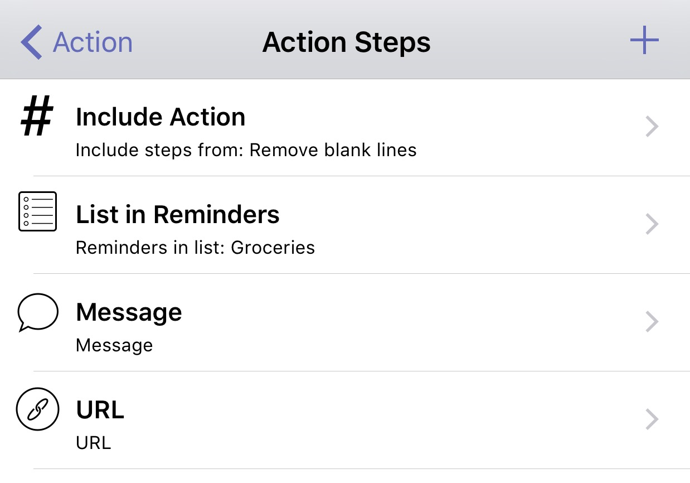
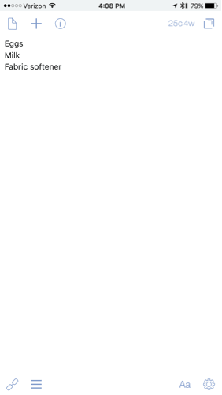

I am constantly finding new things to use my favorite app [Drafts](https://geo.itunes.apple.com/us/app/drafts-4-quickly-capture-notes/id905337691?mt=8&uo=4&at=1001l4VZ&ct=nahumck_me). Everything text starts in Drafts, just like this post. All of my lists, my notes, and my thoughts start here. It is a big part of how I get things done at work and at home.

I’m also in a quest to automate as much as possible. If I’m doing things over and over, I want to take away the friction no matter how small it is. I understand that this is borderline OCD, but I can’t help myself from finding joy in these little things.

### **New Features**

With the Drafts 4.6 update today, there are several new features as highlighted on the [Agile Tortoise blog](http://agiletortoise.com/blog/2016/03/02/drafts-46/):

- Trash Can: instead of deleting your drafts, they are now stored for 30 days. This was apparently a big complaint of users who happened to have their default setting to delete. This is much like how Photos handles the recently deleted items.
- Box.com Integration: this is just like the current support of Dropbox, and provides the same functionality.
- Open in Drafts option: this uses the Safari View Controller, and is great for using a search option, such as [DuckDuckGo](http://drafts4-actions.agiletortoise.com/a/16l).
- Tag Helpers: an added keyboard row that gives you tag options when editing actions. Very useful.
- Added Glyphs: this is something that I’ve personally wanted for a while. This update provides a lot more options for customization of your actions, and is very welcome going forward.
- Include Action: gives you the ability to run actions/scripts within Actions.[1](#fn-1 "see footnote") This means you can create separate actions or scripts of a repeat nature that you can call into any action you create. For those that use a lot of scripts within Drafts, this is going to be huge.
- And many more.

### **Include Action Step**

Long-time users are familiar with how to chain actions together, adding a multitude of different action types into a single action.

I recently thought of how I enter groceries. My wife and I use a shared Groceries list in Reminders, which then gets synced over to [AnyList](https://geo.itunes.apple.com/us/app/anylist-grocery-shopping-list/id522167641?mt=8&uo=4&at=1001l4VZ&ct=nahumck_me) to group the items and make it easier for shopping. Until now, I would enter the items we needed, make sure they were in the correct format, and send them over. I would open up AnyList to make sure they were imported and also to review the list. Lastly, I would then make sure to let my wife know that I added items to the list.

There have been times that I have pulled a recipe in from a website. I copy and paste the ingredients over, delete the items I don’t need to buy, and delete all of the blank lines.

I do this often enough that I should automate it. Thinking of how I would do this, I thought of the steps that could be automated, and in what order:

1. Remove any blank lines from the draft.
2. Pass the list from Drafts → Reminders → AnyList.
3. Send a message to my wife to let her know it has been updated.
4. Open AnyList.

 _You can see the details of the steps [here](https://www.nahumck.me/wp-content/uploads/2016/03/Grocery-Action-Steps-Detail.png)._

Step 1: Thanks to [this action](http://drafts4-actions.agiletortoise.com/a/1ar), I can run a script to get rid of them. And with the Include Action function, I can add that right to my action as the first item.

Step 2: This is a built in function of Drafts. It process each line, and you can optionally specify a delimiter for writing notes, which is helpful when adding a description to “lettuce” to give you a specific type or quantity.

Step 3: This is also a built in function; I set the number for my wife, then a canned message to let her know I updated the grocery list.

Step 4 utilizes the URL scheme of AnyList, which is `anylist://`.

Now that I have [the action](https://drafts4-actions.agiletortoise.com/a/1iJ) set up, I can run it on a list I have entered. My list is passed over, I hit send on the message to my wife[2](#fn-2 "see footnote"), and then I am automatically taken to AnyList. The items appear, and I can go on about my business.

I’ve also created one that doesn’t does message my wife, because I don’t always need to let her know. And of course, I made an [Action Set](https://www.nahumck.me/using-action-sets-drafts/) for both of them.

Could I enter the items into AnyList directly? Sure could — if _I was an animal_. Instead, I can freely add them in one place as I think of them, and send them where I need them to go with the press of a button. This is a simple example of how you can include different actions, especially scripts, to automate and manipulate the text as you pass it along to the next app. It has saved me time ever since it was introduced in beta, now available to all of you.

* * *

1. This doesn’t allow for running multiple URL actions. [↩](#fnref-1 "return to article")
2. There is a limitation of iOS in this step. The system software does not allow for the automatic sending of a message. I would love to see this changed, but I’m not going to hold my breath here. [↩](#fnref-2 "return to article")
