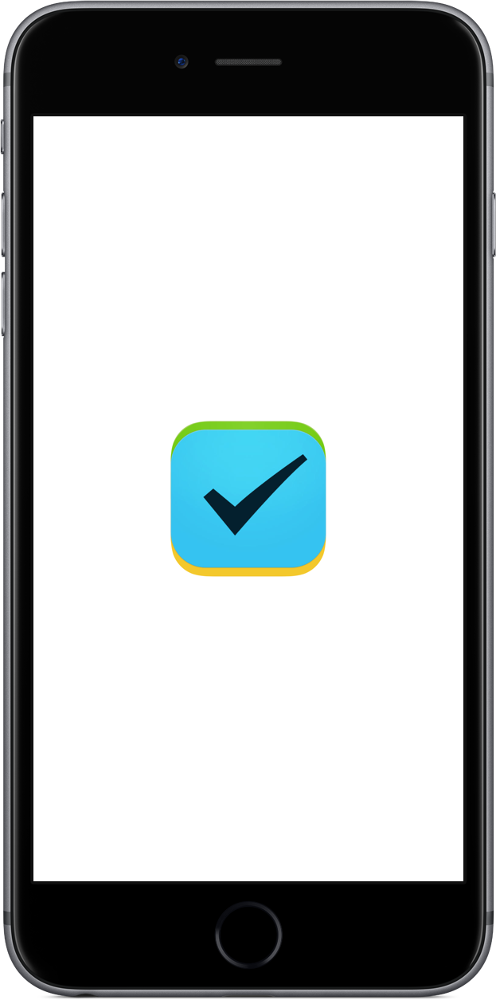

Task management is a very personal choice. Every person has their own idea of how they'd like to organize their life, which is why there seem to be as many task managers as there are people. I’ve tried a bunch of them— Reminders, Clear, Due, Wunderlist, Trello, Things —and through that journey I’ve found 2Do works best for me.

* * *

# ePub Version

Thanks to the power of [Ulysses](https://geo.itunes.apple.com/us/app/ulysses-mobile/id950335311?mt=8&uo=4&at=1001l4VZ&ct=nahumck_me "Ulysses"), I was able to create an ePub version of this post. It's not in the same format as my site yet, but when I get more accustom to the app, I'll likely update it to the same format.

[Click here to download the ePub.](https://dl.dropbox.com/s/qbjmxtabfvmfvd9/Move%20Your%20Thoughts%20to%202Do.epub?dl=0 "Move Your Thoughts to 2Do — ePub")

* * *

# Table of Contents

- [Moving Over to 2Do](https://www.nahumck.me/move-your-thoughts-to-2do/#moving-over-to-2do "Moving Over to 2Do")
- [Expectations of What Follows](https://www.nahumck.me/move-your-thoughts-to-2do/#expectations-of-what-follows "Expectations of What Follows")
- [How I Moved Over](https://www.nahumck.me/move-your-thoughts-to-2do/#how-i-moved-over "How I Moved Over")
- [A Few Missing Things](https://www.nahumck.me/move-your-thoughts-to-2do/#a-few-missing-things "A Few Missing Things")
    - [Review Mode](https://www.nahumck.me/move-your-thoughts-to-2do/#review-mode "Review Mode")
    - [Granular Location](https://www.nahumck.me/move-your-thoughts-to-2do/#granular-location "Granular Location")
    - [Sequential Lists](https://www.nahumck.me/move-your-thoughts-to-2do/#sequential-lists "Sequential Lists")
- [Management Hierarchy in 2Do Parlance](https://www.nahumck.me/move-your-thoughts-to-2do/#management-hierarchy-in-2do-parlance "Management Hierarchy in 2Do Parlance")
- [Features to Start Using](https://www.nahumck.me/move-your-thoughts-to-2do/#features-to-start-using "Features to Start Using")
- - [Groups](https://www.nahumck.me/move-your-thoughts-to-2do/#groups "Groups")
    - [Tags](https://www.nahumck.me/move-your-thoughts-to-2do/#tags "Tags")
    - [Due Dates, Start Dates, and Duration](https://www.nahumck.me/move-your-thoughts-to-2do/#duedates-startdates-and-duration "Due Dates, Start Dates, and Duration")
    - [Projects & Checklists](https://www.nahumck.me/move-your-thoughts-to-2do/#projects-checklists "Projects & Checklists")
- [Sort Navigation](https://www.nahumck.me/move-your-thoughts-to-2do/#sort-navigation "Sort Navigation")
- [Embracing Smart Lists](https://www.nahumck.me/move-your-thoughts-to-2do/#embracing-smart-lists "Embracing Smart Lists")
    - [Examples of Work Smart Lists](https://www.nahumck.me/move-your-thoughts-to-2do/#examples-of-work-smart-lists "Examples of Work Smart Lists")
    - [Example of Location Search](https://www.nahumck.me/move-your-thoughts-to-2do/#example-of-location-search "Example of Location Search")
    - [Example of Important Tag Search](https://www.nahumck.me/move-your-thoughts-to-2do/#example-of-important-tag-search "Example of Important Tag Search")
    - [Other Possibilities](https://www.nahumck.me/move-your-thoughts-to-2do/#other-possibilities "Other Possibilities")
- [Helpful Links](https://www.nahumck.me/move-your-thoughts-to-2do/#helpful-links "Helpful Links")
- [Wrap-Up](https://www.nahumck.me/move-your-thoughts-to-2do/#wrap-up "Wrap-Up")

* * *

# Moving Over to 2Do

I first stumbled upon [2Do](https://geo.itunes.apple.com/us/app/2do/id303656546?mt=8&uo=4&at=1001l4VZ&ct=nahumck_me) during its Free App of the Week promotion on the App Store in June of 2015. I wanted to see how well that worked, so I moved everything there. After a short while, I was overwhelmed by all of the options and features. My brain wasn't thinking how the app seemed to want me to operate.

I started thinking I needed to try something new. There are many in the tech community that considered OmniFocus as the killer to-do app, and I had a bit of a curiosity based on all of the people I respected that were using it.

So, in the fall of 2015, I started to dive into OmniFocus as my new Task Management System (TMS). I was added to the beta program in TestFlight, which gave me basically a "free trial" to see if I could make this work for me.[1](#fn1)

I learned a lot from that experiment. I am primarily an iOS-only user. And while OmniFocus is great at many things, there are several things that don't have feature parity between a Mac and an iOS device in their apps; you almost need both to accomplish everything needed for task management. There were also things that I wish would have been incorporated from other apps to use in my system. About 2 months in, I found myself using not only OmniFocus, but also supplemented it with Due and Reminders. My task management system was now three apps, which is far from ideal.

I started wrestling with the looming feeling: while OmniFocus is great for some, it's UI design is stunning, and comes highly recommended: it just wasn't for _me_. [2](#fn2) It didn't integrate in the way I thought it should and I had difficulty conforming to a set system. I even reached out to friends who had used OmniFocus for years to see what I was doing wrong. Turns Out™, it wasn't me.

Now I had a dilemma. For as much as I wanted to make my system fit OmniFocus, I didn't stop to think about what I needed to fit into my system. The system I was looking for needed to be flexible, to handle the small task to the large project, and help push my TMS to the next level. Around this same time, I could see that work was going to be picking up and I needed to get a handle on things fast.

I spent a lot of time moving around in different systems, trying them out to see what did and did not work. It took time and effort that I could've devoted to other things, but I found it necessary to help me hone in on what I wanted and needed from a TMS on a daily basis. If I use a product and I'm unhappy with a feature (or lack thereof) or I'm not compelled or excited by it, I won't use it. It's a bit of [productivity addiction](https://blog.todoist.com/2016/02/11/productivity-addiction/ "Productivity Addiction — Todoist Blog"), but as long as I set aside the time to review how this works for my life, then I'm happy to do it.

So with all of the apps that I currently had, I started looking at what each one could do. What I needed to do. Clear and Reminders were too simple. Things didn't have enough reminder options for me. Remember the Milk hadn't been updated in a long time. I looked at other options, but each had limitations that I couldn't handle and didn't have multiple integration points into iOS.

And that's when I saw it: **2Do**. It was there the whole time. It had the features I needed. It had the automation I wanted. And aside from some UI elements that I would like to see changed, it proved to be the system I wanted. What I came to realize later is that I just didn't take the ownership to learn it like I should have, and I didn't understand its full potential. So now, I needed to move things from OmniFocus to 2Do. And this, as they say, is where things started to get interesting.

# Expectations of What Follows

I want to make sure I state that I'm coming from an iOS-only perspective (and primarily my iPhone). I don't use a Mac for much of anything, except to upload something to iTunes every once in a while. So your mileage may vary.

Entering things into your new TMS is easy; getting tasks out of your current system is a way more difficult task. For anyone that has ever moved/switched anything (houses, jobs, etc.), it can be:

1. a giant pain in the ass
2. a scary thing to undertake when you do not know fully what you're getting in to
3. difficult because you have to retrain your thinking and methodologies
4. _extremely rewarding_

It's the last part that takes some time to realize. But it really is the most important part. And if your current method isn't doing what it needs or isn't something you really feel like using, break through the fear of change and push through.

## Choosing a Sync System

Before you begin, consider these options. There are pros and cons to each, and starting off with the right one for you will help as you get more of your tasks into the app. 2Do gives you [several options for sync](http://www.2doapp.com/manual/ "2Do Manual"), but I'm only familiar with two of them:

- Dropbox is great. It is the recommended sync service by the maker of the app. One downside is the lack of Siri Integration, but with the invention of Email 2Do, as [Federico Viticci suggested in his review of the feature](https://www.macstories.net/ios/how-email-to-2do-has-improved-my-daily-email-workflow/ "MacStories 2Do Review"), you can simulate a "task assistant" for implementation.[3](#fn3)
- iCloud is good if you share lists in Reminders with others (especially family) and gives you Siri integration. I have found this to be solid as well, but I wanted to keep this separate from iCloud because of the way it handles sync (see the manual). The only list I share is a grocery list, so it's not compelling enough for me to use this option.
- While I haven't tried the others, I would be concerned about using them based on the limitations highlighted by the 2Do User Manual. I would want to use the full feature set (and full sync functionality of everything in the app), so I personally wouldn't recommend another option.

# How I Moved Over

Here's the TL;DR — from my experience, there's not an easy way to do this.

I had tasks with notes entered that I needed to carry over. If I had started from scratch, I would've likely forgotten about them. I needed a way to get things out of one system and into another.

I tried a few different things, and while they worked, it was difficult and required way too much input; frankly, I don't even want to get into them because it was awful and not valuable to you, dear reader. It was so bad, that I ended up completely deleting everything in 2Do and starting over again. I stumbled on the the method that worked for me, and made the most sense.

Here are the tools I used:

- Numbers (to deal with the export of the .CSV)
- Drafts
- Workflow

First, I started with an export of the CSV from my former TMS.[4](#fn4) I imported the file into Numbers and deleted all of the completed items. Then I deleted everything _except_ the task names and notes columns. I took those columns and pasted that into Drafts. I separated the Task Name and the Notes fields by the `|` delimiter, and ran the [action](https://drafts4-actions.agiletortoise.com/a/1fg) that utilizes this [workflow](https://workflow.is/workflows/cb0e400ed8404378af7046a4c69d447d) I had come up with to import tasks.[5](#fn5) This dumped everything into 2Do in my default list (I use the GTD Inbox, so that's where it went for me).

You won't be bringing in flags or dates or contexts/tags or priorities — nothing but what needs to be done and descriptions. And, even though this puts a tremendous amount of effort in front of you to re-enter that data, it has great benefits as you learn your new system:

- Exporting in this manner allows you to keep your original database intact. This is especially useful if you're on the fence for moving everything over.
- You can move a smaller amount over to learn the interface, methods, and all of the useful features of 2do.
- It allows you to refocus and rethink your task management. By stripping away the cruft of your legacy methodology, you can start to change your system.
- Re-thinking your approach allows you to really focus on what is important. Perhaps you don't need _every_ little step in a checklist or project. Getting rid of the clutter allows you to retrain your focus.

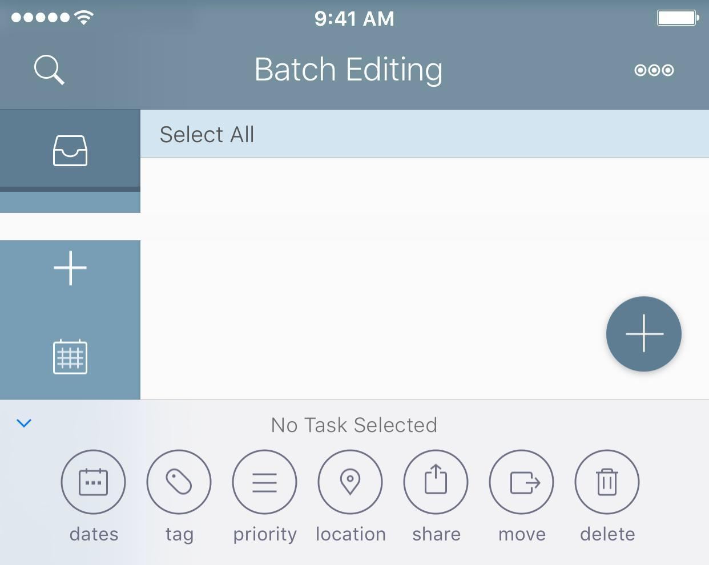

One feature that 2Do provides is batch editing. This will allow you to quickly apply various things and power through a bunch of tasks. This is something that other apps simply don't have, which not only helps move you over from another system, but also helps you in the normal day-to-day use of the app.

# A Few Missing Things

There are a few things that I have enjoyed in other apps that are not in 2Do. While these aren't a deal breaker, they would some useful additions:

## Review Mode

Review mode is something that I really found useful with my time in OmniFocus. This allows you to review specific projects or lists to make sure you get an overview of what is in your TMS, and is another way of helping you remember some of the tasks that could get away from you.

## Granular Location

Another thing that I have found in other apps (Fantastical or OmniFocus, for example) is the ability to set leaving/arriving parameters for tasks. You can set nearby locations, which is better than having no location reminders, but I would really like to see the improvement here. I often want to get a reminder when I'm leaving work to pick up the groceries, but I would really like to set it for a distance away from work, and be able to go directly to the list.

## Sequential Lists

I haven't really used this feature, but I've created the same basic thing in 2Do by having a specific Project or Checklist with priority and/or different start dates to accomplish the same thing. I know several other users have been asking for this, and I would love to see a smart implementation of this type of feature.

# Management Hierarchy in 2Do Parlance

If you've been a long-time user of your current system, you are used to specific nomenclature in regards to your tasks. 2Do offers many of the same features, but with different names. But the key to using 2Do when leaving your old system is this:

_Throw out the old, and embrace the new._

New terms scare us. While it's easy for me to say now, in practice it can be difficult. You can learn new things, even if you are afraid of change.

There's a hierarchy of how to organize things in 2Do. This isn't a rigid system, but rather one that you can customize to your liking. Here are the basics:

- Groups
- Lists
- Projects/Checklists
- Tasks

Groups aren't required, but if you have a layered setup, they are useful. Inside of the groups, you can have multiple Lists. Within each List, there are multiple Projects or Checklists or Tasks with the grouping.

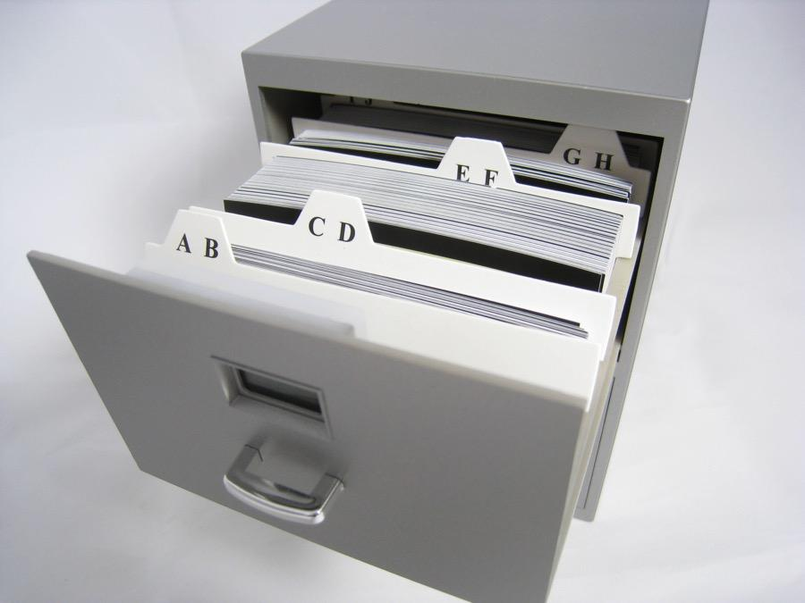

Think of the TMS as a traditional file cabinet: each drawer (Group) contains hanging files (Lists); within those hanging files, you can have folders (Projects/Checklists) or pieces of paper (Tasks); and inside the folders, you can also have paper.

If that doesn't make sense to you, here's a visual mind map to illustrate:

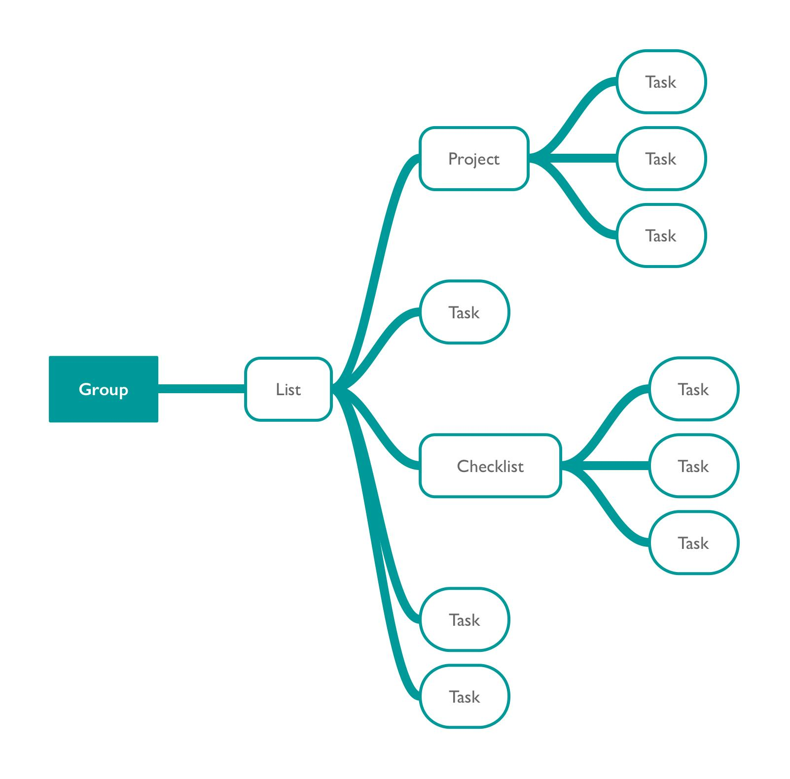

Now that you have things organized how you need them, it's time to start using the features.

# Features to Start Using

As you start to try some of the power features, I would consider first moving over a small, manageable list. This will allow you to customize 2Do to your liking before moving your entire TMS over.

## Groups

Using groups for me is a power feature. It allows you to be more granular about where you place your tasks, and you can then use the Smart List feature to extract out what you specifically need (more on this in a bit). They have helped me keep work and personal tasks separate, all while having one central database for everything.

When you begin thinking about organizing your tasks, I recommend you start thinking of groups like buckets. I have 3 main buckets: Personal, Home, and Work.[6](#fn6) Within each of those groups, I have multiple lists. Here's an example of my Home Group:

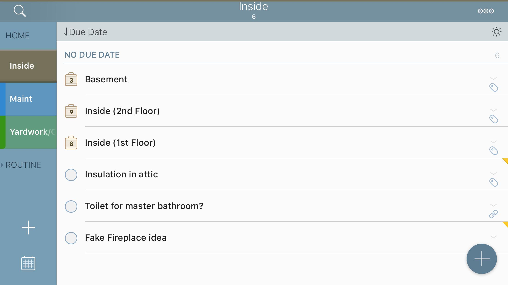

## Tags

Tags are simple to apply, but are extremely powerful in your task management. This is going to separate a lot of your tasks into groupings that make sense. They are very similar to contexts, but more powerful in that an item can belong to multiple instead of one; you aren't locked into a singular way of thinking about where a task resides.

You can set up a bunch of tags up front if you have a list from your previous app. The other option is to create them as you're sorting all of your tasks from the default list into new places within the app.

Another nice thing here is how you can group your tags. These groups are different than how you have your tasks organized, but can be helpful in identifying where things belong.

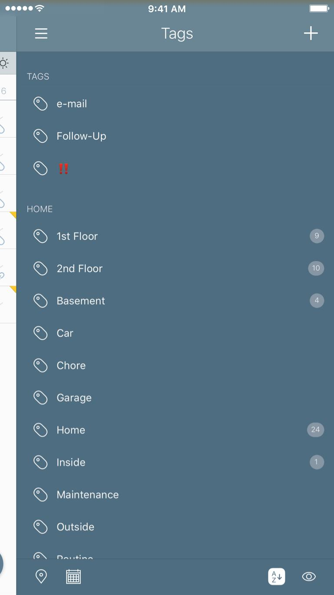

Setting up tags does take time, but as we'll touch on later, will help with the creation of Smart Lists to help you focus on the task(s) at hand. There are also a ton of other useful tips in the user manual.

One helpful tip that I heard on the [Nerds on Draft Podcast](http://www.nerdsondraft.com/podcast/2016/1/26/episode-060-agave-ipa-and-2do) was creating tags for the people you interact with, and then filtering based on those tags so you can focus on talking with them. While I haven't implemented this at work (yet), I have done this for things at home. Helps me navigate certain things I need to discuss with my family, and allows me quick access to those tasks.

Tags also have the option of being [paused](http://www.2doapp.com/putting-your-tasks-to-sleep/). This is extremely helpful to get rid of the clutter that can build up. If you manage projects at work, creating a specific tag for that project can be useful if that project gets put on hold. I've had this happen a few times at work, and pausing those tags gets them out of my view so I can work on projects that are progressing forward.

## Due Dates, Start Dates, and Duration

There are 3 types of time-based metadata that you can apply to a given task/project:

- Due dates are simply the date/time that a task is due. New with 3.8, the digital clock option was added to the existing analog clock option for easy time selection. For due dates, you do not need to select a time; sometimes you know that a task is due on a particular day — like mowing the lawn — but the time is flexible. This is where setting a due date with no due time is useful.
- Start dates are useful for tasks that you want to have appear in your list, but at specific times. By default, tasks with start dates are hidden from view, but can be shown by tapping the clock icon that displays Scheduled Tasks. This helps to get the clutter out of your view, and get you focused on what needs to be done.
- Setting a duration is a very helpful option for when you need to be notified of something in advance. If you know a task is going to take you a few days to complete, but need to be notified to start that task, using duration in conjunction with a due date is a good choice.

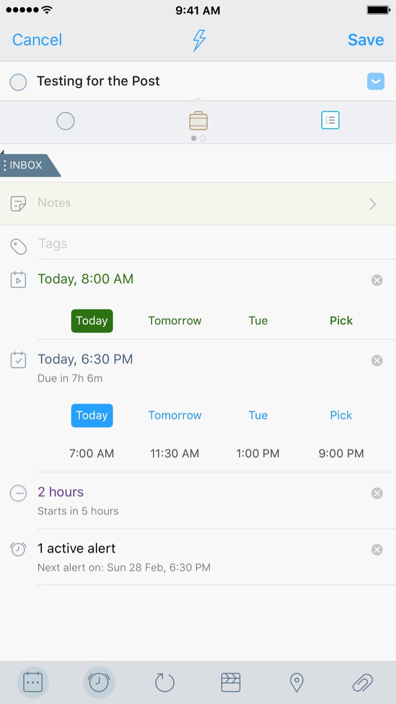

There is a great video on the 2Do YouTube channel that shows you [how to use due dates, start dates, and durations](http://youtu.be/kNcEszfXho4), and gives you good use cases for when you would apply a start date or a duration, and I highly recommend watching it (along with the other videos).

Federico Viticci mentioned in his post on MacStories on [why 2Do is his favorite iOS task manager](https://www.macstories.net/stories/why-2do-is-my-new-favorite-ios-task-manager/) that setting start/due date shortcuts is helpful for entering tasks quickly. I encourage you to read his review to better understand those options, as they will save you time and effort as you are creating new tasks.

## Projects & Checklists

Projects and Checklists allow you to set up smaller projects that contain a set of tasks. They are the same in basic function, but differ in the way start/due dates get applied.

Projects and Checklists can have an overall start/due date applied to the entire set of tasks; the difference between the two is that tasks within a Project can be independent of the overall start/due times, whereas tasks within a Checklist inherit the start/due time.

As of 2Do 3.8.1, there is a great way to use a Checklist with alerts to set up a recurring list of items. This allows you to set up an alert for each task that is based on the start date. When the Checklist is completed, the checklist start/due date are repeated for the specified repeat cycle, and the alert times adjust with those dates.

Here's an example:

Say you needed a reminder to refill your prescription every 30 days. This involves a few steps to complete:

1. Call your doctor to have the prescription written at least a week in advance.
2. After 24-72 hours (depending on the office), you need to drive to pick up the prescription.
3. Then, before you run out of your current prescription, you need to get the new one filled.

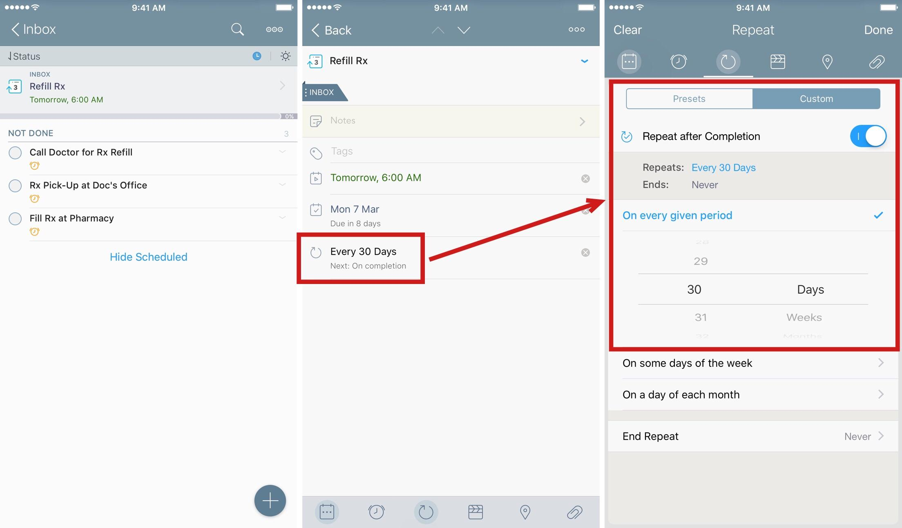

Now with a Checklist, you can set the start date seven days ahead of the due date. Then, you can set up your Tasks within the Checklist, and apply an alert to each one at a date/time relative to the start date:

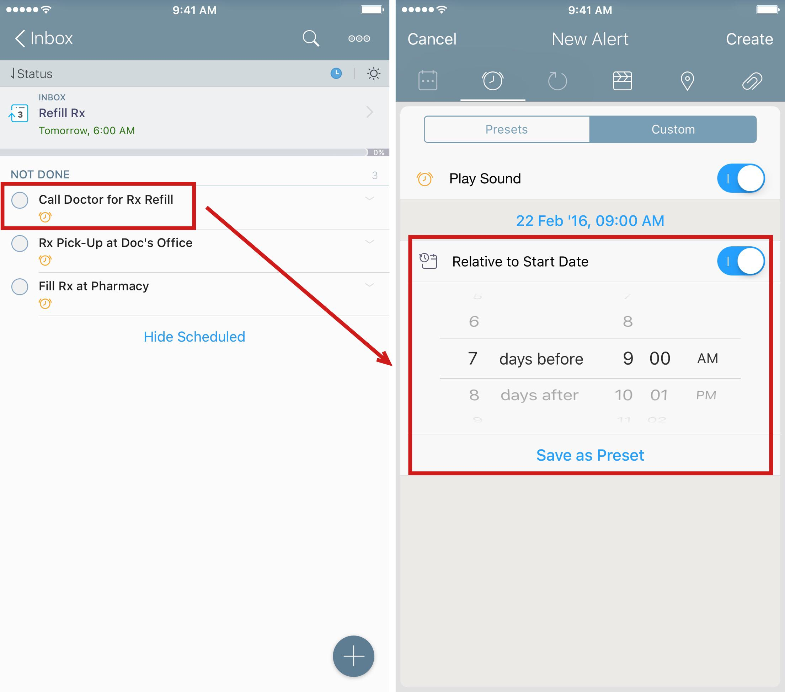

_Update: Many people have asked where they can get the workflows for tasks, projects, and checklists. I have created a post [here](https://www.nahumck.me/2do-workflows/) with all of the updated links to those workflows and actions._

# Sort Navigation

One thing I have heard from others is that 2Do has a lot going on in the screen. There are layers of UI, and there are things that can be missed.

Just prior to posting this, I was contacted by a friend of mine asking how to accomplish sorting. He wanted to sort the tasks manually, without applying a Due Date or a Priority; he just wanted to take a list, and move a task up from near last to the 4th position in the list.

I had always assumed that sorting manually was missing from the app. But, as was pointed out to me, it was right there all along. After all this time, I was glancing over navigational cues that would help me find these items. It would behoove you — and me for that matter — to play around with this a bit more. Let's use the example of the sort options.

Say you have a checklist of groceries, entered as you think of them:

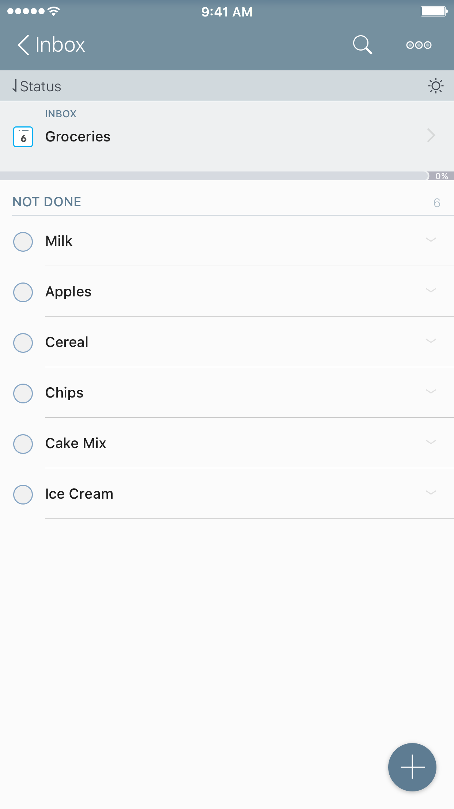

When I go shopping, I like to have my list in the order I move through the store. I generally know the layout of the corner grocery store and the larger store that is a few miles away. I don't have a due date or priority to sort on here, but I want to sort them in the order I need for the store.

First, locate the Sort Bar. Tap on the sort bar to reveal the other options. You will be presented with the first screen, but notice the three dots:[7](#fn7)

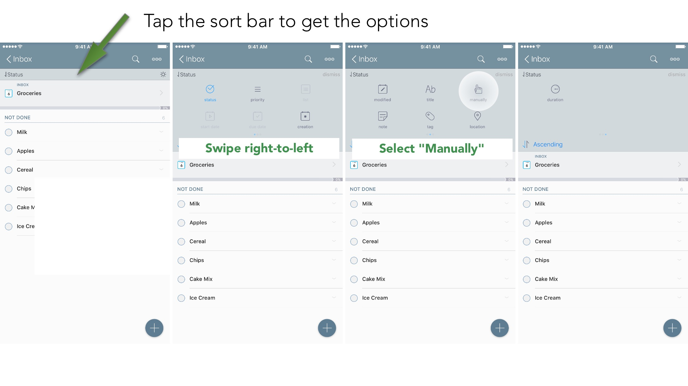

So now, as I swipe left and right, I have multiple options to sort a list, a project, or a checklist. If I select manual, I can move around the items that make sense to me; simply tap on the batch editing icon to enable the mode.

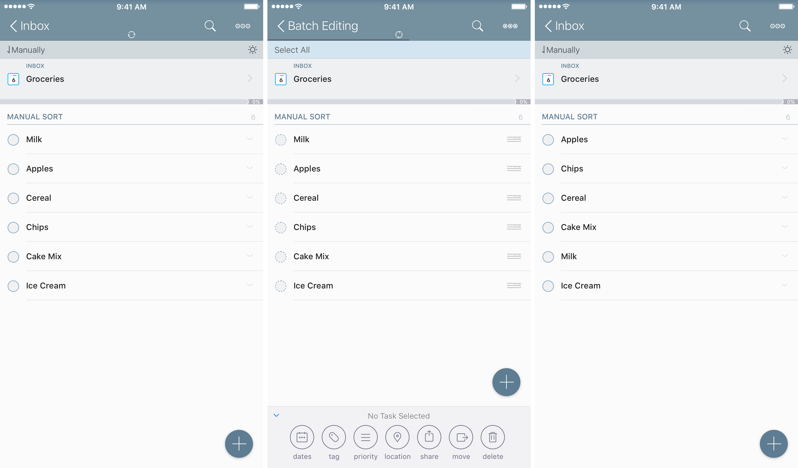

Sort works on the list or Smart List view you are in. You can have one list or project be sorted by due date, one sorted manually, one sorted by creation, etc. It is fully flexible to suit your viewing needs.

# Embracing Smart Lists

The creation of Smart Lists is one of the most powerful features of 2Do, but also has the highest learning curve. There are some limitations that hopefully will be fixed with future updates of the app. Users coming from OmniFocus will find that they are very similar to something like Perspectives, though they may not perform the same way.

One of the biggest tips I can give: [learn the syntax](http://www.2doapp.com/kb/article/how-do-i-use-the-search-feature-to-look-for-tags-actions-and-other-stuff.html "2Do Search Syntax"). Yes, it's nerdy. Yes, some people don't like reading the owner's manual to understand how things work.[8](#fn8) But you absolutely should.

The idea behind Smart Lists is this (from the User Manual, emphasis mine):

> Smart Lists, in simpler words, are in fact **_saved searches._** A smart list only filters on the original list it was create in (such as Home, 'All' and so on) and can be used for applying dynamic date range searches, keyword and tag filters.

This clicked for me as soon as I started thinking for what I wanted to _search_ for, rather than what I thought I want to see. I input many tasks and can't always remember where I put them. Searching for them is helpful; having a way to regularly search for a set of parameters is a godsend.

Many times, I just need to search all of my tasks for things. I may do it once, twice, or a few times - but being able to create a saved search is great. When I complete my search, all I have to do is tap and hold the icon to save And that is why Smart Lists are great: they allow you to customize your search parameters to find the tasks you need to do. They can help you organize your lists across one or multiple projects.

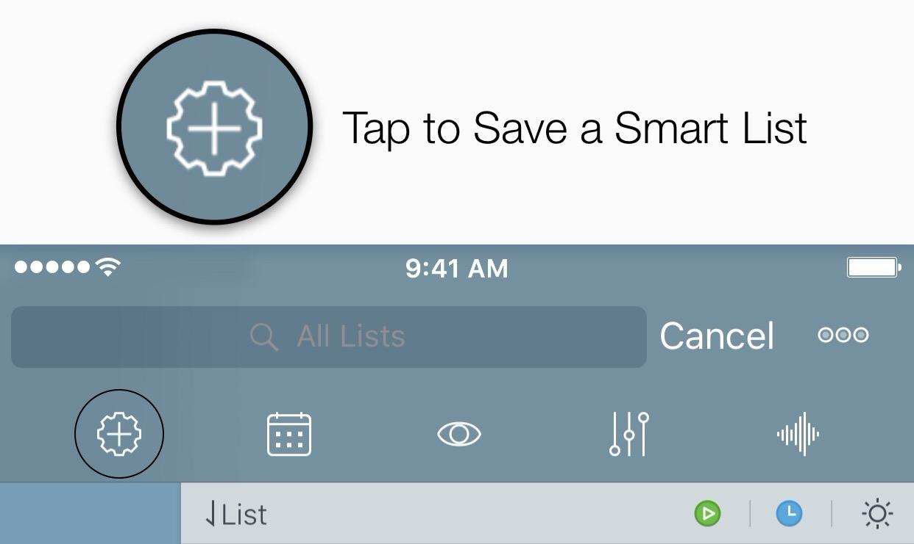

I would recommend that when you create a Smart List, you start off from the All list; searches only refer to the list you searched in, and this will capture everything for you. You can then search in specific groups or lists to narrow it down.

## Examples of Work Smart Lists

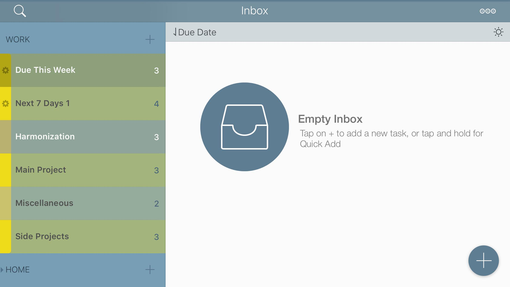

I have a Work group of a few lists. Keeping one list for me with Projects/Checklists was not helping my organization, and I needed that extra level of management. As I enter tasks into my Inbox, I can then sort them based on which list they go into. But if I want to get a look at my whole list, I need to create a search and save it as a Smart List. Here's the syntax I use for searching only items from my Work list:

`groups:work type: task or proj or chck`

I usually view this Smart List by list view; this way I know where I have each item located.[9](#fn9) Now all I need to do to save the Smart List is to press the icon, and I'm all set. I can name this Smart List whatever I want, and even place it inside the Work group I have set up.[10](#fn10)

These work great for showing me everything, but at times I want to see just my work for this week. I can take the same search syntax, modify it slightly, and add a parameter:

`groups: work type: anythisweek and proj or chck or task`

This shows me everything I need to get done this week. One thing to note here is that this only shows you things due this week, and interprets the weekend as the end of the week. So if you look on a Wednesday and you know there's something due Monday, you won't see it.

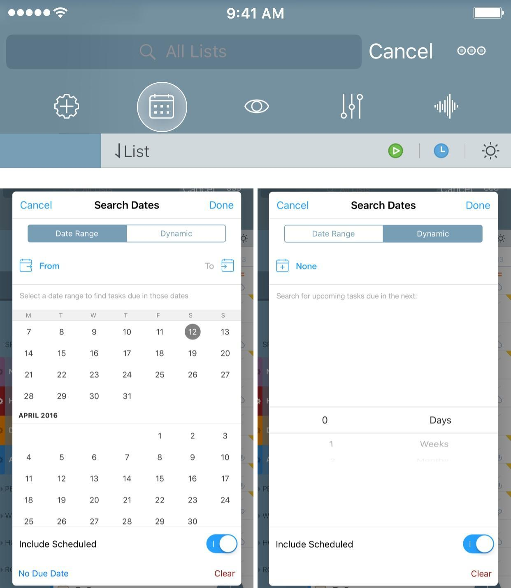

So how do you get that early look ahead? This can be set up using a Date Range or Dynamic Date Range. To do this, you can apply the first syntax example, and apply a dynamic date range. In my experience, I have found it better to search for the parameters I want to see (proj, task, chck, etc.) and _then_ apply the dynamic date range; it assures you that you're entering in the syntax correctly before applying the date.

Here, you can see the difference in the searches:

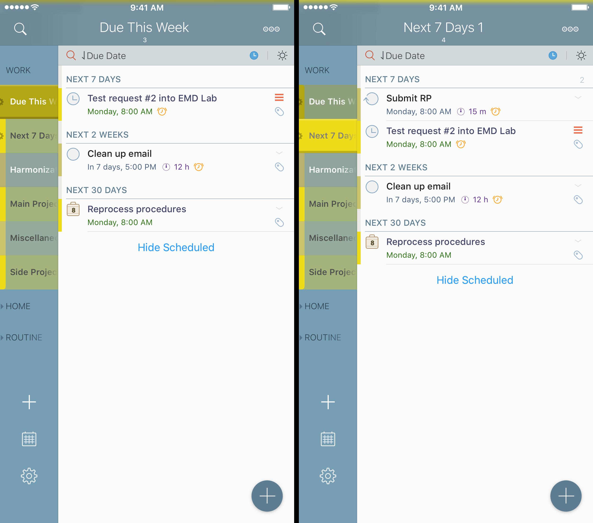

## Example of Location Search

Let's say you are headed home to your family's house for Thanksgiving. There are a number of items you want to pick up or do:

- Pick up chainsaw
- Pick up tree trimmer
- Pick up power tool (that you only need to use once every 10 years)
- Pick up Micro Machines and Starcom toys
- Talk about that embarrassing time when I was 6
- Talk about planning a multi-national trip to Europe

These tasks can reside in any given list. But first I need to create a location where the family home is located, then create the tasks.[11](#fn11) This location needs to be applied to each of the tasks. You can add them to your default list or select a list to which they belong.

Next, you simply go to the All list, and search:

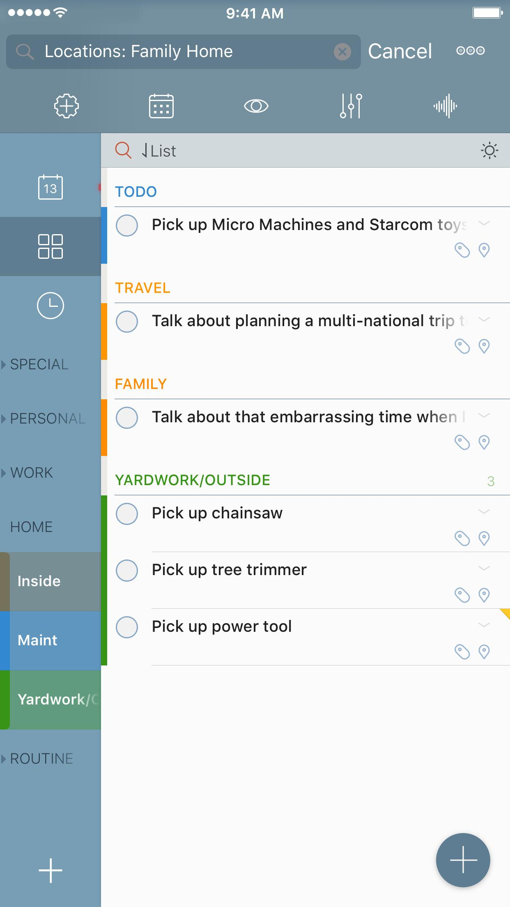

There you have all of your tasks for that location. You could also accomplish the same concept by utilizing a tag called `family home` and search `tags: family home`. Use what makes sense to you.

## Example of Important Tag Search

If there is a task that I really need to get done and I need to visually see that it is important, I have started to use the `‼️` emoji for a tag. Yes, you can use emoji for search! Now, I can search on that emoji to see the important tasks, and save a Smart List:

`tags: ‼️`

I can even rename the list as ‼️ to make sure that I see it on the side.

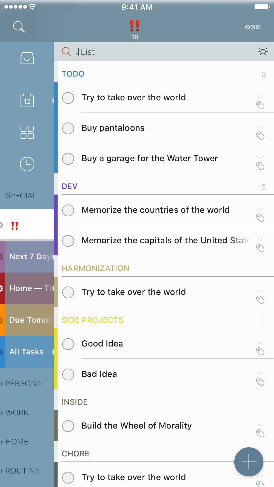

## Other Possibilities

These are some small examples of how to use this feature. There are way more complex syntaxes that can be created to look at your tasks. This is the beauty of this feature. It works **_for_** you (once you learn how to make it work), and allows you to customize how you view your entire system.

# Helpful Links

If you're on the fence about moving over to 2Do, or have other questions, you may find some of the following links useful. Also, as I said previously, you really should read the [2Do User Manual](http://www.2doapp.com/manual/) and check out the [2Do YouTube channel](https://m.youtube.com/user/The2DoApp).

- [MacStories Review of 2Do](https://www.macstories.net/stories/why-2do-is-my-new-favorite-ios-task-manager/)
- [MacStories Review of Email 2Do](https://www.macstories.net/ios/how-email-to-2do-has-improved-my-daily-email-workflow/)
- [Benjamin Brooks on Moving to 2Do](https://brooksreview.net/2016/01/2do/)
- [Nerds on Draft Podcast Episode 60 about 2Do (and beer)](http://www.nerdsondraft.com/podcast/2016/1/26/episode-060-agave-ipa-and-2do). You can also find it in [iTunes](https://itunes.apple.com/us/podcast/nerds-on-draft/id926072169?mt=2).

# Wrap-Up

There is a lot to unpack with 2Do. I admit, it can be overwhelming at first, but it takes some time, testing, and use. I didn't find 2Do useful the first time, but that's because I didn't sit down and figure out how to use it. It isn't a program in which you have to fix your mindset to use it properly; it can be simple just like Reminders, or it can be complex like OmniFocus.

This isn't a pure Getting Things Done (GTD) system, but something that adapts to a user's needs. That said, you _can_ make this a GTD app if you so wish, but you can also break the barriers a bit so that you don't feel confined. (It's a new kind of hybrid system, with just the right rigidity, just the right flexibility…)

2Do is in my dock. It has been firmly planted in the management of all my projects and my day-to-day life. My thought process is now captured as tasks when needed, and it has helped me focus on accomplishing the complexity that is my life. I am thankful that I have finally found something to work for the way I think of my task management.

1. I really wish that Apple would give the developers options for this. You cannot learn if a system will work for you just by pictures alone. You need to set it up, take some time, and see how it works in your life. [↩︎](#ffn1)
2. This could be any app: Things, Todoist, Remember The Milk, Clear, Reminders, etc. It just happened to me while using OmniFocus. [↩︎](#ffn2)
3. If you use Dropbox, I recommend that you immediately buy the Email 2Do IAP. Start with the $2.99 option to play with the integration. The MacStories article in the Helpful Links section will help guide you on setting that up. [↩︎](#ffn3)
4. In this case, I was trialing OmniFocus, and I exported the .CSV from the settings menu. [↩︎](#ffn4)
5. At the time I did this, I did it in a way more inefficient manner. I'm thankful that this action has been massively improved. [↩︎](#ffn5)
6. Some people think that you should keep work and personal separate, but when things get chaotic for me at home and at work, I need to see it all. [↩︎](#ffn6)
7. This is what I missed; it's subtle, and I missed it for a long time. Happier now that I have found it. [↩︎](#ffn7)
8. Looking at you, BMW owners… [↩︎](#ffn8)
9. I also use a tag `work`, and could make a search using `tag:work type: task or proj or chck`. [↩︎](#ffn9)
10. Having a list of lists is a productivity nut's dream, right? [↩︎](#ffn10)
11. You _can_ do this in the reverse, but it's more cumbersome and takes more time. [↩︎](#ffn11)
