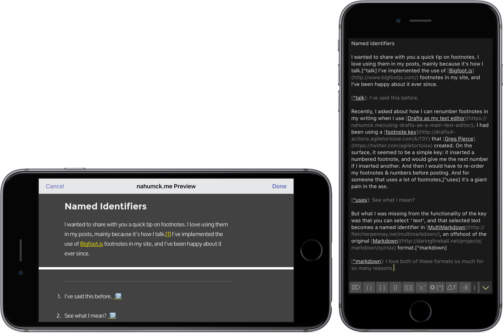
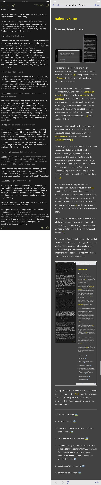

I wanted to share with you a quick tip on footnotes. I love using them in my posts, mainly because it’s how I talk.[\[1\]](#fn-1 "see footnote") I’ve implemented the use of [Bigfoot.js](http://www.bigfootjs.com/) footnotes in my site, and I’ve been happy about it ever since.

Recently, I asked about how I can renumber footnotes in my writing when I use [Drafts as my text editor](https://www.nahumck.me/using-drafts-as-a-main-text-editor/). I had been using a [footnote key](http://drafts4-actions.agiletortoise.com/k/13Y) that [Greg Pierce](https://twitter.com/agiletortoise) created. On the surface, it seemed to be a simple key: it inserted a numbered footnote, and would give me the next number if I inserted another. And then I would have to re-order my footnotes & numbers before posting. And for someone that uses a lot of footnotes,[\[2\]](#fn-2 "see footnote") it’s a giant pain in the ass.

But what I was missing from the functionality of the key was that you can select _text_, and that selected text becomes a named identifier in [MultiMarkdown](http://fletcherpenney.net/multimarkdown/), an offshoot of the original [Markdown](http://daringfireball.net/projects/markdown/syntax) format.[\[3\]](#fn-3 "see footnote")

The beauty of using named identifiers is this: when you convert Markdown text to HTML, the footnotes _automagically_ get numbered in the correct order. Moreover, no matter where the footnotes fall in your document, they will all get sorted out at the bottom of the HTML document. Because my custom preview formats the `[[draft]]` tag as HTML, I can simply view my preview at any time without having to convert my post.[\[4\]](#fn-4 "see footnote")

It’s such a small little thing, and one that I completely missed when I installed the key.[\[5\]](#fn-5 "see footnote") Now that I fully understand what it does, it takes me no time to add a simple footnote here or there. I also have a shortcut for my external keyboard set to `⌘+6` to speed up the creation. I don’t want to get too crazy with them,[\[6\]](#fn-6 "see footnote") but it’s nice to know that I have that ability available with relatively little effort.

I don’t have to stop and think about where things fall, how to rearrange them, what number I left off on, etc. Using them in this way allows me to write as I need to write, without the stop in my train of thought.[\[7\]](#fn-7 "see footnote")

This is a pretty fundamental change in the way that I work, but I think the result is really profound. If it’s a little difficult to understand my explanation, I hope that when you see the end result you’ll understand why creating footnotes in this manner can be very beneficial to your writing.

Having quick access to things like this just reminds me — yet again — that [Drafts](https://geo.itunes.apple.com/us/app/drafts-4-quickly-capture-notes/id905337691?at=1001l4VZ&ct=nahumck_me) has a ton of hidden power, unlocked by the actions and keys. The more I use it, the more I explore the possibilities, the more I love it.

* * *

2. I’ve said this before. [ ↩](#fnref-1 "return to article")

4. See what I mean? [ ↩](#fnref-2 "return to article")

6. I love both of these formats so much for so many reasons. [ ↩](#fnref-3 "return to article")

8. This saves me a ton of time now. [ ↩](#fnref-4 "return to article")

10. You should really read the descriptions & the code a bit to understand what it fully does. And if you create your own keys, you should annotate the hell out of them. I need to be better at that, too. [ ↩](#fnref-5 "return to article")

12. because that’s just annoying [ ↩](#fnref-6 "return to article")

14. It gets derailed enough. [ ↩](#fnref-7 "return to article")
