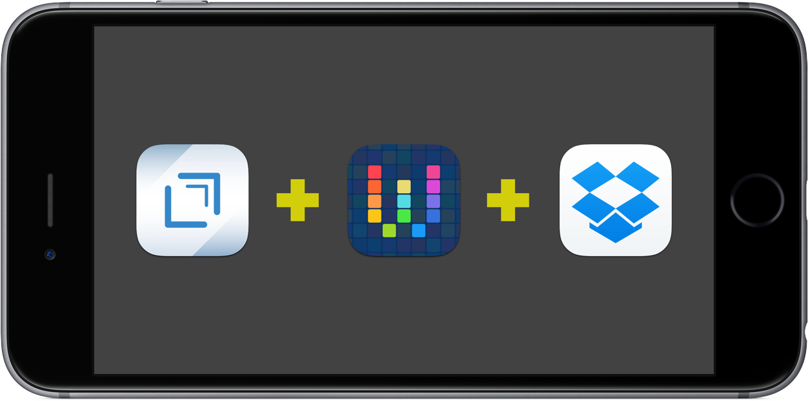
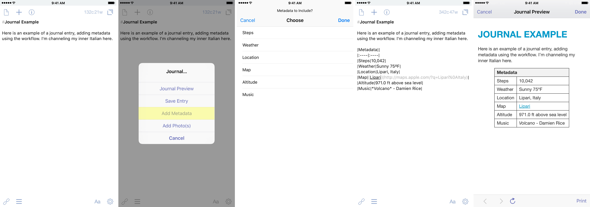
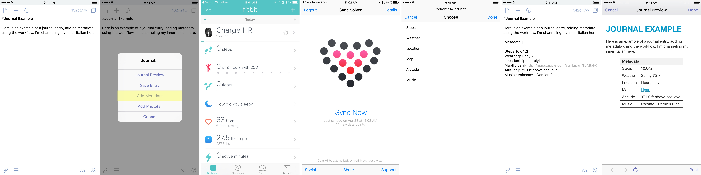
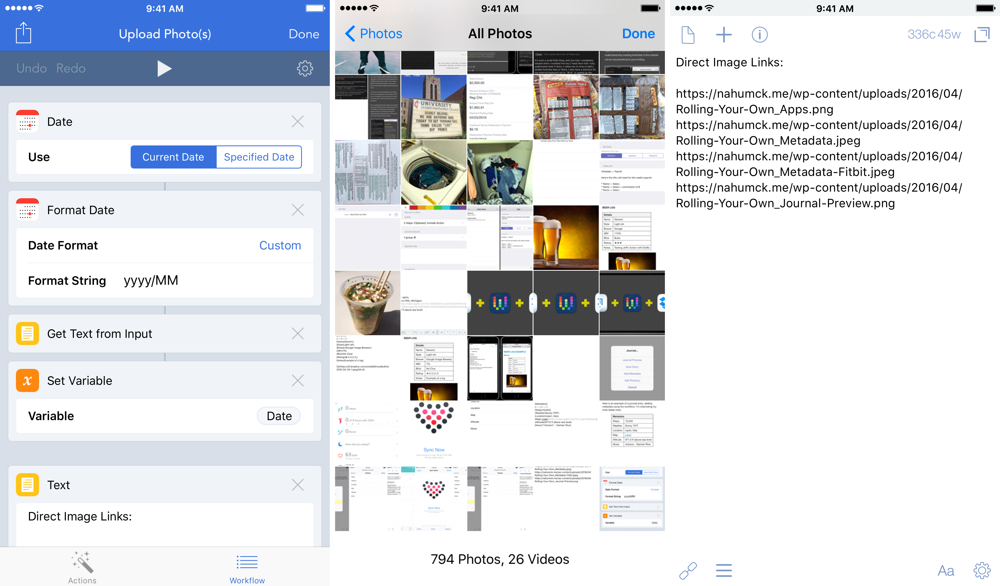
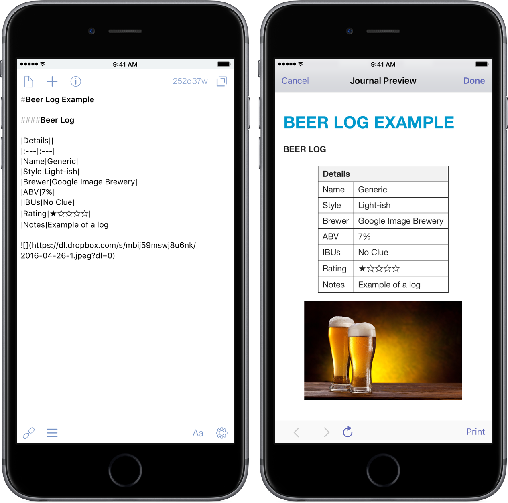

Journaling has been something that has been difficult for me to get into. I’m still not great at it. I often forget to do it, and then when I remember, it’s cumbersome to make it happen. I’ve never kept a physical journal for any length of time, mainly because I’m not sure what I’m _supposed_ to journal.

There are a lot of apps out there for journaling, but I’ve only tried [Day One](https://geo.itunes.apple.com/us/app/day-one-2-diary-+-journal/id1044867788?at=1001l4VZ&ct=nahumck_me) and [Momento](https://geo.itunes.apple.com/us/app/momento-private-diary-daily/id980592846?at=1001l4VZ&ct=nahumck_me). A lot of people love those apps, and they get the job done. But for me, they never really captured my interest to write, defeating the purpose of a journal.

I think that the problem with using these apps is that it’s yet another source of mental overhead for me. Sure, I could use Day One. It looks sharp, and satisfies the singular need. But that doesn’t _feel_ good to me. I like rolling my own solution.[\[1\]](#fn-1 "see footnote") I don’t have to figure out how to save things in a special way or how to back up to my own solution so that I don’t lose the data.

This friction, albeit not horrible, really didn’t sit well with me for whatever reason. If I’m going to do more journaling, I needed a better solution that works for me. I need to use something that allows me to write the way I like to write. I need something I can make my own. And it just so happens, I use it daily.

## Setup

First, the solution has a few parts. You need [Drafts](https://geo.itunes.apple.com/us/app/drafts-4-quickly-capture-notes/id905337691?at=1001l4VZ&ct=nahumck_me), [Workflow](https://geo.itunes.apple.com/us/app/workflow-powerful-automation/id915249334?at=1001l4VZ&ct=nahumck_me), and [Dropbox](http://dropbox.com) for storage.[\[2\]](#fn-2 "see footnote") There are multiple actions & keys that I use, along with an Action Set. You can find all of them [below](https://www.nahumck.me/rolling-your-own/#setup-links).

I understand that using two apps plus a storage service to replace one, single-focused app may seem like nonsense or something that is more clumsy. But I am constantly using all of the apps for this solution; they’re in most (if not all) of my daily workflows. Also, I trust Dropbox with my data, and I’ve never had a single problem with it; sync doesn’t break, there’s no down time, and everything is well integrated across iOS and most apps.[\[3\]](#fn-3 "see footnote") So in reality, I’d really be adding a fourth app in my life if I want to use a dedicated journaling solution. As of late, I’ve been pulling back on the apps that I rely on.

The beauty of this is that I don’t have to rely on another 3rd party sync service to keep my data. There have been too many times where an app or service changes their policy, changes their business model, or does something else that limits the way something works. I have yet to see Dropbox do something that I dislike. Drafts & Workflow are in active development. For the foreseeable future, I don’t have to worry about an integration going away.

This feels like a service that is my own, and I don’t have to fret about negative changes that break my habit. And should a new text editor get released or a current one go away, at least the pieces of the workflow stay there, even if it is not as well integrated as it is now. I can change, I can adapt, I can flow with whatever comes next.

### Start Writing

Getting started is the hardest part. Using [2Do](https://geo.itunes.apple.com/us/app/2do/id303656546?at=1001l4VZ&ct=nahumck_me), I set up a reminder to help me remember to journal.[\[4\]](#fn-4 "see footnote") I set this for the morning based on the recommendation from my sage-like friend [Seth](http://twitter.com/sethclifford), so that it was in my head first thing, and I would be cognizant of using it during the day. I open up Drafts, and add the time using [a key](http://drafts4-actions.agiletortoise.com/search?utf8=%E2%9C%93&search_type=keys&q=time&button=) in the extended row, and I’m ready to write.[\[5\]](#fn-5 "see footnote")

### Add Metadata

One of the many things that is nice with journaling apps is the ability to add different metadata to each entry. If you keep things like a workout or sleep journal, this can be helpful in checking progress. Lately, I’ve been paying attention to my step count to see how well I sleep; so far, if I have a high step count, I have deeper sleep. Imagine that — if I move more, I sleep better.

Remembering a time, place, what the weather was like, what you were doing can all be key memory triggers that will help put you back in the moment when you reflect on it. So, how can I add this to my entry? Other apps have that integrated. Well, it took some time, and I had some help, but I finally made it work.

For me, I wanted to have the following:

- Steps
- Weather Conditions & Temperature
- Location
- Map
- Altitude
- Currently Playing Music

All of them are optional to include. Simply tap on the ones you want, and the workflow does the rest. Music, location, maps, and altitude are all able to be done within Workflow using your phone’s built-in GPS. Getting the step data uses either your iPhone, Apple Watch, or a Fitbit (more on that below). And weather required special integration, as you’ll find out.

#### Weather Conditions & Temperature

The one part of the workflow that I needed to get help on was the weather information. Thanks to the help of Workflow guru himself, [Stephen Millard](http://thoughtasylum.com), I was pointed to [a workflow](https://workflow.is/workflows/05fdf6523bed4178a865a7f69268633f) that called the Forecast.io API. This method requires that you get an API Key, which you can get for free on the [developer page of Forecast.io](http://developer.forecast.io); your first 1,000 API calls per day are free, which would likely be impossible for you if this is for journaling. This is the same service that powers the great weather app [Dark Sky](https://geo.itunes.apple.com/us/app/dark-sky-hyperlocal-weather/id517329357?at=1001l4VZ&ct=nahumck_me).

This returns the data I need, and from there I take out the specific variables I want. This doesn’t require that I leave Workflow, making it seamless. There are multiple other variables that you can get information for if you look at the documentation, but I only included the current conditions and the temperature.

#### Steps

The step action is defaulted for iPhone. If you have an Apple Watch, select that by pressing on iPhone and switch it.[\[6\]](#fn-6 "see footnote")

For Fitbit users: this isn’t as easy as if you have an Apple Watch. There are more steps involved, and you’ll need to buy [Sync Solver](https://geo.itunes.apple.com/us/app/sync-solver-for-fitbit/id935306292?at=1001l4VZ&ct=nahumck_me) to make the steps work. But it _does_ work. Sync Solver is an app that syncs with the Fitbit Dashboard, then pulls that data into the health app. I don’t have a watch, but I made a different workflow that first pulls up the Fitbit app, then pulls up Sync Solver, then you can return to the app to finish the rest.[\[7\]](#fn-7 "see footnote") You may enable permissions for Workflow to open Fitbit and Sync Solver before working properly, so don’t be surprised if it doesn’t work the first time.

### Add Photos

I’m sure you’re thinking “But wait — _Drafts doesn’t support photos._” And you would be right. Sorta. While Drafts doesn’t support inline photos per se, it does support Markdown-formatted image links.

I was given a workflow that used Workflow.app to copy the Markdown link to a selected photo onto the clipboard. I took that, modified it, and came up with a workflow to select one or more photos right from Drafts, save the photos, and return all of the image links in a new draft. This is especially handy when you want to add all of the photos to a single entry at once. There have been a few times where I wanted to remember a meal, and I’ve attached several photos of the meal using this action.

### Journal Preview

I wanted to be able to view the journal posts like you would in some of the other apps. I created a custom Drafts HTML preview for this so that I can make sure that my image is correct and that things are formatted the way I want them to be before I save off my entry.

### Saving

This is a simple thing. I have a folder in Dropbox called “Journal”, and an action that saves the journal entry into that folder; it uses the current day’s date as the file name. Recently, I added a prompt step so that if I forget to save the journal entry, the prompt will appear (with the current date displayed), and I can change it to a different date if needed.

I only have one journal for now. But what if I want to make another? I could easily add another action to save it in a new location within Dropbox. I could also use the Journal folder and have sub-folders to have one for personal or work or coffee or beer. There’s no limit to how many you could set up.[\[8\]](#fn-8 "see footnote")

### Reviewing

I don’t typically go back and pine through my journal, relishing in the past. But, should I ever need to do this, I have the option of viewing it in Dropbox or importing the file back into Drafts for view.

There are also a bunch of text editors that, when paired with Dropbox, will allow you to review them. Most of the editors like [Editorial](https://geo.itunes.apple.com/us/app/editorial/id673907758?at=1001l4VZ&ct=nahumck_me), [1Writer](https://geo.itunes.apple.com/us/app/1writer-note-taking-writing/id680469088?at=1001l4VZ&ct=nahumck_me), and [Byword](https://geo.itunes.apple.com/us/app/byword/id482063361?at=1001l4VZ&ct=nahumck_me) will render them pretty nicely.[\[9\]](#fn-9 "see footnote")

## Journaling

What should I write about? _Who knows_. But I can write about whatever I want. I suppose that’s the beauty of this. And with the mental overhead greatly reduced for me by rolling my own solution, I can just write what I want to write.

I’ve been writing a lot more. My journaling is becoming more regular, and I’m starting to understand what I should be doing with it. It’s a fantastic tool to help me get through life’s ups and downs, to mark occasions that are important in my family’s life, and helps me focus my thoughts.

What might start as a simple note could turn into a journal entry. What becomes a journal entry could turn into a blog post. The fantastic part here is that no matter what I’m writing, I’m _starting_ in the same place every time. It’s the spot where I’m the [most at home](https://www.nahumck.me/using-drafts-as-a-main-text-editor).

* * *

## Setup Links

### Drafts Actions

- [Save Entry](https://drafts4-actions.agiletortoise.com/a/1lv)(to Dropbox)
- [Add Photo(s)](https://drafts4-actions.agiletortoise.com/a/1lh)
- [Add Metadata](https://drafts4-actions.agiletortoise.com/a/1li)
- [Journal Preview](https://drafts4-actions.agiletortoise.com/a/1lo)

### Workflows

- [Journal • Photo(s)](https://workflow.is/workflows/6a220f0f6f344a6fb737572822277737)
- [Journal • Metadata](https://workflow.is/workflows/f5c458151fc04dacb1e39c4de5856ff2)
- [Journal • Metadata](https://workflow.is/workflows/7dd5809abd434be7a922244d7e21d8c4) - _for Fitbit users_

### Action Set & Key

- [Journal… Action Set](https://drafts4-actions.agiletortoise.com/a/1lk)
- [Journal… Action Key](https://drafts4-actions.agiletortoise.com/k/1ll)

* * *

2. because I have issues and like making things difficult for myself until I figure it out and then try to forget how much trouble I went through. [ ↩](#fnref-1 "return to article")

4. Full Box integration is currently not yet supported by Workflow. If/when that becomes available, it is likely that you can modify the actions & workflows here to use Box instead. [ ↩](#fnref-2 "return to article")

6. A lot of Drafts users really want to have Dropbox integration. Maybe this will come in a future update. [ ↩](#fnref-3 "return to article")

8. This is a huge step for me. I will easily forget this if I’m not reminded to do it. Use the todo / reminders app that you like most to accomplish this. [ ↩](#fnref-4 "return to article")

10. There are several keys that can do time. Pick the format you’d like or make own to suit your needs. [ ↩](#fnref-5 "return to article")

12. This may be defaulted to Watch automatically. I don’t have an Apple Watch myself, but I’ve been told that it might change upon installing the workflow. [ ↩](#fnref-6 "return to article")

14. This makes me want to get a watch just to simplify this. [ ↩](#fnref-7 "return to article")

16. Except your 1TB of storage… [ ↩](#fnref-8 "return to article")

18. And, you likely already have one of those anyway. [ ↩](#fnref-9 "return to article")
