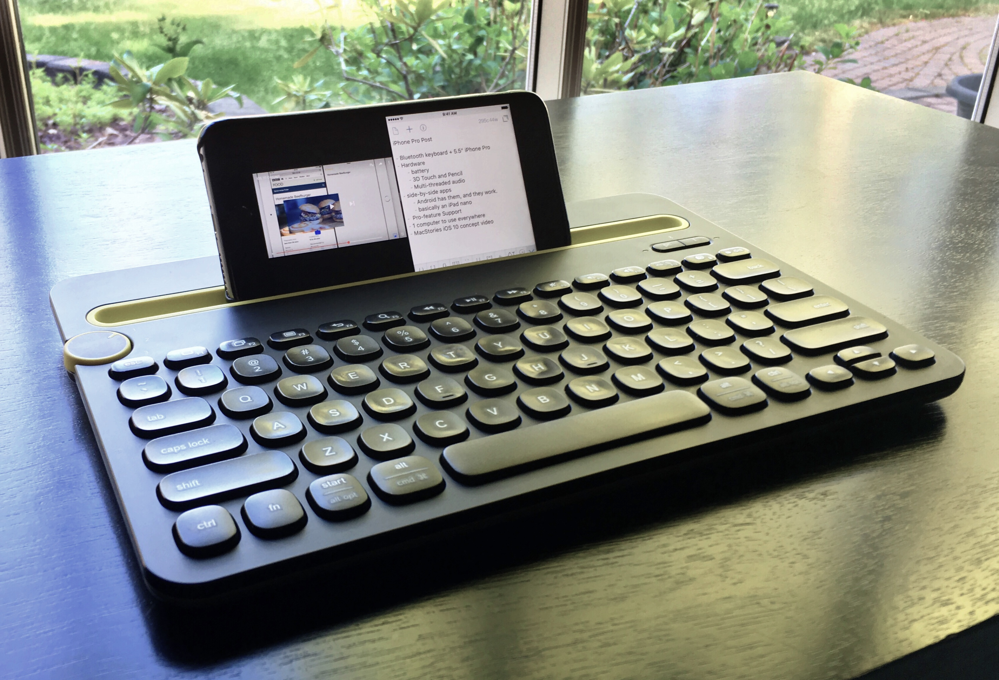

With the two major events coming up, [WWDC](https://developer.apple.com/wwdc/ "WWDC 2016") and the inevitable September event for the next iPhone(s), there are a lot of articles about the future of different devices, changes in the software coming with iOS 10, and how you can do real work on them.

This got me thinking about my own setup, and the things that I’d like for the future. My current setup is extremely simple, and some might even find it downright crazy. But it’s the best setup for a computer that I’ve ever used.

## My Setup

My setup consists of two things, and these two things only:

1. A [Logitech k480 Bluetooth Keyboard](http://www.amazon.com/dp/B00MUTWLW4/?tag=nahumck-20 "Logitech k480 on Amazon")
2. My iPhone 6s Plus

That’s it. I don’t use the MacBook Air that we own. I don’t use a PC except for work. I don’t use the iPad Mini we have either. This is my _only device_, and I’ve accomplished quite a bit with it.

Before you toss this idea aside, realize what I’ve done on my computer phone:

- Started my website, including the domain names and hosting
- Made two different themes for my site, while learning to code in HTML
- Written thousands of words in over 30 posts
- Converted a [post to an ePub](https://www.nahumck.me/move-your-thoughts-to-2do "Move Your Thoughts to 2Do") in under an hour[\[1\]](#fn-1 "see footnote")
- Created [my own journaling solution](https://www.nahumck.me/rolling-your-own "Rolling Your Own")
- Created and saved audio/songs
- Created logos using vector graphics
- Read more books in the past year than the prior three years
- Connected with friends and made some fantastic new friends

And I could list a ton of other things. All of this is made possible by the portability of the device and apps I’ve chosen to use, and I can’t imagine working any other way. Apps like [Workflow](https://geo.itunes.apple.com/us/app/workflow-powerful-automation/id915249334?at=1001l4VZ&ct=nahumck_me "Workflow: Powerful Automation Made Simple") and [Drafts](https://geo.itunes.apple.com/us/app/drafts-4-quickly-capture-notes/id905337691?at=1001l4VZ&ct=nahumck_me "Drafts 4 for iOS") have become so powerful that it’s easier for me to do my work on my phone, rather than a PC. And because the Mac feels like a better version of the PC, it is off-putting for me to use.

## iPads Pro

I know what you’re probably thinking: just get an iPad Pro with a Smart Keyboard.

There are two iPads with the Pro moniker available, which essentially are just two different screen sizes; I think I would get the 12.9" screen size if I had to choose, as that felt the most comfortable when I was recently in the Apple Store. At this point, it is essentially a portable laptop, and can do many of the functions thrown at it. It even has an advantage if you get the LTE version, because you can connect anywhere you get service and don’t have to worry about finding a place with wifi.

I can see that working on that size of a device is appealing. I can see where the extra screen real estate allows you to see more of what you are doing. Apps like [Ulysses](https://geo.itunes.apple.com/us/app/ulysses-mobile/id950335311?at=1001l4VZ&ct=nahumck_me "Ulysses Mobile") are better suited for split screen support; on one side you can have Ulysses, on the other Safari for researching.[\[2\]](#fn-2 "see footnote")

I might even be happier with two devices: a small portable phone, and a large screen iPad with everything else. I can envision a future with a 4“ iPhone, a larger Apple Watch, and a 12.9” iPad Pro.[\[3\]](#fn-3 "see footnote")

This really has me thinking of what I want versus what I need for the future of my devices. Sure, having multiple devices is great; but I think that for me the only benefit would be the larger screen size, and it is really hard for me to justify spending that much money when it’s not needed.

## iPhone Pro

What I really want to see from Apple is an “iPhone Pro”. No more numbers. This would help differentiate the product line, and simplify the name. It is done today with the Mac line, and I see no reason to make the iPhone any different, other than people’s own vanity about owning the latest-and-greatest device as a status symbol.

This needs to be a powerful device and be given some of the Pro-level features given to the iPads of the same designation. Essentially, I want this to be an iPad Pro nano.

The new hardware, together with software features from iOS 10 — and even some available from iOS 9 on iPads today — would give me the Pro-level features in an always-with-me device.

### Hardware

The iPhone Pro should get the same processor given to the iPads, but certainly would be a clocked-down version. It doesn’t need to be as quite powerful because of the screen real estate being much smaller; but what this would do is give the iPhone Pro the proper processing power to push auxiliary things, like a USB microphone for podcasting when multi-threaded audio is inevitably introduced. How great would it be to hear an episode of [Canvas](http://relay.fm/canvas "Canvas on Relay FM") that was fully recorded through an iPhone?

Another thing I would like to see is a thicker phone: not by much, but enough to put a larger battery inside. It could even get thicker by the camera bump to make it a flush back again. I’m a pro user, and I do a lot with my device. On the days where I do a lot of writing, I usually have to charge my 6s Plus because of the Bluetooth keyboard usage. More battery can only help me, and I’m positive I would get used to the weight. I came to the Plus-sized phone from a 5c, and it was comfortable in about a day.

Many iPhone SE users say that they don’t miss 3D Touch, but I use it daily: I use it to launch apps, preview links, and I use the 3D Touch trackpad gestures for navigating around anything with a text field. It has become second nature to me, and now the it’s muscle memory, I don’t want to see that go away.

These are relatively small improvements to make, but making them would yield a better class device, and enable the software improvements that would make this Pro phone great.

### Software - iOS 10

I can confidently say that I want everything that was in the MacStories [iOS 10 Wishes post](https://www.macstories.net/stories/ios-10-wishes/ "iOS 10: Wishes - MacStories"). And I want to have all of the iPad features come to the iPhone Pro. If you haven’t seen the video from that post, here it is:

<iframe width="853" height="480" src="https://www.youtube.com/embed/J2VcbT4Pgdk?rel=0" frameborder="0" allowfullscreen></iframe>

One of the biggest overall sweeping software changes I would like to see is landscape layout for all apps. There are many apps that support this, but not yet all; Music.app would greatly benefit on iOS from a landscape option. Another of my favorite apps, [Slack](https://geo.itunes.apple.com/us/app/slack-team-communication/id618783545?at=1001l4VZ&ct=nahumck_me "Slack for iOS"), does not yet support landscape mode on the iPhone: having to constantly rotate the device when the technical support (via auto layout) is available is maddening.

#### Split Screen Apps

Despite what others have said, the 5.5" screen is plenty big enough to have side-by-side app support. Don’t think of it as split screen on an iPhone Plus, but rather split screen on an iPad Nano. Android has this feature, and I think this could be done eloquently. I do understand that a small screen would not be ideal when using the software keyboard in split screen, but using an external keyboard allows the full screen to be utilized.

There are so many times that I want to have two things side-by-side just to review them. If I’m reading a book, which I do almost exclusively on my iPhone, if I ever want to take notes on a book, I have to either use the 3D Touch gesture to switch apps, or double press the home button to go back. With the drag-n-drop copy/paste concept shown in the MacStories concept, this would be an awesome productivity addition.

This would be even better than picture-in-picture, where I think the 5.5" screen is too small. I know that YouTube has their own way of doing it in portrait mode on iOS, but to really see a video, I believe it would be better in split screen mode.

#### Improved Bluetooth Keyboard Support

I would really love to see the iPhone Pro get the same support for Bluetooth keyboards as the entire iPad line. Currently, I can’t hold down the ⌘ key and get a menu of available keyboard shortcuts. An iPhone Pro would need to be a first-class citizen from a software perspective. Apps like [Drafts](https://geo.itunes.apple.com/us/app/drafts-4-quickly-capture-notes/id905337691?at=1001l4VZ&ct=nahumck_me "Drafts 4 for iOS") get this right for the iPhone, but I want to see it happen across Apple’s own apps and be made available to all apps where it makes sense.

Having the Bluetooth keyboard is great. I don’t always need to use it when I’m out and an idea quickly hits me. But when I want to get serious about my writing, I can use it with my phone and just start typing. It effectively makes this device a small iPad.

#### Apple Pencil Support

Apple Pencil Support. I’m not sure how much I would use this, but I think this would be a welcome addition to a lot of people. I can think of document signing, quick sketches in an app like [Paper by FiftyThree](https://geo.itunes.apple.com/us/app/paper-by-fiftythree-sketch/id506003812?at=1001l4VZ&ct=nahumck_me "Paper by FiftyThree"), image editing in [Pixelmator](https://geo.itunes.apple.com/us/app/pixelmator/id924695435?at=1001l4VZ&ct=nahumck_me "Pixelmator for iOS"), or even adult coloring apps like [Pigment](https://geo.itunes.apple.com/us/app/pigment-only-true-adult-coloring/id1062006344?at=1001l4VZ&ct=nahumck_me "Pigment") all while on the go. I can even envision a line of iPhone Pro cases that would fit an Apple Pencil in them for easy carrying.[\[4\]](#fn-4 "see footnote")

Ok, after writing all of the possibilities of what Apple Pencil support could bring, I want it now…

## iPhone Only

Am I crazy to want this? Probably. But I run my site with it. I can take it anywhere. I can type a lot with the keyboard, but I can also just use voice dictation, the software keyboard, or even something like [Gboard](https://geo.itunes.apple.com/us/app/gboard-search.-gifs.-emojis/id1091700242?at=1001l4VZ&ct=nahumck_me "Gboard"). Am I limiting my multitasking ability due to a smaller screen than an iPad? Yes, but in my experience, it hasn’t been an issue. Does it look dumb? Yes. I’ve used my current setup at work, and had more than a few strange looks sent my way. But I’ve also shown people what is possible today, and they are amazed.

So why run iPhone only? Well, frankly, I’ve been doing just that for well over a year; I’ve increased my productivity by simply adding the external keyboard. The only time I touch a computer is when [my cousin](http://goldroom.la) drops a new mix that isn’t available on [Apple Music](http://apple.com/music "Apple Music") or [Spotify](https://geo.itunes.apple.com/us/app/spotify-music/id324684580?at=1001l4VZ&ct=nahumck_me "Spotify"), or if my wife has a problem that she’s encountered and can’t fix. But those instances are far and few between.[\[5\]](#fn-5 "see footnote")

Additionally, my wife and I have made a conscious decision to be better about how/when we spend our money over the past few years. We have often put off purchases to make sure our future is ok. We’ve had [surprises in the past](https://www.nahumck.me/out-of-the-fog "Out of the Fog"), and they have caused strain that we as a family don’t want to have to worry about again.

Being conscious of these things means not getting shiny new toys every year or every few years. But with the advent of the [iPhone Upgrade Program](http://www.apple.com/shop/iphone/iphone-upgrade-program "iPhone Upgrade Program"), this means I can get the latest-and-greatest iPhone every year if I choose. Being iPhone-only I’m only locked in to _one_ device, not trying to manage two, and save myself hundreds or thousands of dollars in the process.

I’m a mechanical engineer in my day job, and I don’t run a business as part of my writing, so I can’t count a second device as a business expense and use it as a tax write-off. I don’t get to have some of the benefits that other writers do when it comes to multiple devices. There are limits, and I have to be an adult and live within them.

And here’s the other part of it: I get as much or more done all on my phone than most people do on multiple devices.[\[6\]](#fn-6 "see footnote") It still surprises me the things I am capable of doing - I _can_ and _do_ get real work done on my iPhone. It is my only personal computer, ultra-portable, and incredibly powerful.

To date, the iPhone 6s Plus has been the best computer I’ve ever owned. It travels with me everywhere and allows me to be incredibly productive with everything in my life. Enhancing that experience, adding improvements to the usability of the software, and adding some Pro-level features would make the best computer even better.

When it comes to cameras, they say that the best one is the one you have with you; I think that the same can be said of my computer.

* * *

_

This post was 100% made on iPhone using the following apps:

- [Drafts](https://geo.itunes.apple.com/us/app/drafts-4-quickly-capture-notes/id905337691?at=1001l4VZ&ct=nahumck_me)
- [Longscreen](https://geo.itunes.apple.com/us/app/longscreen/id913571256?at=1001l4VZ&ct=nahumck_me)
- [Pixelmator for iOS](https://geo.itunes.apple.com/us/app/pixelmator/id924695435?at=1001l4VZ&ct=nahumck_me)
- [Ulysses for iOS](https://geo.itunes.apple.com/us/app/ulysses-mobile/id950335311?at=1001l4VZ&ct=nahumck_me)
- [Workflow](https://geo.itunes.apple.com/us/app/workflow-powerful-automation/id915249334?at=1001l4VZ&ct=nahumck_me)

_

* * *

2. Not an exaggeration. Ulysses is an incredible app. It took time to format it to Markdown XL. The ePub creation took seconds. [ ↩](#fnref-1 "return to article")

4. I would love to see the team at Ulysses add a Safari View Controller in their side bar. This would allow it to be out of view, but when you need to do research, you wouldn’t need to leave the app. Having a search field that kicks it off would be perfect. [ ↩](#fnref-2 "return to article")

6. Now if someone just wants to pass me that spare $2,000, please… [ ↩](#fnref-3 "return to article")

8. Trademark Tim Nahumck 2016 [ ↩](#fnref-4 "return to article")

10. I would really welcome a change in Apple Music to allow for an upload of music and match it, much like you can on the desktop, even if that requires that you pay for iTunes Match for the year. [ ↩](#fnref-5 "return to article")

12. And it’s not even a “Pro” label. [ ↩](#fnref-6 "return to article")
