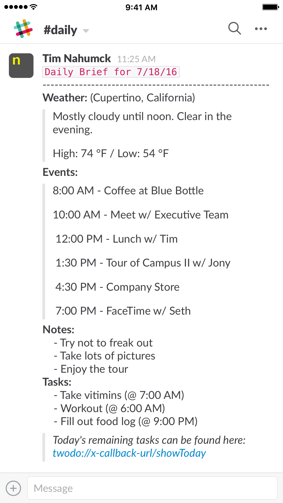

[Slack](https://geo.itunes.apple.com/us/app/slack-team-communication/id618783545?at=1001l4VZ&ct=nahumck_me) has recently become a focal point of my daily interaction: I have many friends who use the service, most of which I’ve never met in real life. It’s been a valuable personal communication tool with them, and I’ve appreciated every second of the time with most of the groups I’ve joined.

But while Slack touts it as “Team Communication”, it also has become a great tool in becoming my [personal information center](http://sethclifford.me/2015/09/using-slack-as-a-personal-information-center/). I get information from many sources through Slack. There have been several apps that I’ve just flat-out replaced by using Slack with other integrations. Things like RSS readers, daily weather alerts, and even notifications of new Drafts actions are all piped in to various channels in my personal Slack group.[\[1\]](#fn-1 "see footnote")

My friend [Seth](http://sethclifford.me) and I were conversing about how we could use Slack more in this way. What information could we have delivered to us? What could we include that would eliminate a need for this? Productivity is always a discussion that needs to be [revisited](https://overcast.fm/+BZhztAgc/39:10), but you need to have a discussion about why you need something, if it can be thrifted from your daily life, or if you can make it better.

Seth came up with a [brilliant idea](http://sethclifford.me/2016/07/an-update-on-how-im-using-my-private-slack-team): What if we could take several things — calendar, tasks, and notes — and combine them into one note into a specific channel, and that’s the _first_ thing we look at in the morning. This would be run before settling in for bed, so that you can capture those last minute thoughts before passing out sleeping.

And with so many things that Seth and I talk about, it sparked some thoughts of how this could happen. After a little bit of time, I had a general concept of what I call “The Daily”.

### The Daily

So the concept behind this is simple: get bits of information from different sources — a note taking app, calendar(s), and our task management system(s) — and pipe them into one spot. For me, everything starts in [Drafts](https://geo.itunes.apple.com/us/app/drafts-4-quickly-capture-notes/id905337691?at=1001l4VZ&ct=nahumck_me), I use [2Do](https://geo.itunes.apple.com/us/app/2do/id303656546?at=1001l4VZ&ct=nahumck_me) as my task management app of choice, and I wanted to send everything into a “#daily” channel in Slack.

Because I start [the note](https://www.nahumck.me/how-to-apply-the-note) in Drafts, I can simply take that text and pass it to [Workflow](https://geo.itunes.apple.com/us/app/workflow-powerful-automation/id915249334?at=1001l4VZ&ct=nahumck_me); it can grab all of the information I need from the various inputs and place it into one easy text block that I can format to my liking. One of the benefits to using Slack for this purpose is that I can use the Markdown-like format to highlight text in different ways, allowing me to view sections.

In addition to the information in The Daily, I wanted to also have the daily weather for the next day in the same channel. Using IFTTT, there is a simple recipe to pipe in a daily alert for the tomorrow’s forecast. One problem that I encountered with this, however, is when I am not at home and traveling; the recipe is for a specific place, and doesn’t update. To solve this, I took the [Forecast.io API](https://developer.forecast.io/), and used that to add tomorrow’s weather forecast to my report.

I’m not going to get technical about all the specifics of “The Daily” workflow, but I’ve put comments everywhere I could think of within it to guide you.[\[2\]](#fn-2 "see footnote") It’s very complex, and too complex to go through the “how and why” in a post; if you want to know how/why, it’s all in the workflow. I’ve also created them as separate workflows: one that contains the weather, and one that has everything else. All of these workflows can be found in the [Workflow Appendix](https://www.nahumck.me/the-daily/#workflow-appendix) section below.[\[3\]](#fn-3 "see footnote")

But the combined workflow does a great job at aggregating all of this information in one spot so that I can see what’s ahead for my day, all in one convenient spot. And really, it’s not about the how, it’s about the _why_.

Having one place to go to for information is difficult in the Age of Apps. Widgets are great for glanceable information, but that’s still multiple sources for looking at things. It’s like getting a news report about your day in the morning: “Here’s what’s happening in your neck of the woods. Now here’s Tim with the weather!”

It’s been really fantastic to use this at night, and view it all in one place in the morning. I can see my day ahead without having to go multiple places. I’m not trying to clear all of the badges from my phone. I don’t have to go to multiple apps and waste time. I’m not tempted to peruse Twitter to see what I missed. I can get this information about my day, and head out to face it.

If Siri is the digital assistant for my phone, think of my personal Slack as the assistant for _my_ portion of the internet. Like with any assistant, I need to be able to direct them to get the information I want in the manner in which I want to see it. I get notified of the information I find important, interesting, and in some cases vital to what I’m doing.

I love the direction that this is heading, and I’m finding new use cases for Slack. It is slowly but surely becoming one of the most powerful apps on my phone.

* * *

### Workflow Appendix

- [The Daily](https://workflow.is/workflows/ea41736317e04a03808118c470f58693) - Full Version w/ tasks (for 2Do users)
- [The Daily](https://workflow.is/workflows/25e6732c3eb5463cb5f43dd40ec82b7c) - Full version, URL to tasks
- [The Daily](https://workflow.is/workflows/21f96903f087421294342a09e635781b) - no weather w/ tasks (for 2Do users)
- [The Daily](https://workflow.is/workflows/7820b1e043444b83bc34c8e411fb14ab) - no weather, URL to tasks
- [Tomorrow’s Weather](https://workflow.is/workflows/f883989919a64d1ba5cf83fb222a2acc) - only the weather

* * *

1. Slack party, channel for 1. [ ↩](#fnref-1 "return to article")
2. If you do have questions, shoot me an [email](mailto:tim@nahumck.me). [ ↩](#fnref-2 "return to article")
3. A note to non–2Do users: I have created two workflow below that does not include the steps in getting tasks from 2Do, and provides only the URL block to paste into your note for the day. From what I have read, there isn’t another app that allows for the task export in the same manner. Additionally, if you use more than one system, the step will allow you to add more than one URL to add for your daily report. [ ↩](#fnref-3 "return to article")
