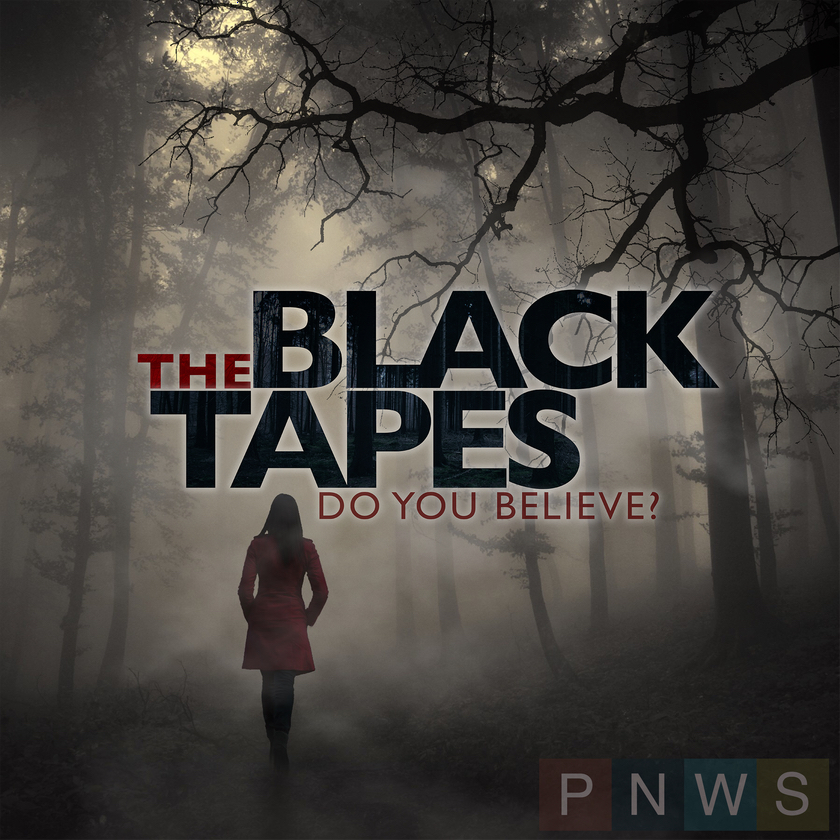

## Science Vs

I really like the [Reply All](https://gimletmedia.com/show/reply-all/episodes/ "Reply All from Gimlet Media") podcast from [Gimlet Media](https://gimletmedia.com/ "Gimlet Media"). If you haven't listened to that show, make sure you go listen to it. At the end of episode #71, they had a preview of the second season of a podcast I had never heard of, [Science Vs](https://gimletmedia.com/show/science-vs/episodes/ "Science Vs from Gimlet Media") I listened to the preview, which was the first half of the "Fracking" episode, and I was hooked.

Hosted by [Wendy Zuckerman](https://twitter.com/wendyzuk "Wendy Zuckerman on Twitter"), the whole idea of this show is to take a topic, break down the key points, and scientifically back-up or refute the validity of said points. The topics range from fracking to diets to medical marijuana. In the latest episode and first in a two-part series titled "Guns", she tackles a fiercely debated topic dealing with guns in America. It points out where some of the groups that use statistics get it wrong, and shines some light on how some of these figures get collected. The difference the podcast brings to the debate is that it's not from a passionate point of view, but rather a scientific one to help understand what is really going on. Is it a problem? Is it a problem with incorrect statements of fact?[1](#fn1) I'm really looking forward to part two.

A nice touch in the beginning of the episode: she gives the telephone numbers for two suicide prevention and crisis hotlines, and even more in the show notes. This is a touch of class that I have not experienced while hearing another podcast, and given the subject matter, was the _perfect_ way to start the show. Bravo, Wendy.

I'm happy that Reply All featured a segment, and I'm going back now to binge-listen to [season one](https://itun.es/us/WGbG7.c "Science Vs - Season 1 by ABC Radio and Wendy Zukerman"). I highly recommend you do the same.

[_Science Vs on iTunes_](https://itun.es/us/iYxR-.c "Science Vs - New Season by Gimlet")

[_Reply All on iTunes_](https://itun.es/us/__fj4.c "Reply All by Gimlet")

## The Black Tapes

I don't remember how I heard of [The Black Tapes](http://theblacktapespodcast.com/ "The Black Tapes Podcast"), but ever since listening to the first few episodes, I've been enjoying this serialized docudrama. The show features Alex Reagan sharing her journey, along with her producer Nick and the focal point of the show, Dr. Richard Strand, through a complex web of a story. The show deals with the "Black Tapes", a series of tapes that cannot be scientifically explained. It covers elements of the supernatural, demons, the occult, and other topics; some of the are downright terrifying, and often makes me thankful this is an audio-only show.

I should state now that this is not a show for kids, or even listening to it with kids in the car. It can be more intense than other docudrama podcasts, with the background soundtrack adding effects that can make you feel a bit uneasy (but adds to the ambiance of the show). The story starts from the first episode, so if you want to get into the show, you really do need to start with episode one. I've really enjoyed this podcast, and if you enjoy [Lore](http://www.lorepodcast.com/ "Lore Podcast"), I would definitely give it a shot.

[_The Black Tapes on iTunes_](https://itun.es/us/n3pD7.c "The Black Tapes by Pacific Northwest Stories")

[_Lore on iTunes_](https://itun.es/us/aD-s6.c "Lore by Aaron Mahnke")

1. I've often hear this statistic: "90% of all statistics are false." [↩](#ffn1)
