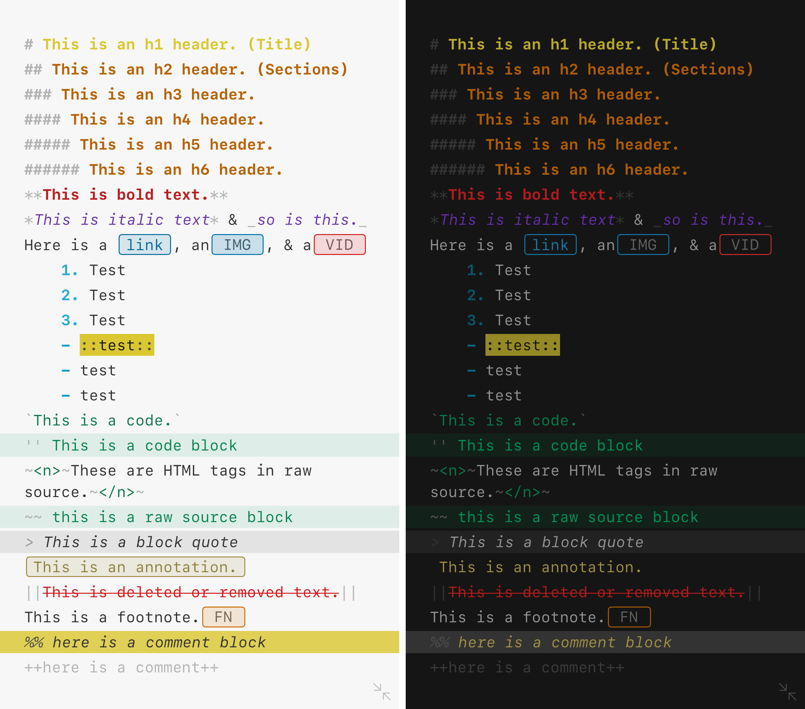
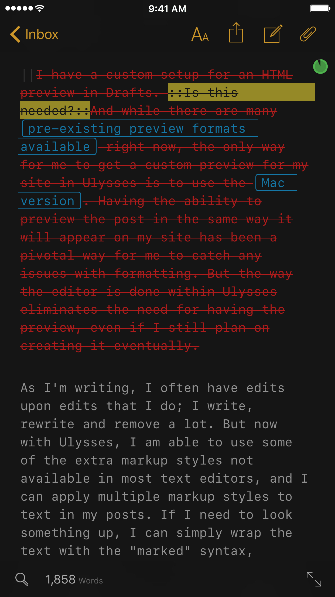

I often can get stuck in my ways. I might find something I really like, and use it until it breaks. And then I'll go get the same thing to replace it. The exception is apps: I like trying things, even if I only end up back where I began. And when I find a great app, it usually makes me want to use it often.

For a long time now, I've used [Drafts](https://geo.itunes.apple.com/us/app/drafts-4-quickly-capture-notes/id905337691?mt=8&uo=4&at=1001l4VZ&ct=nahumckme "Drafts on the App Store") for all of my writing. I absolutely **love** Drafts: I've written about my love for it and the amazing things it can do [multiple times](https://www.nahumck.me/tag/drafts/ "nahumck.me - Drafts posts") over. I write and process posts through Drafts, using a combination of keys, actions, and [Workflow](https://geo.itunes.apple.com/us/app/workflow-powerful-automation/id915249334?mt=8&uo=4&at=1001l4VZ&ct=nahumckme "Workflow on the App Store") to get them published. If my dreams come true for the [next big version of Drafts](https://www.nahumck.me/drafts-5-0-a-wish-list/ "nahumck.me - Drafts 5.0: A Wish List"), it will further cement it as the single app on iOS that I can't live without.

There are three main ways that I use Drafts on a regular basis (for writing):

1. short snippets of text that I need to transform into something else in another app
2. my daily [journal](https://www.nahumck.me/rolling-your-own/ "nahumck.mr - Rolling Your Own") entries (typically short)
3. my website (usually too long)

The first two are made easier with Drafts, due to the custom workflows I have set up to make them happen. But having a dedicated app to concentrate on my website, where I don't get distracted — by notes, calendar entries and tasks that reside in Drafts before they are sent elsewhere — is extremely appealing to allow me to write in a more focused manner.

So in the year of great writing apps, and my own interests with [trials and experiments](https://www.nahumck.me/trials-and-experiments "nahumck.me - Trials and Experiments"), I began feeling like maybe I should sit down and really give some dedicated apps a shot. Am I using the right tool for the job? Are there things that I'm missing or could improve upon by not trying something different, something new?

### Byword

I first went back to [Byword](https://geo.itunes.apple.com/us/app/byword/id482063361?mt=8&uo=4&at=1001l4VZ&ct=nahumckme "Byword on the App Store") to see if I could start with something simple. Byword has a great, simple interface and is a traditional Markdown editor. The direct publishing from within the app is pretty great. But for me, the experience is about the same as Drafts, and I don't want to add an app into my workflow unless it's going to make things better for me.

### Editorial

I've used [Editorial](https://geo.itunes.apple.com/us/app/editorial/id673907758?mt=8&uo=4&at=1001l4VZ&ct=nahumckme "Editorial on the App Store") quite a bit in the past. It's a solid text editor that not only uses Markdown, but also TaskPaper and other formats; the editor itself is much like Byword, but with the addition of folding and arranging headers. It has a very powerful automation component, powered by Python, which can do some amazing things if you know what you're doing. It integrates well with Dropbox, which is something that I like to have so that I can keep my files all in one place.

But the development of the app has been stagnant. [Pythonista](https://geo.itunes.apple.com/us/app/pythonista-3/id1085978097?mt=8&uo=4&at=1001l4VZ&ct=nahumckme "Pythonista on the App Store") is the app that makes the developer money, so justifying development time on an app that isn't going to make you money is something that few app developers will ever do, let alone with great frequency. If an app isn't moving forward and progressing, I can't stick with it and be left behind.

### Scrivener

[Scrivener for macOS](https://geo.itunes.apple.com/us/app/scrivener/id418889511?mt=12&uo=4&at=1001l4VZ&ct=nahumckme "Scrivener on the Mac App Store ") has been around for a long time, and users of the app have wanted it to come to iOS for years. Now that it's finally available for [iOS](https://geo.itunes.apple.com/us/app/scrivener/id972387337?mt=8&uo=4&at=1001l4VZ&ct=nahumckme "Scrivener on the App Store"), I wanted to see what the feature set was like.

It didn't take me long to realize that while Scrivener looks to be an amazing app, it wasn't going to work for me. I am spoiled by Markdown: composing anything in a [Markdown format](http://daringfireball.net/projects/markdown/ "Daring Fireball - Markdown") has become second nature to me. And while I'm willing to try new things, changing from that markup style isn't one of them. That said, if you're penning a lot of books, screenplays, etc., — it looks to be a solid app for you.[1](#fn1)

### Ulysses

I had previously purchased [Ulysses for iOS](https://geo.itunes.apple.com/us/app/ulysses/id950335311?mt=8&uo=4&at=1001l4VZ&ct=nahumckme "Ulysses on the App Store") to do one thing: make an ePub for my post on [moving over to](https://www.nahumck.me/move-your-thoughts-to-2do "nahumck.me - Move Your Thoughts to 2Do") [2Do](https://geo.itunes.apple.com/us/app/2do/id303656546?mt=8&uo=4&at=1001l4VZ&ct=nahumckme "2Do on the App Store"). I was astonished at how well it worked, especially when it was all from my iPhone; I created an ePub in an hour. But aside from that, I had never really spent any amount of in-depth time making it my only long-form text editor.

I'm very used to posting from Drafts via Workflow to my WordPress site. There are times that I will need to make changes to the formatting, so I had to make [a workflow](https://workflow.is/workflows/b7d5805192534d809fb37d0a457e83ba "Workflow - Ulysses → Drafts") to send the text to Drafts.[2](#fn2) But I have yet to do that again in practice, thanks to how well the direct integration of publishing to WordPress has worked for me.

The customization of the editor and the export formats is where Ulysses really does shine over other apps that I've used. The clarity it allows is simply amazing, and is something that I will hold other apps to when new ones inevitably come along. You can change fonts, colors, line spacing, etc. in the editor for a fully customizable experience to make the writing environment comfortable for _you_. The Markdown XL color syntax elements allow you see an element of your text as a formatted or special element, but do not really take away from reading like other traditional Markdown editors can.

There are existing [Ulysses themes](http://styles.ulyssesapp.com/tagged/Theme "Ulysses Style Exchange - Themes") and [other preset customizations](http://styles.ulyssesapp.com/ "Ulysses Style Exchange") that you can choose from, but if you have the [Mac version](https://geo.itunes.apple.com/us/app/ulysses/id623795237?mt=12&uo=4&at=1001l4VZ&ct=nahumckme "Ulysses on the Mac App Store"), you can create your own custom style. I spent some time with my MacBook Air Water, and after a little time and tweaking I was able to make my own [custom theme](http://styles.ulyssesapp.com/bundle/Drafts+5.0/57a1dbbb0d7f933124cbe659 "Drafts 5.0 Theme - Ulysses Style Exchange") based on my vision of a [Drafts 5.0 color syntax](https://www.nahumck.me/drafts-5-0-a-wish-list/ "nahumck.me - Drafts 5.0: A Wish List").[3](#fn3) Additionally, I was pointed to a post which allowed me to get [SF Mono](http://jschaible.com/sf-mono-font/ "SF Mono Font") as a font choice. The combination of the two has lead to the most visually stunning writing experience I've ever had, and actually makes me want to _write_. I really would love to see the ability to create the theme and other customization options come over to iOS, even down to my [iPad nano](https://www.nahumck.me/making-a-case-for-the-iphone-pro "nahumck.me - Making a Case for the iPhone Pro"), so that I don't have to touch the Mac at all. Hopefully The Soulmen will add this functionality as it continues to gain feature parity between macOS and iOS.

And just when I didn't think it could get better, [typewriter mode](http://www.ulyssesapp.com/press/releases/16-07-28-Ulysses-2.6-WordPress.pdf "Ulysses 2.6 Release Notes (PDF)") showed up in the Ulysses beta. I previously had written off the idea of a typewriter mode in apps; I thought that by having a changing focal point within an app, it would make for a worse experience. But I can tell you now that I was so very, very wrong. Having this mode has been incredibly helpful, and allows me to write words more fluidly than I ever have before. I can focus on the sentence, line, or paragraph I'm trying to write, rather than being distracted by everything within the entire sheet.

As I'm writing, I often have edits upon edits that I do; I write, rewrite and remove a lot. But now with Ulysses, I am able to use some of the extra markup styles not available in most text editors, and I can apply multiple markup styles to text in my posts. If I need to look something up, I can simply wrap the text with the "marked" syntax, denoted by `:: ::` . And later, if I decide that I don't want to include a section, I can use the "delete" markup `|| ||` ; this is nice because I can keep everything in the text, but it won't post that text upon export.

Another thing to love about Ulysses is the find/replace feature. It's more than just find and replace: think of it more like search and replace. The search (find) function of the app allows me to search to ensure that I'm not repeating too many instances of the same word. I have previously not had this option available to me on iOS, and I'm very grateful to have it to improve my posts going forward.[4](#fn4)

I do miss some of the custom shortcuts and ways that I can use the Safari View Controller to search for links that I have set up in Drafts. There is a way in Ulysses to search with text by selecting a word, pressing "Define", and then pressing "Search Web" in the bottom right corner; that will kick you to Safari and you can tap on the upper left corner to return to Ulysses. This is far from elegant or easily discoverable, and I'd like to see this improved, especially for users using smaller screens.

I'm starting to train my muscle memory to work better with Ulysses. For example, I had some difficulty getting the [external keyboard shortcut](http://media.the-soulmen.com/ulyssesapp/resources/blog/Ulysses%20for%20iOS%20Shortcuts.pdf "Ulysses Keyboard Shortcuts (PDF)") keys down. To help with this, I actually went and changed my Drafts keyboard shortcuts to be the same (as much as possible) as Ulysses. I'm still learning, still making mistakes, but using the same shortcuts in two places has been helping immensely.

And ultimately, it's been helping me do the one thing it was designed to help me with: write. I'm able to take my ideas and converge on what my message is going to be. I'm able to discern between what is important and what is not. I can write in sections, splitting a post (like this one) into smaller, focused chunks, and accomplish more in less time.

When I started this experiment, I only set out to try out another way, feeling like I'd end up back where I started. I thought I'd see how a dedicated app fares in my method and style of writing and determine that I was ok with what I had. But I wanted to give it a fair shot, before I completely discard it as something I don't need, free from the sway of prominent bloggers and tech influencers telling me what I should be using.

To my surprise and delight, I'm absolutely in love with Ulysses. It has transformed the way I'm approaching my writing. It's not replacing my journal or quick notes, but it is serving as the focal point for my site; I have more clarity, more enthusiasm, more determination, and I think I'm producing better results. And an app that does that is nothing short of _fantastic_.

_Ulysses is [available on the App Store for $24.99](https://geo.itunes.apple.com/us/app/ulysses/id950335311?mt=8&uo=4&at=1001l4VZ&ct=nahumckme "Ulysses on the App Store"), and well worth every penny._

1. I'm really excited to see what lies in store for Federico Viticci's review of iOS 10, which is going to be completely written in Scrivener. But even he has said it is not his go-to app for his normal posts. [↩](#ffn1)
2. It took me a while to realize that the export was a .zip file. Slightly annoying, but not insurmountable. [↩](#ffn2)
3. You can also download it [here](https://dl.dropbox.com/s/jz7f5ceqfe9uwf1/Drafts%205.0.ultheme?dl=0 "Drafts 5.0 Concept Theme") if you don't have Ulysses yet and want to make sure you can save it somewhere. [↩](#ffn3)
4. In one of my drafts for this post, I had the word "writing" in it 35 times. I got it down to around 10 by using this feature. [↩](#ffn4)
