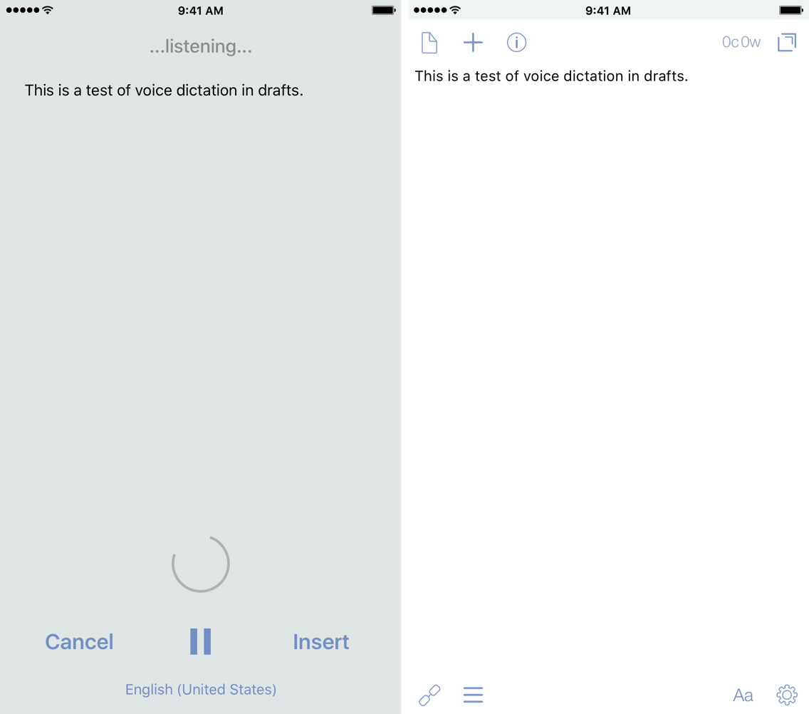

There are a lot of things during the day that I often need to remember. And most of the time, I'm trying to get things into my phone quickly without having to think too much about where it's going.

**_Enter Drafts_.**

[Drafts](#) is a wonderful tool for this kind of activity. I can simply enter the text using my fingers and thumbs. Starting ideas here has been the natural place for me for a long time now. And with the latest update, it's now made even easier with the dictation feature, thanks to the changes made in iOS 10. It takes cognition-to-completion, something I first heard from Merlin Mann on Back-to-Work, down to seconds to complete. All you have to do is 3D Touch the Drafts icon on your iPhone and start talking: it's as simple as that. You don't have to tap anything to make new draft or think where the icon is on your home screen – even though it should be in your dock – and then start typing into whatever keyboard you choose. You just press and talk.

We often use technology, even if it's pen and paper, to get the thoughts from our head to paper so we can remember it later. And now with modern technology – i.e. the smartphone or smartwatch – we can really shorten the time it takes to get these things out into our digital sheets.

Back in February, Gabe at [Macdrifer](http://macdrifter.com "Macdrifter.com") posted about [talking to his Apple Watch](http://www.macdrifter.com/2016/02/talking-to-my-watch.html "Macdrifter.com - Talking to My Watch"). In the post, he was able to dictate the entire thing while he walked to the grocery store. If I had an Apple Watch, I would be capturing things left, right, and center with my voice — likely to the annoyance of those around me. With the improvements in iOS 10, I can turn my iPhone into the same thing, but better.

When the first beta with this feature rolled out, there was a limitation of the capture time.[1](#fn1) But later in the betas, Greg was able to cleverly work around this limitation, and it's a **game changer.** The first time I tested it, I picked up my phone when leaving work, and just talked for 20 minutes while I captured the main portion of this post. I was able to use the pause button if I needed to stop and think of how I was going to say something. This eliminates the need for creating multiple drafts and allows me to have one continuous, fluid session. With that limitation removed, I can just talk to my dingus on the way home. With this feature, I can literally complete 90% of my posts on the way home, just by talking. I can use the time to be productive, fix small mistakes or add links later, and then get posts out.

If I spoke multiple languages, dictation entry in Drafts would be the best way to do it. The official dictation support — along with all of the new features of the release — can be found [here](http://agiletortoise.com/blog/2016/09/12/drafts-470/ "AgileTortoise - Drafts 4.7"). With the new multi-keyboard feature in iOS 10, it's limited to similar languages, like English and Italian. But with the dictation feature, _any_ language that is [supported by Siri](http://www.apple.com/ios/feature-availability/#siri "Feature Availability - Siri") works with dictation, so you can go from English to Russian to Italian to Mandarin and back again, pausing between each, all in one session without fully stopping.[2](#fn2)

Of course, Drafts wouldn't be complete without a custom key for dictation. This allows you to use a keyboard shortcut to start dictation on the Smart or a third-party external keyboard.[3](#fn3) Now even as I'm writing, I can simply activate the shortcut key and talk; it inserts the spoken text where I had my cursor. There are times that I might be cooking in the kitchen, and with this, I can hit the keyboard and just start talking while walking around, dictating my shopping list without stopping. Then I can send it along to [AnyList](https://geo.itunes.apple.com/us/app/anylist-grocery-shopping-list/id522167641?mt=8&uo=4&at=1001l4VZ&ct=nahumckme "AnyList on the App Store") with an action later.

If you've never used dictation, there are helpful things to know. Macworld has a [good article](http://www.macworld.com/article/2048196/beyond-siri-dictation-tricks-for-the-iphone-and-ipad.html "Macworld - Beyond Siri: Dictation tricks for the iPhone and iPad") — albeit from 2013, but it's still true — covering some key basics, including commands, that I have found to be incredibly useful:

> Speak punctuation and symbols: To include punctuation in your dictation, you need to say “comma,” “period,” “hyphen,” and so on.
> 
> You can say “new line” to dictate a return character, and “new paragraph” to add two returns. You say “apostrophe” for a possessive noun, such as “Jerry Garcia apostrophe S guitar,” for Jerry Garcia’s guitar.
> 
> When you want to capitalize a word, say “cap.” If you’re sending a message to someone about a movie preference, for example, you might say “I’d like to watch cap lord of the cap rings.”

Journal entries have been made way easier now. I've been using [Drafts for my journaling](https://www.nahumck.me/rolling-your-own/ "nahumck.me - Rolling Your Own"), and this takes it from typing to a (one-sided) conversation. The beauty of this is that it sounds more natural, more in line with how I speak, rather than me trying to perfect my words. I often just dictate the entry, save it, and move on without editing it (other than for any dictation errors). Slowly but surely, it's becoming second nature to me to start a new draft, insert the timestamp, and then start dictating the entry.

While I'm doing most of my long-form writing in [Ulysses](https://geo.itunes.apple.com/us/app/ulysses/id950335311?mt=8&uo=4&at=1001l4VZ&ct=nahumckme "Ulysses on the App Store") [these days](https://www.nahumck.me/something-different-something-new/ "nahumck.me - Something Different, Something New"), this really has me pining for using this feature in combination with things I think about for [Drafts 5](https://www.nahumck.me/drafts-5-0-a-wish-list/ "nahumck.me - Drafts 5.0: A Wish List"). The power of Drafts really shines here by cutting down the time it takes for me to get my thoughts out, and is so much better for idea generation. If I have an idea while driving or walking around the house, I can just simply pick up my phone, 3D Touch the Drafts icon, and start talking. This makes Drafts a very compelling [writing tool](https://www.nahumck.me/using-drafts-as-a-main-text-editor/ "nahumck.me - Using Drafts as a Main Text Editor"), now more than ever.

With this new feature in Drafts, it can turn my powerful pocket computer into a dedicated dictation dingus for me to get more thoughts out, things accomplished, and go about my day.

_Drafts is [available on the App Store for $4.99](#) — which is a steal at this price. You can even throw him a tip now too._

1. This is an Apple limitation. [↩](#ffn1)
2. Impressive. Most impressive. [↩](#ffn2)
3. Mine is `⌘ + /` , which is a part of the "?" key. [↩](#ffn3)
