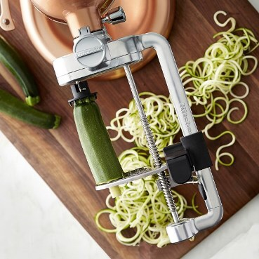
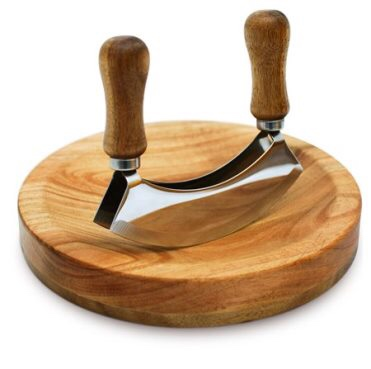
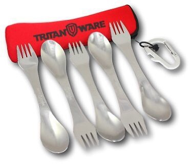

Here'a some kitchen things that have piqued my interest:  

## Kitchen Aid Spiralizer

I received the [KitchenAid Spiralizer](http://www.amazon.com/dp/B00XPRRHYW/?tag=nahumck-20 "Amazon.com - KitchenAid Spiralizer") as a gift from my wife. I do enjoy cooking because it's therapeutic most of the time. I'm also a sucker for good pasta,[1](#fn1) so getting me something that helps me make pasta _alternatives_ is amazing.

One of the best meals I've made in a long time has been chicken zucchini pesto. It's a simple, healthy recipe; I had been attempting to make zucchini noodles by hand (with a peeler and a knife), and things turned out mostly ok.

But now that I'm using the spiralizer attachment, I do not know how I survived without it. What used to take me 45+ minutes to do by hand now takes 10 minutes, including cleanup, with this tool. It's an attachment for our KitchenAid mixer, which does all the hard work.[2](#fn2)

This is easily my favorite thing I've had in the kitchen in a long time, and makes me want to create new things all the time. Easy set-up, easy clean-up, easy dinner - and healthier living.

## Mezzaluna Knife

I gifted this [Mezzaluna Knife](http://www.amazon.com/dp/B01EOWP18U/?tag=nahumck-20 "Amazon.com - Mezzaluna Chopper") to my wife.[3](#fn3) Cutting up fresh herbs can be a \[literal\] pain, but this makes that process easier. We tend to do a lot with fresh herbs, and although I could use a knife and cutting board, anything to make my work easier — and safer — in the kitchen is better for me.

## Tritanware - Camping Silverware

I usually pack food for work. Which means I go through a lot of plasticware during the week. After a few times of eating what I normally eat for breakfast (see below) and breaking my fork/spoon in it, I needed to look for something better.

This [camping silverware](http://www.amazon.com/dp/B01C3JR6FW/?tag=nahumck-20 "Amazon.com - Tritanware Stainless Steel Set") is a combination fork, knife, and spoon all-in-one. They come in a nice carry case with carabiner in set of five - one for every day of the work week - and are machine washable. I can also use them while camping, which means they get a dual purpose. They've been outstanding for what I need. I also feel better that I'm not contributing more to the garbage pile, and that's enough for me.

* * *

## Recipes

Like I said above, this dish is great. I've been able to tweak it for how I like it. You can download a printable version [here](https://dl.dropbox.com/s/3hk08g8dc7oo2yn/Chicken%20Zucchini%20Pesto.pdf?dl=0 "Chicken Zucchini Pesto").

## Chicken Zucchini Pesto

**Ingredients**

- 6 zucchini (medium sized)
- 1-2 lbs chicken breast
- 4oz basil
- 4oz spinach
- 4oz arugula
- 1/2 cup pine nuts
- 1/2 - 1 cup olive oil
- 1/2 cup nutritional yeast
- salt and pepper to taste
- water

**Directions**

1. Use the spiralizer to make the zucchini noodles. Set aside.
2. Cook the chicken in olive oil, season with salt and pepper. Cut up into strips or cubes; set aside.
3. Make the pesto by combining the basil, spinach, arugula, nutritional yeast, and olive oil into a blender until smooth. Salt & pepper to taste. _Note: This makes a lot of pesto, which is good for leftovers_
4. Place 1 tbsp of olive oil in a pan on medium heat. Add zucchini and cook for 1-2 min, stirring occasionally. Add 1/4 - 1/3 (depending on portion) of water, and cook for an additional 6-8 min, until the desired firmness is achieved to be like pasta.
5. Add chicken and the desired amount of pesto to the meal, stir until warmed, and serve.

This is completely dairy free, and is amazingly filling.

  

* * *

For those that want the recipe for my breakfast, I got the inspiration from a recipe I found online and tweaked it. Hope you enjoy it. You can download a printable version [here](https://dl.dropbox.com/s/1iuhwq5rpcx6cpu/Breakfast%20To-Go.pdf?dl=0 "Recipe - Breakfast To-Go").

## Breakfast To-Go

**Ingredients**

- 1 container of liquid egg whites (or 9 eggs)
- 2 packages of uncooked turkey breakfast sausage patties, total of 24 patties
- small amount of shredded cheese of choice
- salt and pepper to taste

**Directions**

1. I start off by using 12 [4-oz mason jars](http://www.amazon.com/dp/B00B80TK2K/?tag=nahumck-20 "Amazon.com - Ball Jars - 4 oz, Set of 12") in a 9 x 13 baking pan (to avoid spillage in the oven).
2. Place 2 patties in each container. Use your fingers to line the jar with the patties, making a spot for the egg to fit.
3. If you want to add cheese, add just a pinch to each one. You can also add a slice of mushroom, or a pinch of chives, or whatever else you'd like.
4. Evenly distribute the eggs, leaving about 1/4" from the top. If you are using the eggs, beat them together first.
5. Cover the entire baking pan with aluminum foil and put in the oven for 55 min at 375ºF.
6. Let them cool down and put the lid on each one. These can be refrigerated and/or frozen.
7. When you heat them up in the microwave, be sure to heat them all the way through with the lid off.

For how I make this recipe, it's about 120 calories or so, and it's the perfect amount to go with my coffee.

  

1. Pasta is my spirit animal. [↩](#ffn1)
2. If you don't have a mixer, The Pampered Chef makes this [standalone version](http://www.amazon.com/dp/B01LBPV1UU/?tag=nahumck-20 "Amazon.com - The Pampered Chef Veggie Spiralizer") of something similar. [↩](#ffn2)
3. The sixth anniversary is iron or wood, so I got both. [↩](#ffn3)
