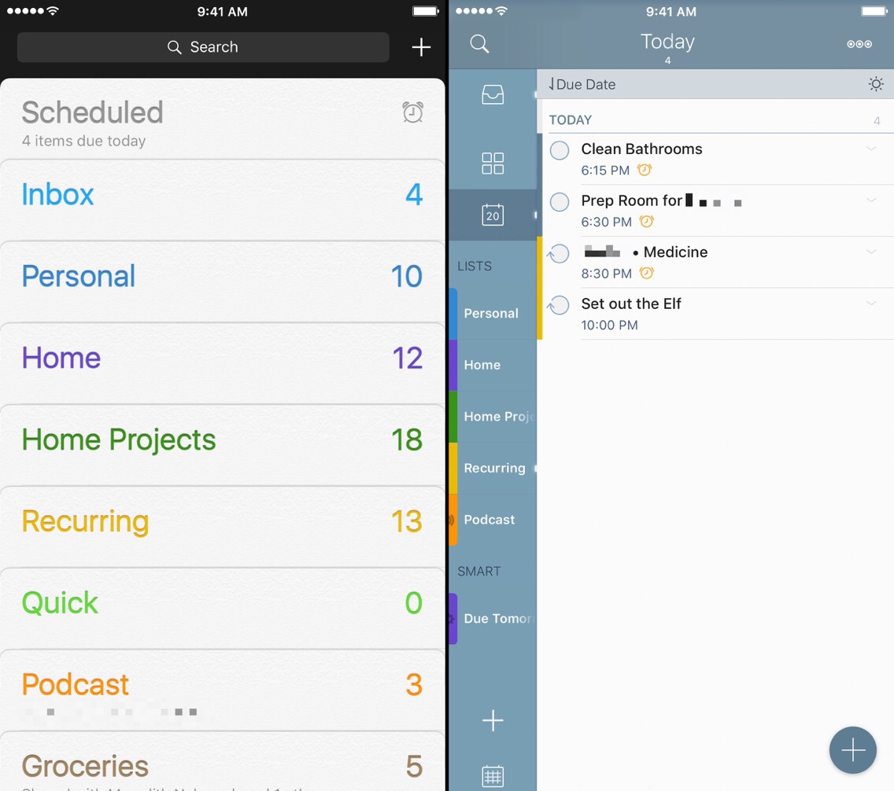
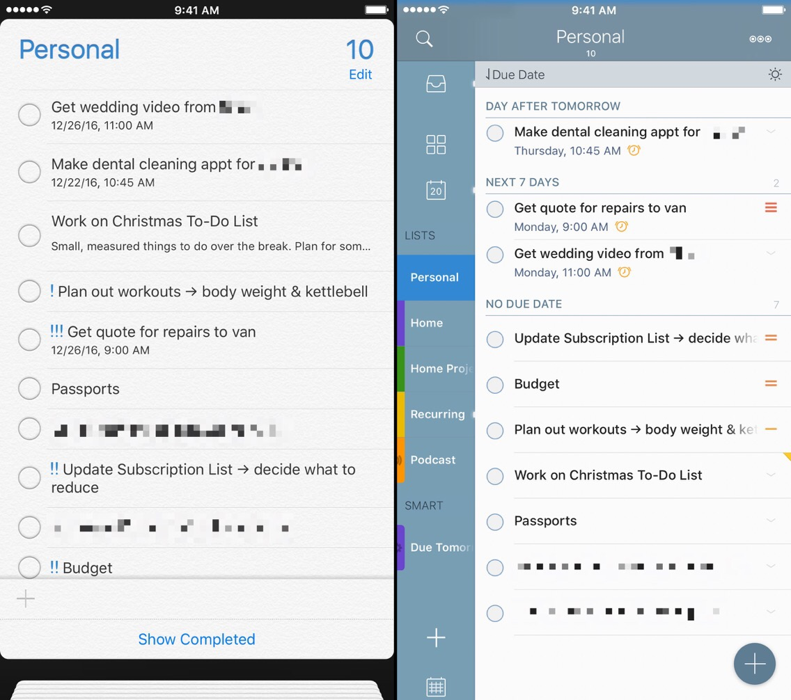

This summer opened my eyes to trying new things with task management. I had a great, wonderful system, [and then split it in two](https://www.nahumck.me/bifurcation "Bifurcation - nahumck.me"). Then I [tried Reminders instead](https://www.nahumck.me/basic "Basic - nahumck.me"), and loved it even more when I got my Apple Watch. And life as I knew it was going along just fine. Until something just felt off.

I couldn't put my finger on it. I was accomplishing what I needed, and there wasn't really a hole in my system. Life had just gone from chaotic to simplistic. And maybe that's why things felt wrong. I can't explain why, but it just didn't feel right anymore. I'm sure it's a bit of a sickness, but I have come to realize I need to have some complexity in my life.

So I started thinking of what to do next. Did I need to try a new system? I've tried [OmniFocus](https://geo.itunes.apple.com/us/app/omnifocus-2/id904071710?mt=8&uo=4&at=1001l4VZ&ct=ntwitter "OmniFocus for iOS on the App Store"), [Things](https://geo.itunes.apple.com/us/app/things/id284971781?mt=8&uo=4&at=1001l4VZ&ct=ntwitter "Things for iOS on the App Store"), [Due](https://geo.itunes.apple.com/us/app/due-reminders-countdown-timers/id390017969?mt=8&uo=4&at=1001l4VZ&ct=ntwitter "Due for iOS on the App Store"), etc. and nothing really stuck, despite those apps being great in their own ways. I thought about what made the Reminders experiment so great: the simplicity. But yet, when I needed to look at everything going on, it was cumbersome at best. I tried to make something work, but it just felt wrong to me. So maybe it wasn't a problem of the tools I have and what I'm using, but rather _how_ I'm using them (or not).

And it's led me to a strange, crazy place.

## The New System

So, this system I've developed uses four — yes, you read that right, four — different applications: Drafts, Reminders, Fantastical, and 2Do. I know, I know: this is _**NUTS**_. Why on earth would anyone want to use FOUR apps when you can use ONE task management system? I'm clearly off my rocker here. But here's the thing: it's really using one task management system — Reminders — all while giving me the flexibility I want while keeping the simplicity. So let me break it down.

### Drafts

[Drafts](https://geo.itunes.apple.com/us/app/drafts-quickly-capture-notes/id905337691?mt=8&uo=4&at=1001l4VZ&ct=ntwitter "Drafts on the App Store") is the place where a majority of my tasks start anyway. It may be something I'm quickly thinking of, it might be grocery items, it might be a one-off thing that my boss said I need to get done. But it still goes to Drafts first.

The beauty here is that it's one main point for entry, with the exception of capturing anything with Siri. Now that I have my Apple Watch, I find myself using Siri to do just that, and I've realized I need to have some sort of Reminders integration into my system. And because Drafts can also hook into Reminders, it's an integral part of the system, even beyond [everything else](https://www.nahumck.me/tag/drafts/ "Articles about Drafts - nahumck.me") that I use it for already.

### Fantastical

One area where Reminders.app falls short is input. I have, for a long time, loved the natural language parsing (NLP) capability of [Fantastical](https://geo.itunes.apple.com/us/app/fantastical-2-for-iphone-calendar/id718043190?mt=8&uo=4&at=1001l4VZ&ct=ntwitter "Fantastical for iPhone on the App Store"). And I use that a lot for calendar entries for both work and home.

But one place I wasn't using it before was for reminders. When I was using a dedicated app for task management before, I was using Dropbox to sync it all. I had a vastly different need then. I was using it for work and home, and Dropbox was the only way to have everything that I needed fully backed up if something bad were to happen to my device. But since I have made that split, my home task list became much easier to manage, and I don't really need it.

Using NLP, I can send text from Drafts in a specific format to create a reminder at a specific time, set a repeat, set a list using the `/` followed by the list name, or even a priority by adding up to three `!` marks after it. The best part of this is that I can quickly take a list that I've entered into Drafts, add some key information about due dates/times, priority, or whatever - and send it along to get into my system. The parsing is flexible enough to handle the simple stuff all the way up to the more complex task entry.

### Reminders

Reminders.app by itself is an OK app. There are a lot of improvements that could be made to make it better for most people - just like Apple did with Notes. But it does a _lot_ of things really well. Notifications are really great with it because they stay persistent on the lock screen, even if I am turning on/off my screen; think of it like nagging alerts, but without the repeating sounds or occasional bugs of it not working. Reminders can really be what I need: simply a collection of lists, each with tasks that may or may not have a due date.

But the biggest power of using Reminders lies in the backbone that is the CalDav sync. And because Apple has made this something that developers can tap into, it allows you to use the simplicity of Reminders, while adding some layers of complexity if another app provides it. It allows me to enter in tasks from various sources, and have it show up in one place. And this is primarily how I was enjoying life since summer.

I still use the watch app to quickly check off a task, as the native watch app is really great. This may change in the future if a certain app gets a certain update that I want to see, but for now this is good enough for my wrist.

But the Reminders.app on the phone viewing wasn't doing it for me. I needed to see everything in my system at once, and you simply can't do that in Reminders. But, I know a few places that can. And that's where an old friend comes in…

### 2Do

I have [long loved](https://www.nahumck.me/move-your-thoughts-to-2do "Move Your Thoughts to 2Do - nahumck.me") [2Do](https://geo.itunes.apple.com/us/app/2do-reminders-personal-planner/id303656546?mt=8&uo=4&at=1001l4VZ&ct=ntwitter "2Do for iOS on the App Store"), as you all well [know](https://www.nahumck.me/tag/2do/ "Articles on 2Do - nahumck.me"). And somewhere beginning in the fall, I decided to start trying other things. I wanted to try them to gain perspective, and because I truly want the app to be better; trying out other apps allows me to gain insight on how it improve something and make it even more vital to my system. And as Fahad can attest to by my numerous messages and lengthy notes on what I would love to see going forward in the app, my passion for it has not dwindled at all. In fact, some of the experimentation of other apps has actually made me appreciate it more. Recently with my uneasy feeling, I've been pulled back to 2Do more and more.

And so I was torn: I like a lot that Reminders has to offer, but I like a little more complexity like 2Do can provide. I like Reminders, I like Fantastical, I love 2Do. I like Drafts + Reminders, I love Drafts + Fantastical, I love Drafts + 2Do.

- Drafts + Reminders.
- Drafts + Fantastical.
- Drafts + 2Do.
- Drafts + Fantastical + Reminders + 2Do.

There was the answer I was looking for, and I had it in my grasp at any point in time. 2Do has Reminders Sync capability. I previously was using Dropbox to get all of the benefits of 2Do, but now that my needs are simplified, it's possible for me to use 2Do with Reminders Sync to bring the system together, without having to worry about [the caveats](http://www.2doapp.com/kb/article/which-sync-method-should-i-use.html "Which Sync Method Should I Use? - 2doapp.com"). I get the benefits of Siri, Drafts, Fantastical, and 2Do, all in one system.

I think a big part of why this make so much sense to me is the GTD mentality of "review". Using 2Do as the window into my tasks, and having the ability to tap an icon to view all of my lists at once, it's basically the Review feature I was missing from my system. I tried to simulate this by keeping a big list in Drafts, but there are times that I need to have everything in one place, and using two different apps wasn't working. I struggled to get my arms around it all, noticing that things would slip through here and there. I can also create [smart lists](https://www.nahumck.me/move-your-thoughts-to-2do/#embracing-smart-lists "Embracing Smart Lists - nahumck.me"), which can really bring it all together.

I can also sort the tasks in my lists in 2Do, which is something greatly lacking in Reminders. I can look at the Scheduled view in Reminders.app, sorted by due date, but it's not what I need from my other lists. There are times I want to see everything by priority or by a location or by due date. There are other times I want to take my entire list and focus on what's really important. And using 2Do features on top of Reminders allows me that window into my life.

## A New Way Forward

So, I now have Drafts as my entry point. Fantastical, Siri, and 2Do can handle the processing of tasks that I throw their way. Reminders will give me the notifications I need, except the badge count. And 2Do will give me the viewpoint into what the overall landscape of my personal task life will be, including the badge count, so I know if I haven't gotten something done. And even though it sounds crazy to say that using four apps is better than using two, it's 100% true for me. I'm entering tasks in a few different ways, being notified by persistent reminders, but my viewport into all of it is in one spot. And it's a place I feel extremely comfortable in.

I've been using this system for only a short time. I'm sure that things will change. But I haven't been this excited about my tasks in a while. Reminders is great, but it needed a little bit of help, and it came from an amazing, familiar place that I love. And even though I'm only a short time in — I can already tell that this is going to be something that I am extremely happy with for a while.[1](#fn1)

The sum of the parts really makes this system feel whole. It's making me feel better about the things I'm doing. It's helping me see what might have slipped my mind, or what glaring items I have that need to get done. It's taken some time to get to this point, and I cannot believe that I wasn't using this sooner. I guess all good things come to those who wait, right? I'm glad I took the time to wait for this to happen. And now starts the count of how long it will be until I change my mind again…

1. Until 2Do 4.0 happens. But, maybe even then, it won't change my system much. Who knows. [↩](#ffn1)
