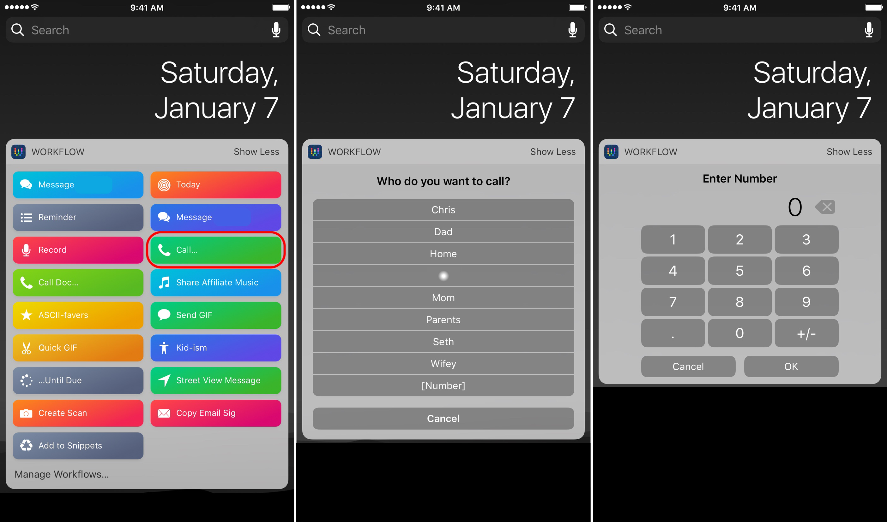

There are a lot of times where I seem to create good workflows or actions. They sometimes come out of nowhere, and really elevate some of my productive life. And sometimes I [create them for friends](https://www.nahumck.me/drafts-tapcellar/ "Drafts TapCellar - nahumck.me") based on their original ideas.

Recently, I was helping Seth work through an idea, and it turned into [an awesome evolution clipboard management](http://sethclifford.me/2017/01/using-drafts-and-workflow-as-a-clipboard-manager/ "Using Drafts and Workflow as a Clipboard Manager"). There's a lot of useful tips in there and new ways of using [Drafts](https://geo.itunes.apple.com/us/app/drafts-quickly-capture-notes/id905337691?mt=8&uo=4&at=1001l4VZ&ct=ntwitter "Drafts on the App Store") and [Workflow](https://geo.itunes.apple.com/us/app/workflow-powerful-automation/id915249334?mt=8&uo=4&at=1001l4VZ&ct=ntwitter "Workflow on the App Store"), so go read it. Now. I'll be here when you get back…

Ok, all done? Good.[1](#fn1)

Being that Seth and I talk often — OK, a _LOT_ — and we often bounce these things back and forth, I helped to create some actions and workflows to make those ideas become a reality. One of the important parts I came up with in the article he posted was the use of a dictionary to produce a list, which is helpful in so many things and a "damned creative" way of doing it, as he put in. Using this same idea, I improved [a workflow](https://workflow.is/workflows/2563ac9600dc4ba5b474f3e7f80f545a "Call Workflow Example") that I had made for my frequent contacts, pulling from a plain-text dictionary of names and numbers instead of listing out a menu and contacts, while also leaving the option to input a number to call. I made an additional one for the doctors and pharmacies we use. And I plan on creating more.

I was really pleased with myself for coming up with this idea. But here's the thing: I have done this kind of list lookup before, however, it was used for a completely different purpose. I had previously posted about a [Today workflow](https://www.nahumck.me/second-screen/ "Second Screen - nahumck.me") that helps me see my daily agenda ok my Apple Watch. In that workflow, I had a part that used a dictionary which [formatted the time](https://workflow.is/workflows/985adf6fa08a484cb8dd0d83113c7ba2 "Time Format Example") of events or reminders: it would change a give time of `12:00 AM` to `12⁰⁰a`. I did this because, well, that's just how I like to see the times. As I was working the idea of these clipboard snippet workflows out in my head, it dawned on me to try the same method to replace text with a link. After trying some different things, I ended up creating something that was even better than I had hoped. I had taken something from before, changed it up, and made it work for me in a new way. Keeping text files that I can change and pull from in iCloud Drive isn't a new concept, but using it in this way has elevated what I'm doing and made it more powerful for many other productivity workflows.

When I was a kid, I thought my dad was the smartest technical person I knew. He had such a breadth of knowledge about a lot of things: cars, home repair, gardening, etc. And while I know my dad is incredibly smart, what I've come to learn as I've gotten older is that he has the intelligence as well as the _experience_. Having the experience from previous situations or obstacles and knowing how those were solved before can make all the difference in the world. He could look at anything like a puzzle, break it down to its parts, and then work to build it up and make it a functioning whole. And I feel like I have learned a lot from him in this regard, and still often learn now that I'm older.

Now, I have a wonderful community of like-minded nerds who challenge me and help me to learn new things or new methods of working. And some of them have become great friends - even best friends — that foster the creativity within me to use the tools that I already have or learn new ones to apply in different ways, create new methods, and solve other problems. The reality of my circle of friends and the greater productivity world I poke around in: I'm not the smartest person when it comes to this stuff, nor will I ever claim to be. There are [other](https://twitter.com/viticci "Federico Viticci") [highly-capable](https://twitter.com/arix "Ari Weinstein"), [intelligent](https://twitter.com/sylumer "Stephen Millard") [individuals](https://twitter.com/jordanmerrick "Jordan Merrick") who have more experience than me at putting the pieces together to create amazing workflows. But I'm always gaining the experience necessary to improve, put things together into something new, and be able to create some useful workflows of my own. I started out not knowing what I could do with Drafts and Workflow to using it daily, unsure of how I'd live without them. They really have taken my personal productivity to another level.

As Seth said:

> I realize it seems circuitous and somewhat silly, but the whole point of all of this is to **play and learn.** … these small excursions also allow me to think through problems and find new ways to solve them. … These are the little puzzles I like to solve.

Personal growth can come from a lot of different places. And in my life thus far, nothing has made me grow more as a person than gaining experience. It has allowed me to learn as I go and further my personal and professional lives in positive ways. It allows me to have new insight into different puzzles that need to be solved, and I can't wait to see what my experience helps me do for the next one.

1. If not, seriously. GO. READ. IT. NOW. [↩](#ffn1)
