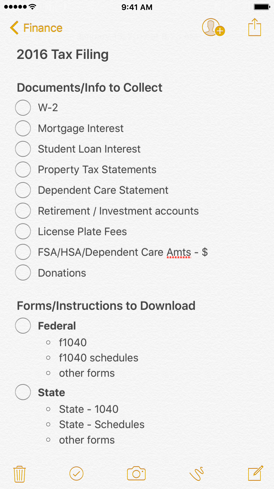
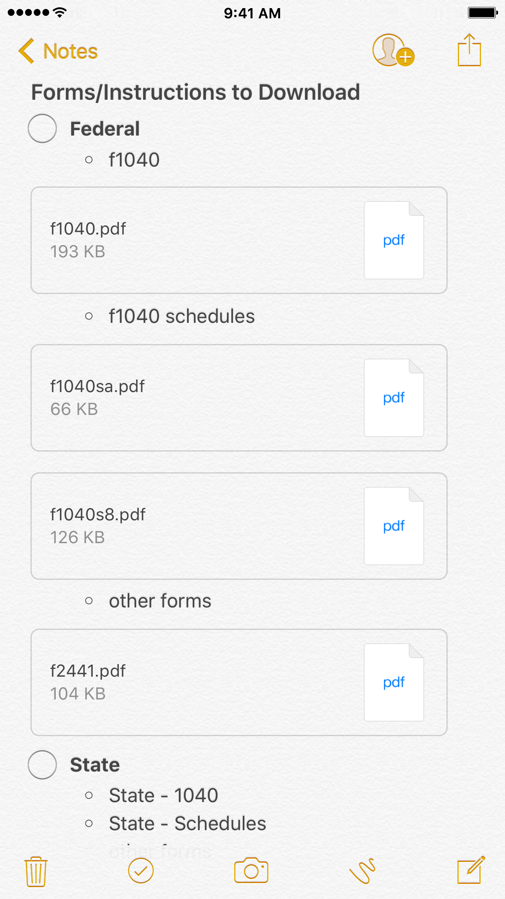

There are two certain things in this world: death and taxes. And since [I'm not dead yet](https://www.nahumck.me/out-of-the-fog/ "Out of the Fog - nahumck.me"), I'll have to do some adulting on a yearly basis and do my taxes. I'm not upset about paying taxes; in fact, I'm one of those people that likes knowing how my taxes work and figuring it out myself, because it's my money. And sometimes, doing some tedious tasks bring me joy. It's a sickness really. But I digress…

Let me get this out of the way: there is nothing wrong if you want to pay someone else to do your taxes.[1](#fn1) It might save you time, you can deduct the fees on the next year's taxes, and you have piece of mind that things \[hopefully\] didn't get screwed up to avoid an audit; if something does happen, at least there's some recourse in getting it taken care of without cost to you. You may have more complex taxes because you run your own business or whatever. And there is zero wrong with paying someone who is well-versed in tax filing to do this work for you.

But rather than pay $150 (or more) a year, I fill out my own forms. For my adult life, I have done my own taxes almost every year, save two: the year we bought a house and got married, and the year right after that. The years prior to us getting married, I was able to fill out the EZ forms, which are just as they sound: easy. The tricky couple of years, especially the second, laid the foundation for me to be able to handle more complexity with taxes with a house and family. The only other big life event that influenced our taxes was the birth of our youngest son, which from a tax perspective, only adds another dependent. We've had miscellaneous forms here and there to fill out for credits when we've purchased energy efficient windows or new appliances, but nothing has been so complicated that I can't figure it out.

For the last few years, I have downloaded the documentation and forms that I needed, filled out everything, and printed it all from iOS. I usually make a checklist in my task management app for the things I need. But this year, because I've been using Reminders.app for the last several months and it is limited in structure, I needed a different way to keep track of my taxes.

In general terms, I need to do the following:

- Make a checklist of personal information and documentation to gather like W2s, taxes paid, etc.
- Make a list of forms and instructions to file.
- Store gathered documents in a single place, so I know right where to go.
- Fill out the forms and store the completed, signed versions for my records.
- File my taxes.

This year, I'm going to use Notes.app for getting my taxes done. There are a lot of benefits now that Notes.app has been improved starting with iOS 9, and is flexible enough to handle this. My taxes are relatively simple, and I can follow along with the information I needed from the year prior to see what I need to gather. I entered everything into a new note, capturing everything as plain text; then I formatted a note like this:

Now that I know what I need, I can start gathering the information into the note. I can include images of my license plate fees, and store them directly into the note. I can download the other documentation and forms as PDFs, so that everything is in one convenient place.[2](#fn2) And, I can also _lock_ the note, so that my personal information won't be easily accessible.

For completing my tax forms, I use [PDF Expert](https://geo.itunes.apple.com/us/app/pdf-expert-edit-annotate-sign/id743974925?mt=8&uo=4&at=1001l4VZ&ct=ntwitter "PDF Expert for iOS on the App Store") to fill out all my forms. I also use the wonderful [PCalc](https://geo.itunes.apple.com/us/app/pcalc-the-best-calculator/id284666222?mt=8&uo=4&at=1001l4VZ&ct=ntwitter "PCalc for iOS on the App Store") for my calculator, especially in the widget: utilizing the copy/paste functionality there helps me as I go line-by-line when I'm filling out the forms. I always fill the forms out at least twice: the first time to fill it out, the second time to double check that I'm right. If there is a discrepancy, I'll fill it out another time to reconcile the other two. Repeat as needed. Again, my taxes are relatively simple, so doing this work just takes a bit of my time. But if I have everything I need right there in a note, it's a breeze to go through.

When I know that I'm done and it's ready to send out, my wife and I will digitally sign the forms in PDF Expert, and I'll save a flattened PDF into the note. I'll print it out, and send it in. Yes, I'm one of those people also. I could e-File my taxes, but I have envelopes, so I might as well just print it out and mail it in. If you do mail it in, send it in [USPS certified mail](https://www.usps.com/ship/insurance-extra-services.htm "Insurance & Extra Services - USPS.com"). It will cost you a minimum of $7.54 total for both Federal and State taxes,[3](#fn3) but it means that if it gets lost in the mail, you won't be assessed late fees on your taxes.[4](#fn4)

I already made a note template so that next year, I can copy it, and then easily change the tax year; I can also save things in there as the year progresses, which will be super helpful for me. Doing your own taxes can be tricky, and it's not for everyone. But it's made that much easier when I have one place to look for everything, and it's even easier when the tool I need is natively there in iOS. Notes.app has really come a long way, and I'm hopeful that it keeps improving.

1. Note: this is for the US tax system. So if you're outside the US and reading this, I have no idea if this is done in the same way. [↩](#ffn1)
2. I would, however, love the ability to edit the PDFs in place in Notes. If I can fill out forms and sign them right from Notes.app, that would be amazing. [↩](#ffn2)
3. Depending on how thick the stack of paper is to mail, your postage may be more. [↩](#ffn3)
4. Just make sure you keep a copy of your receipt(s) for this. Pro tip: take a picture or scan, and add that to your note. [↩](#ffn4)
