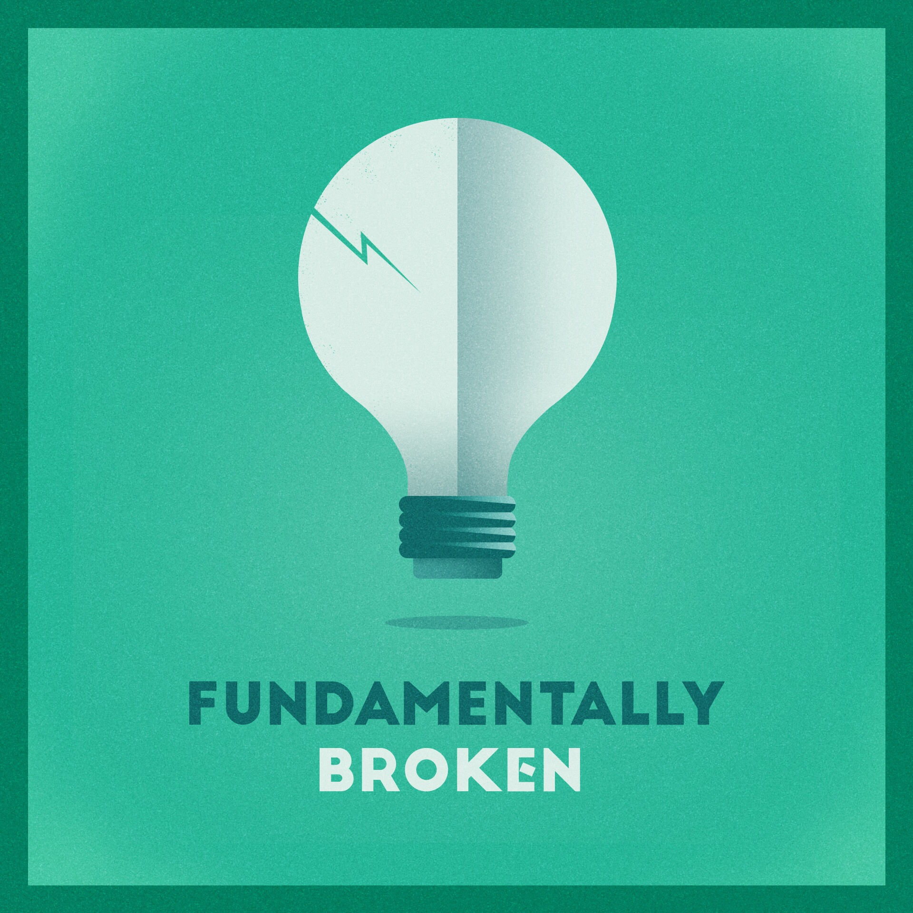

All too often, I realize the paths I take in my daily life have problems. And it makes me realize how broken I can be, often times at very basic level. But when I have these moments, I'm able to overcome them through creative methods, past experiences, and most of all friends, and build it back up again. And sharing the problem makes me feel that I'm not alone.

[Seth Clifford](https://twitter.com/sethclifford) and I met as all modern-day bromances do: on the internet. Over time, our internet acquaintance has turned into a solid foundation for a friendship. And now, he is one of my closest friends. Through some time, patience, and a lot of some badgering, we are finally taking the next step: a podcast.

A special thanks to the amazing [Satchell Drakes](https://twitter.com/SatchellDrakes) for the incredible artwork. I couldn't be happier with how well it turned out. He is the best!

In the [first episode](https://itunes.apple.com/us/podcast/fundamentally-broken/id1200632692?mt=2#episodeGuid=7babb7e7-3ac7-4b3e-9f65-06047c23d630), we talk about the reasoning for the show, and what we want [Fundamentally Broken](http://podcast.fundamentallybroken.men) to be. For now, this is going to be monthly-ish: it could be sooner, it could be longer. We are busy with work and family, and sometimes our available time is slim. So it's just going to be a surprise when you see it pop up in your feed.

Hope you enjoy the show!

[Website](http://podcast.fundamentallybroken.men) | [iTunes](https://itunes.apple.com/us/podcast/fundamentally-broken/id1200632692) | [RSS](http://simplecast.com/podcasts/2622/rss) | [Twitter](https://twitter.com/brokenmenshow)
