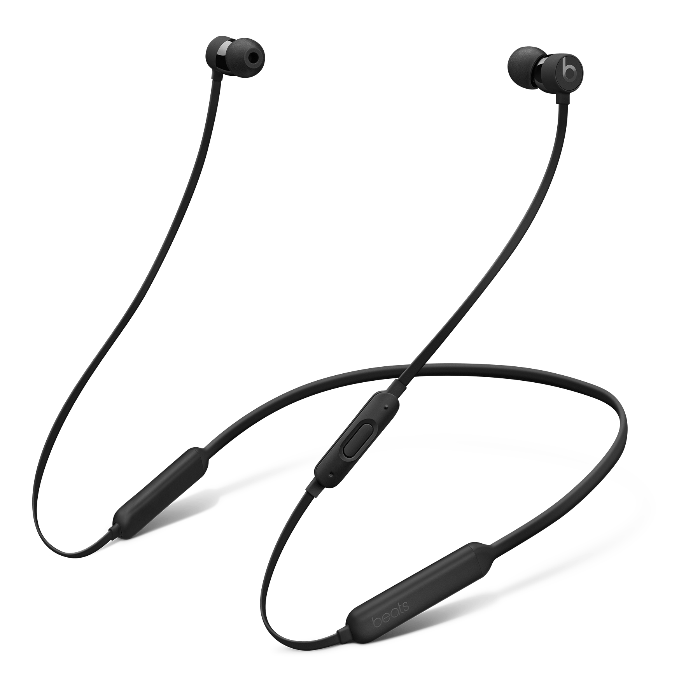

I first started into the world of expensive headphones when I bought my first pair of wired [Bose in-ear headphones](http://www.amazon.com/dp/B000XA8766/?tag=nahumck-20).[1](#fn1) They were $100 at the time, and it wasn't much more for the extended warranty. And as it turns out, I'm really glad I purchased it: over the next three years, I ended up exchanging three different pair because the cable had worn out near the connector, causing a short and either choppy or no playback. Upon my fourth exchange, I was done with a wired connection. I finally stepped into the Bluetooth era, and got some [Jaybird X2 earbuds](http://www.amazon.com/dp/B013HSW4SM/?tag=nahumck-20). And for a long time, I was happy. Then I started getting connection issues. I exchanged them under warranty. Then I had the same connection issues on this new pair, even though this time the phone was different. I then exchanged them, this time picking up the [Jaybird X3 earbuds](http://www.amazon.com/dp/B01M7NCT5O/?tag=nahumck-20).

Jaybird makes a fantastic product — when it works. The biggest gripes I have with the X3's: 1) the use of a proprietary charger, and 2) the continuation of the connection issues. Both of these drive me insane, but Bluetooth is Bluetooth, and I don't think it's any fault of the Jaybird team. In regards to the charger: if I lost this tiny adaptor, I'm screwed. It's not an item I could go get at the store, like it was on X2's, which was a micro USB connection. It's a design choice that while provides the "sweat proof" design,[2](#fn2) is puzzling to me from a customer perspective. There are other minor gripes: the weighting is imbalanced due to the inline controls,[3](#fn3) and there is some minor latency at times (something that Bluetooth hasn't mastered yet). Overall, it's a solid option; but I'm still not personally happy with them.

So, while I was recently in the Apple Store to get my wife's phone upgrade, I was able to try out both the [AirPods](http://store.apple.com/xc/product/MMEF2AM/A) and the [Beatsx Earphones](http://store.apple.com/xc/product/MLYE2LL/A). They were gracious enough to get me the demo models, and two alcohol wipes (which I used liberally for both pair). The setup process on both is really nice. Quick couple of taps and done. And while the AirPods have that bit of magic and whimsy with them, they don't work for me: they don't fit my ears well, and they do nothing for sound isolation. Sure, I could get something like the [EarHoox](http://www.amazon.com/dp/B01MXMTELG/?tag=nahumck-20), but then I wouldn't be able to put the AirPods in the case with them on.

Speaking of cases, the Beatsx come with a case, but it's not really great for the headphones. However, I have found it very useful as a carry case for my lightning cables, a flash drive, and a microUSB cable. I'm usually just wearing the headphones during the day even if not in use, so I don't really have a need for the case as it was intended. I would like to see some sort of closure to ensure that nothing will come out of it. It's something that other headphones have, and would be a nice touch here.

The Beatsx sound was very close to that of the X3's, but only after I messed around with the [Jaybird MySound](https://geo.itunes.apple.com/us/app/jaybird-mysound/id1055470300?mt=8&uo=4&at=1001l4VZ&ct=ntwitter "Jaybird MySound on the App Store") app for a while. The Beatsx sound profile is actually more pleasing to me than other models I've tried right out of the box: both the bass and treble are crisp, but not overpowering. It's a good mix of sound for something that you might wear for a long time. Even though it's not customizable to the nth\-degree, it's convenient for me to just pop them in and not mess with the sound. They don't have the sound signature that true audiophiles enjoy, but they would likely work for most people.

There are a couple trade-offs with the Beatsx: they aren't advertised as sweat proof, so I have to be more careful with them; however, I don't foresee that being an issue. It's not quite as good at noise isolation, but only marginally so. And when I use the [Comply Comfort Foam Tips](http://www.complyfoam.com/products/ts-500/ "Comply TS/X-500 Foam Tips") like I had on the Jaybirds, they isolate just as well. The tips are well worth the money, as they are more comfortable for my ears over longer listening times than the supplied silicone tips.

The convenience of the Lightning port/cable for FastFuel charge is unreal: no proprietary cable to carry around (or worse, lose), no microUSB cable, no adaptors. Just a standard Lightning cable, which I always have with me when I travel. This makes my everyday carry minimal yet more functional for my needs. And if I forget to charge them, 5 min charge for 2 hours of playback gets me what I need in a hurry.

The W1 chip is a breeze for setup. The range on the earphones is phenomenal thanks to the upgrade in Bluetooth class and the W1 chip pairing: I've been able to leave my phone in the basement, go into the 2nd floor room that is on the opposite side of the house, all without losing playback once. I can go anywhere around my house and have a solid signal. With the Beatsx with me, along with my Apple Watch, I'm completely mobile around my house without my Plus-sized phone going with me.

As I'm getting older, I'm often swayed by the ease and convenience of different things: apps, processes, and products. When I'm presented with a choice — in this case between two great products — I'm going to trade convenience for a few minor features. There's less to think about, less to worry about, and at the end of all of it — that's the most convenient thing I can think of for my life.

1. Quick note: I'm considering $100+ headphones as expensive. Most people use whatever they can find that is cheap or is supplied with their device, so most will consider $100+ as a considered investment. [↩](#ffn1)
2. Except that I have heard of people who have gone through several pairs due to sweating so much… [↩](#ffn2)
3. I think they could have done a micro USB charging port on a similar-style inline "weight" to balance the design, and also provide for a standard cable charger. But what do I know, I'm just an engineer. [↩](#ffn3)
