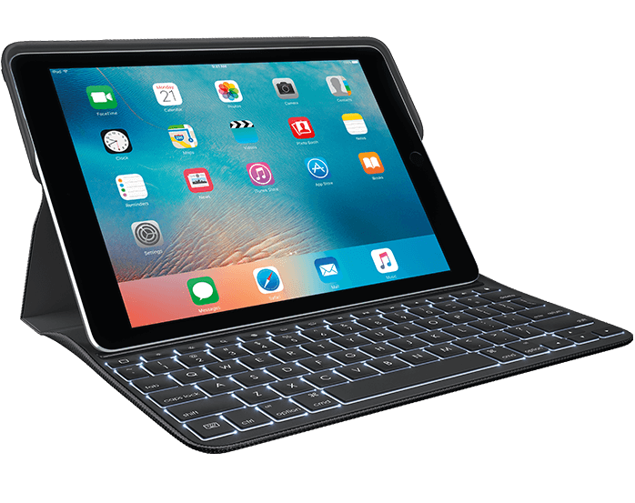
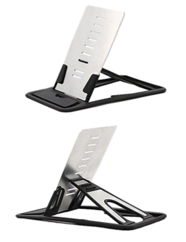
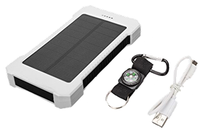

### Logitech Create Keyboard

The moment I made the decision to get the iPad Pro 9.7", I knew that I wanted to get the [Logitech Create Keyboard](http://www.amazon.com/dp/B01HIS30OY/?tag=nahumck-20 "Logitech Create Keyboard - Amazon.com"). This is hands down the best keyboard for the iPad Pro, as many other people will tell you.

What I love about this keyboard is that while it adds some heft to the device, it is still ultra-portable, and contains my entire work station in an all-in-one setup. In most cases, this is the only thing that I need to bring around with me. I can do some of my work, write to my heart's content, and get anything and everything done with efficiency. The keys are backlit, which is a nice touch over the keyboard that I previously had. It's the perfect compliment to the Apple Pencil, with the built in pencil loop. And the best part of all: it's attached to my iPad Pro. _**[FINALLY](https://www.nahumck.me/perfectly-mobile/ "Perfectly Mobile - nahumck.me")**_.

### iMangoo Foldable Stand

Now that I have my iPad Pro with the Create keyboard, my old [Logitech k480](http://www.amazon.com/dp/B00MUTWLW4/?tag=nahumck-20 "Logitech k480 Bluetooth Keyboard") has been given to my son for his use with his iPhone at school.[1](#fn1) Because I want his iPhone to last and it is permanently in a [LifeProof](www.lifeproof.com "LifeProof Cases") Case, his phone doesn't fit so well into the integrated stand on the keyboard. So I started looking at options for him to use for a stand.

I originally was going to go after the [current stand](http://www.amazon.com/dp/B00W6XFE3M/?tag=nahumck-20 "Spinido Phone Stand Dock Holder") I have, but it isn't portable enough for what he would like. That's when I ended up finding the [iMangoo Foldable Stand](http://www.amazon.com/dp/B01959FPCY/?tag=nahumck-20 "iMangoo Foldable Stand - Amazon.com"). It is a very portable stand; in fact, it's a little thicker than a credit card when fully collapsed. But it's capable of holding your phone or tablet just fine. It's not going to be the stand that looks pretty and is a perfect compliment to the Feng shui of your desk. It will, however, serve as a nice piece of kit in a carry bag that is a no-brainer. In fact, I ordered one for myself, and it's been working out very nicely. The perfect complement to the mobile workstation.

### SOMAN Solar Charger

This charger came my way at Christmas time as a gift.[2](#fn2) During that time, I was also reorganizing some things inside my house, and put it somewhere out of the way. Out of sight, out of mind — and I forgot that I had it. Then I finally remembered it on a recent trip I had.

The [SOMAN® Portable Solar Panel Charger](http://www.amazon.com/dp/B01GRP35NA/?tag=nahumck-20) is a 10000mAh battery dual-USB battery pack with a solar charger option. It is also rain-resistant, dust-proof, and shockproof. It charges via a microUSB cable that comes included. I used it at various times during the trip, and never had to recharge it the entire time.

The solar panels are meant to keep it topped up with charge, but can also fully charge the device if you are somewhere that wall charging isn't. And it even comes with an LED flashlight if you need one in a pinch. This battery pack is rugged, capable, and — best of all — fairly inexpensive at less than $15.

1. We've offered up to have him use a tablet, but he doesn't want to carry it. He only wants to carry his phone. A chip off the old block... [↩](#ffn1)
2. Thanks, Mrs. Claus... [↩](#ffn2)
