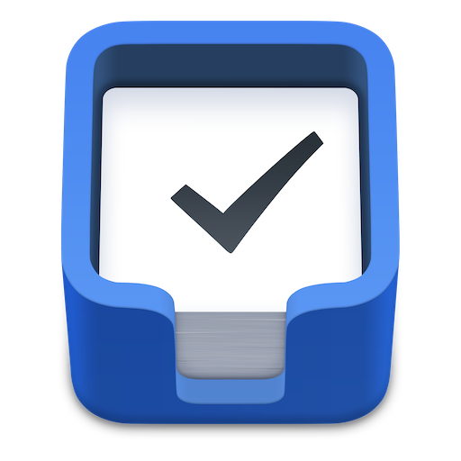

I recently picked up the iOS version of Things 3 for both [iPhone](https://itunes.apple.com/us/app/things-3/id904237743?mt=8&uo=4&at=1001l4VZ) and [iPad](https://itunes.apple.com/us/app/things-3-for-ipad/id904244226?mt=8&uo=4&at=1001l4VZ). And there's a lot to love about the new version: the new look is great; the simplicity of the layout is fantastic; and all of the small, purposeful animations are phenomenal.

As an app developer, giving users options — even if your own opinions don't match those users' thought patterns — is ultimately the best way to go forward. This doesn't have to be tweaks to everything in the app and giving the user options upon options. But often, these features would benefit the app for both novice and power users, increasing the flexibility and functionality of the app. And I believe that there are some very meaningful changes that could be made in Things 3.

Here are 3 things I want to see in Things 3:

## 1\. Complete Feature Parity

At this point in macOS and iOS development, the feature parity between the Mac and iOS apps should be the same, except where Apple places a limitation. And when there is a redesign of an app, there really shouldn't be any difference between the two. As more and more users are going iOS only, the functionality of the app should not depend, in any way, on having a Mac. And there are several examples of ways that the Things iOS apps are not on par with the Mac app.

Things 2 had several [keyboard shortcuts](https://support.culturedcode.com/customer/en/portal/articles/83945-keyboard-shortcuts) in iOS. If nothing more, they allowed a user - more specifically iPad Pro users - to quickly create a new task via the `⌘ N` shortcut. And it's a big omission for the growing base of iOS-only users. They exist in the Mac app, I would like to see these get added to iOS, as to make the app more usable when using an iPad Pro and an external keyboard.

The Today view is a great way to view your tasks for Day/Night. But one advantage that the Mac app gives you is the ability to sort based on Area; once set on the Mac, this option syncs over to iOS. It's an odd choice that you can set it on macOS, but not set it on iOS. This could simply be another sort option placed in the upper right carrot icon, where you find the sorting by tag, select, and share options.

Speaking of tags, there should be a proper way to manage your tags on iOS. As of now, the only way to manage tags would be when editing a single task. What I would propose is an added menu item in the settings list, so that tags can be managed outside of tasks. This will allow you to organize your thoughts on them in one clear list, group them together, and become more useful as you manage your tasks going forward.

## 2\. Dark Mode

The look of Things 3 is clean. Bleach clean. Almost _too_ clean. And while that's awesome at times for clarity, it is almost too much white. I would love to see a dark mode added. The development cycle has been slow and deliberate with Things, and I feel like this was a miss for some polish and user-facing customization.

As much as I don't like it, there are are many times that I will dump tasks into my inbox just before bed, because I'm thinking of them and I need to remember them for later. Having the dark mode/theme added would be a welcome change. There are elements of it already on watchOS, and something I'd like to see carried into the app.

## 3\. URL Scheme Support

I am a huge proponent of iOS automation. I am constantly using [Drafts](https://itunes.apple.com/us/app/drafts-quickly-capture-notes-share-anywhere/id905337691?mt=8&uo=4&at=1001l4VZ) and [Workflow](https://itunes.apple.com/us/app/workflow-powerful-automation-made-simple/id915249334?mt=8&uo=4&at=1001l4VZ) to get things accomplished on iOS. But there aren't too many [URL schemes](https://support.culturedcode.com/customer/en/portal/articles/2803573-things-uri-scheme) available.

What I would like to see them do, at the very minimum, is open up the app from a URL standpoint to allow the use of an [x-callback-URL](http://x-callback-url.com) perspective. This will allow other apps to chain into task creation. Rather than send a list from Drafts to Reminders to Things, I could send that list over iterations from Drafts.

Once that is added, adding additional items like due/reminder times, tags, etc. would be easier. There are many reasons to do this: if you're a new user, you can simply import a text list of items into the app and get going; if you have meeting minutes, you can export the tasks for further processing in Things; and you could build templates outside of the app for importing, similar to how [OmniFocus](https://itunes.apple.com/us/app/omnifocus-2/id904071710?mt=8&uo=4&at=1001l4VZ) and [2Do](https://itunes.apple.com/us/app/2do-reminders-personal-planner/id303656546?mt=8&uo=4&at=1001l4VZ) currently support. It would make it more powerful while remaining simplistic, which is really what this app strives to be.
