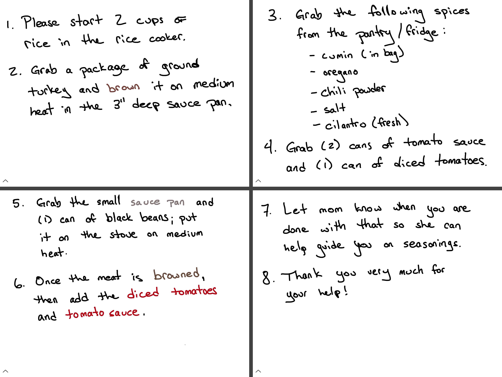

Every year in spring, it seems as thought I get sick at least once: the changing of the weather, additional allergens in the air, kids bringing home more and more germs. Whatever it is, it sucks more now that I'm an adult. It usually knocks me down in one form or another, and harder than it used to previously; I need more rest in ever increasing amounts. Getting old **_sucks_**.

So, as is tradition, I spent all of this past weekend sick. Naturally, the weekend hit a multitude of complications with our plans and family productivity. Obviously we, as a family, need to be flexible when something like this happens. But when I get sick, it puts a tremendous strain on everyone else in the family. Not as much gets done, our plans change, and everyone is usually bummed about it.

This time, the sickness also took something that made everything that much worse: my voice. It's simply [laryngitis](https://en.m.wikipedia.org/wiki/Laryngitis "Laryngitis — Wikipedia.com"), and thankfully nothing worse. Not having one's voice is difficult, and I couldn't imagine life like this permanently; it's incredibly frustrating to have to figure out ways of communicating other than by speaking. I count myself unbelievably lucky that I have my senses. In a way, I'm grateful that this happened, because it has allowed me to think of things differently in terms of the accessibility of my devices, and also brought an unexpected accessibility feature along with it. There are times that we, as a family, need to communicate via messages — mainly due to the youngest one sleeping. I'll have to send messages to my teenager, who purchased his own Bluetooth on-ear headphones, and sometimes can't hear me talk, even when I'm right behind him.[1](#fn1) But this weekend was especially important. I don't like being a family that just texts from couch-to-couch, but we ended up planning dinner and our evening activities together in a group chat. Sometimes simple text can adequately convey your message.

When it came time to make dinner, however, I wanted my oldest to make it. I try as often as I can to impart wisdom and small tasks that he should be able to do. But how on earth, with no voice, can I give him directions? My first thought was to send a text, but even though I can type fast, it wouldn't be good for what I need. So I looked on my iPad to see what tools I have at my disposal. It was pretty apparent that I should use [Linea](https://geo.itunes.apple.com/us/app/linea-sketch-simply/id1094770251?mt=8&uo=4&at=1001l4VZ "Linea on the App Store"). I could simply use a white canvas and a black pen or marker to write. It was easy for me to write down some simple instructions for him. Using layers, I ended up writing out how to put things together, just as a reminder of the things he should be putting into the meal because he has made this before. It made it easier to communicate with him, and dinner turned out pretty well. Being able to simply write down directions to him was a huge help.

As the weekend went on, I continued to use Linea for communication in my house. We ended up doing more than I thought we would, despite my inability to communicate verbally. I interacted with my youngest by working on letters and numbers with him; I also drew him small pictures to make him laugh. While Linea is primarily an app for artists,[2](#fn2) Linea allowed me to get past a communication barrier I was facing, and interact with those around me.

When life throws you a curve ball or two, sometimes you find something unexpected that can help you along your way. I'm very thankful that I picked up Linea as soon as I got my iPad Pro. It was a wonderful weekend companion for me and allowed my voice to be heard with my family.

_[Linea](#) is $9.99 on the App Store._

1. Much to my dismay and frustration. [↩](#ffn1)
2. Some of the drawings I have seen are incredible. I can only hope to one day be that good. [↩](#ffn2)
