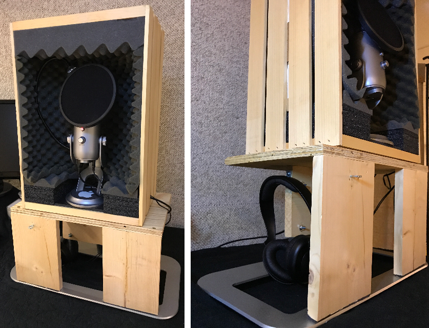
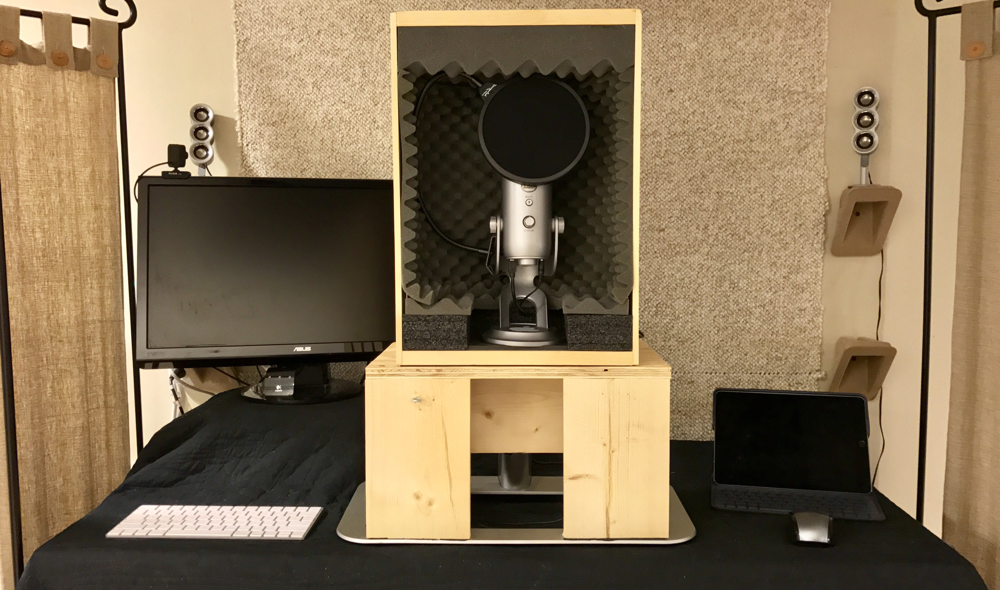

I've recently ventured [into the podcast world](http://fundamentallybroken.men "Fundamentally Broken"). I've been wanting to do one for a long time, and I'm thankful that I'm finally able to do that with my friend [Seth](http://sethclifford.me "Seth Clifford"). Now that it's been out for a bit, I thought I'd share a bit about my setup. I'm starting out in this space; I went with some equipment that, while not the top end, is widely recommended for a beginner: the [Blue Yeti microphone](http://www.amazon.com/dp/B002VA464S/?tag=nahumck-20). I ended up getting one on Amazon Prime Day, as well as a [DragonPad pop filter](http://www.amazon.com/dp/B008AOH1O6/?tag=nahumck-20). My initial plan was to use 2 iOS devices: an iPhone 5c for the FaceTime call and my iPhone Plus for recording, utilizing the [Lightning to USB3 adapter](http://www.amazon.com/dp/B01F7KJDIM/?tag=nahumck-20) to record my end using [Ferrite](https://geo.itunes.apple.com/us/app/ferrite-recording-studio/id1018780185?mt=8&uo=4&at=1001l4VZ&ct=ntwitter "Ferrite Recording Studio on the App Store").[1](#fn1) However, I was gifted a 2009 Mac mini, which surprisingly still works well for recording. We use FaceTime Audio to make the call and [Audio Hijack](https://www.rogueamoeba.com/audiohijack/ "Audio Hijack by Rogue Amoeba") to record. So while I use iOS for everything in my personal life, this is the only thing for which I use a Mac.[2](#fn2)

With my recording hardware set, I needed a good space to record. One particular area in our basement was pretty well isolated from the house, and would be a good place to start. First, I needed a decent desk. My parents brought me the unused drafting table from their house, and I was able to set it up at a good height for standing. I added some 2" scrap foam blocks and an unused piece of 3/4" plywood to elevate the desktop to a comfortable height for me; I also added some other spare wood that I cut to length so that I could elevate the monitor a bit. I covered it with a blanket I wasn't using to help attenuate the metallic noise from the desk itself. Though that portion of the basement is carpeted, I also bought an [anti-fatigue mat](http://www.amazon.com/dp/B017HIJ86O/?tag=nahumck-20 "Anti-Fatigue Mat") that helped with standing while recording.

Even though the area was isolated from most of the noise in the house, there was still some ambient noises coming from the air conditioning ductwork above my head and the two vents into the basement on either side of me. So I got to work \[over-\]engineering a solution. During my research, I found a portable mic surround that would isolate the noise around the mic; rather than line the wall with foam, I thought this would be a good idea for the space. Later that day, my wife came home one day with a [wooden crate at Michael's](http://www.michaels.com/artminds-wood-crate-carry-all/10228808.html#start=1), presumably for my youngest's toys. But the moment I saw it, I thought of creating a box to stick the Yeti into, surrounding the mic with foam in order to isolate the mic from the ambient sound.[3](#fn3) After a few iterations and some on-hand materials, I had something I was happy with.

Although the desk is a nice height for standing, the microphone wasn't in the proper height for me to record, and I needed to elevate it. I looked around the house for unused items, rather than buying a stand or a boom arm. I ended up making a stand for it using the base for our TV that was going unused, as we had wall-mounted the TV. Using some spare plywood around the house, I was able to make up a shelf for the mic box to sit on. The mic can now be used sitting or standing, which gives me the option depending on how I'm feeling.[4](#fn4) I've also added a couple of brackets to set [my headphones](http://www.amazon.com/dp/B003LPTAYI/?tag=nahumck-20 "Sennheiser HD 202 II Professional Headphones - Amazon.com") and [cable ties](http://www.amazon.com/dp/B008F28WB4/?tag=nahumck-20 "Monoprice Hook and Loop Cable Ties, 60 pack - Amazon.com") to clean up the cords a bit.

Here's a "pro-tip" for setting up your own space: before you go buying anything, use what you have around you. You'd be surprised what a little thought and time will get you. I was able to get a lot of things just by rummaging around my house. The foam, the TV stand, repurposing the desk. Even the shelves I have for my desktop speakers were things just sitting: in fact, they are actually the corner packaging from a MacBook Air box. Reduce, reuse, recycle.

I've also been able to think about this space with more than just my podcast setup in mind. When I'm not recording and I want to do some serious writing, I can use the stand to elevate my iPad Pro in the [Logitech Create Keyboard Case](http://www.amazon.com/dp/B01HIS30OY/?tag=nahumck-20 "Logitech Create Keyboard - Amazon.com"). For ergonomic purposes, I ended up picking up a [Magic Keyboard](http://www.amazon.com/dp/B016QO64FI/?tag=nahumck-20 "Apple Magic Keyboard - Amazon.com") to use not only with the Mac mini, but my iPad as well for longer writing sessions. Not only do I have a podcast space, but I also have a quieter space to write, be creative, and is a retreat that I didn't have previously. Having personal space is [important](http://podcast.fundamentallybroken.men/4 "Fundamentally Broken Ep 4 - A Place to Sit and Stare in Silence").

I've used various foams I had around my house in the setup to isolate different things: the mic to the box, the box to the stand, etc. There was also ambient fan noise from the furnace. To minimize a lot of it (most of which was coming from the closet behind me), I had found some scrap foam and carpet remnant. I attached the carpet to the wall using a staple gun, and glued the foam to cardboard to hang behind me. Glueing the foam to cardboard didn't turn out well, and I ended up getting some [foam-core poster boards](http://www.amazon.com/dp/B0006VRTZM/?tag=nahumck-20 "Elmer's 20x30x3/16"). I attached the foam using special [foam adhesives](http://www.amazon.com/dp/B00WRQ5RVC/?tag=nahumck-20 "NextTape Foam Adhesive Tabs, 24 pack - Amazon.com") and are easy to apply (peel-and-stick). I affixed two [adhesive hooks](http://www.amazon.com/dp/B000OEJARG/?tag=nahumck-20 "3M Command® Hooks, 9 pack - Amazon.com") to hang each board by two small [screw eyes](http://www.amazon.com/dp/B005P1VRJM/?tag=nahumck-20 "5/16") from the ceiling. I also created a board for the ceiling, using the same strategy and a small piece of chain that I had lying around. We had some standing dividers, which were useful to set to the side to help minimize noise on the sides. With all of this set up, I basically ended up making a small studio.

I'm really happy with how all of this turned out. It's efficient and I've minimized how much money I wanted to put into this thing. I really truly have only put in under $100 total (not including the equipment), and the rest I was given or able to find/repurpose. In the future, I might pick up some better sound isolation foam [from a local store](http://www.thefoamfactory.com/acousticfoam/acousticfoam.html), replace what I have, and add more; but for now, I'm going to keep utilizing this and be happy in my personal space. Being resourceful, reasonably mechanically inclined, and thinking outside the box about using some old items in my house, I have been able to make a decent setup that sounds good enough for audio quality. Sometimes, all you need to do is look around you and you'll find everything you need.

1. There's a great reference for using the adaptor over at [Six Colors](https://sixcolors.com/post/2016/03/a-few-lightning-usb-3-adapter-follow-ups/). It includes helpful tips and the capabilities/limitations of using it on iOS. [↩](#ffn1)
2. At least until an iPad Pro with updated software can record both ends. Once that happens, then I'm likely going to be back to only iOS for everything. [↩](#ffn2)
3. I was able to scrounge around and find some foam from various sources: old packing boxes, an old SuperDrive shipping box, some free toolboxes I got while in college. You can get it multiple places, but if you can get it for free, do it. It can only help improve the isolation. [↩](#ffn3)
4. I'll generally be standing for recording, however, as I tend to fidget a lot. [↩](#ffn4)
