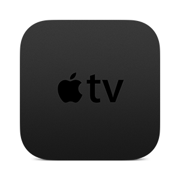
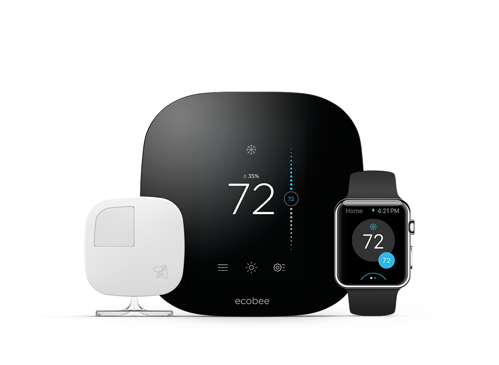
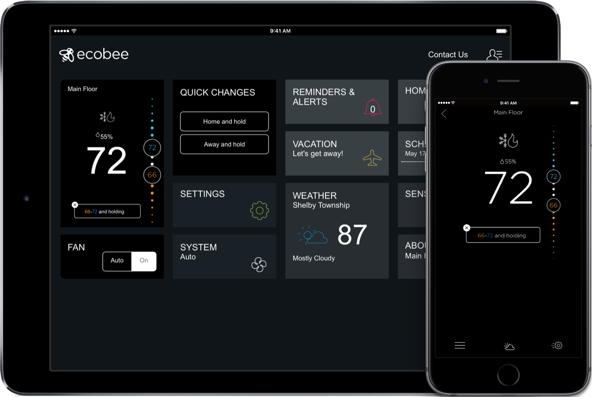

## Apple TV

We recently decided to get a [fourth-generation Apple TV](https://store.apple.com/xc/product/APPLETV2 "Apple TV - Apple Store"). My entire family uses Apple products, from iOS to Mac. And given that we recently cut cable, we needed something better to watch shows and movies with. Prior to now, we'd have to watch either via the smart TV built-in apps, or through plugging something in. Not ideal at all.

One of the things I really, really like about having the Apple TV is AirPlay. We can use the iPad mini 2 as a giant remote for the TV as well, if we want. My youngest loves the show _[Thunderbirds Are Go](http://www.amazon.com/dp/B01LZDGBB8/?tag=nahumck-20 "Thunderbirds Are Go - Amazon")_, and until Amazon brings their app to the tvOS, we can just use the iPad to project it on the TV.

The Siri remote is really nice and the battery lasts a long time. I'm a bit paranoid about losing it, and they aren't cheap to replace. But so far, I'm using a remote caddy that I found for less than $10, and that helps keep it in one location. I am considering getting a remote cover for it in a bright color, just so we don't lose it somewhere.

One additional aspect of having the Apple TV: this can lead to HomeKit-enabled devices being a part of our house, as the technology improves and our finances allow.[1](#fn1) It will open up a new possibility for us going forward, even if it's not going to be anything more than a set-top replacement right now.

Overall, I'm really pleased with how the Apple TV is working for us at home. I'm sure Apple will announce something even better at WWDC, but I'm happy with it as it currently stands. I'm sure I'll find even more uses for it over time.

## Ecobee 3

Home ownership is... well... fun? Yes, fun. Let's go with that. Owning a home means often maintaining or improving it; improvement is often necessary and can be expensive. But spending the money up front can yield dividends down the road.

Recently, I improved the insulation and ventilation in our attic — something that was long overdue. With that in place, I wanted to keep the house at a good temperature year round, no matter what the weather. We had a basic thermostat that worked well. But one thing we have to consider in our climate is which mode — heat or cool — we have to be in at any given time. In the spring/fall times of the year, we might want cooling in the day and heating at night; the temperature swings can be 40-50°F difference, and that has made from some interesting mornings when waking up.

So I started searching for a thermostat which would automatically switch, thus providing better HVAC performance. And much to my dismay, I wasn't coming up with much. Really, when it comes down to it, I just wanted to have my thermostat automatically switch modes. Then, at the suggestion of a friend of mine, I started looking into smart wi-fi thermostats. He has a Nest, and was really happy with it. My house is a little larger than I think the nest could handle accurately, so I looked at an [Ecobee3 Thermostat w/ Remote Sensor](http://www.amazon.com/dp/B00ZIRV39M/?tag=nahumck-20).[2](#fn2) In addition, also picked up a 2-pack of the remote sensors. Now I can monitor the whole house temperature: I have one sensor on each side of the 2nd floor, one in the family room, and the integrated sensor on the thermostat in the center of the house.

The setup for the thermostat is pretty rad. If you download the [Ecobee](https://itunes.apple.com/us/app/ecobee/id916985674?mt=8&uo=4&at=1001l4VZ "Ecobee on the App Store") app, it guides you through the installation process complete with instructions, images, and videos. There's a bit of wiring involved, but at no time did I worry about it; the app does a great job at doing everything needed. Speaking of the app, it's a really nice app that supports iPhone, iPad, and Apple Watch. I can make adjustments when I'm gone, or even if I'm feeling lazy and don't want to get out of bed.

Now, one big reason I went the route of the wifi thermostat vs a traditional one: rebates. Before you look into purchasing one of these, see if your electric and gas companies offer a rebate on wifi thermostats. I was able to get one for each utility company. With those two rebates, and a third for my newly-installed insulation, I was able to completely pay for my new thermostat with the extra remote sensors. Not bad at all. With the new insulation and thermostat, I'm really anxious to see how well this cuts down on our energy bills.

## BUBM Universal Accessories Bag

I _might_ have a watch band problem. It's not be as bad as others, but I have a total now of 12 watch bands. And for a while, I haven't really had a good way to store them. There are times that I would like to take them with me: if I travel or change from work to workout, I want to be able to grab a new band whenever I feel the need.

I stumbled upon the [BUBM accessory bag](http://www.amazon.com/dp/B01FC4H9X4/?tag=nahumck-20 "BUBM Universal Electronics Accessories Bag - Amazon.com") thanks to [this article on iMore](http://www.imore.com/best-way-organize-apple-watch-bands "Best Way to Organize Apple Watch Bands - iMore.com"). Priced at $13, this seemed like the best choice on the list, rather than going with the $50 option. The bag comes with enough space to store a total of 16 bands, 2 in each slot provided. It also gives me a little spot to include four to six more bands or some other accessories, such as a [Speck CandyShell Fit Case](http://www.speckproducts.com/apple/apple-watch-cases/apple-watch-42mm-cases/candyshell-fit-clear-apple-watch-42mm-cases/IW-42-CS-FIT-CL.html#start=4) or a [charging cable](http://www.amazon.com/dp/B012BN15LQ/?tag=nahumck-20 "Apple Watch Charging Cable (1m) - Amazon.com") for the Apple Watch; I'm also keeping the Lightning to headphone jack adaptor and the Apple Pencil charger adaptor. The best part is that it is better protected and takes up less space than what I was using previously. It's the perfect little carry case for all of my extra accessories.

1. The smart light bulbs and switches are still expensive. But I think the cost is coming down, thanks to more manufacturers developing products in this space. [↩](#ffn1)
2. I found this on sale at The Home Depot, presumably because the Ecobee4 thermostat is now on sale, which has an integrated Echo into it. But I'm ok with not yelling at my dingus to change the temperature. [↩](#ffn2)
