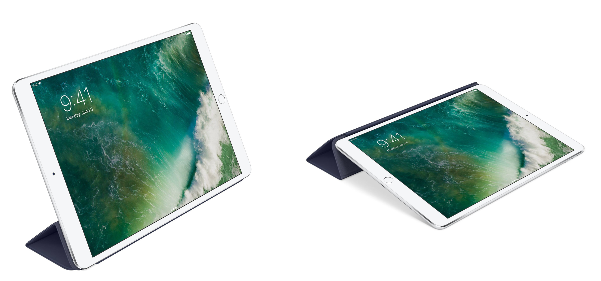
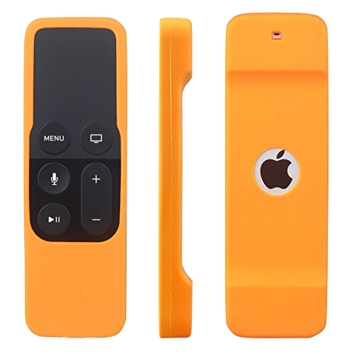

## Smart Cover for iPad Pro

When I first purchased my iPad Pro 9.7, I immediately wanted to get the Logitech Create Keyboard Case. That has served me very well, and something that I have [really enjoyed](https://www.nahumck.me/piques-of-the-week-volume-10/). But there are a lot of times when I'm just going around the house where the added heft of the functional case really didn't work well. I started to remove the iPad from the case fairly often, but lost some functionality.

That's when I thought to pick up the [Smart Cover for iPad Pro 9.7](http://www.amazon.com/dp/B01DOQR680/?tag=nahumck-20). Not only does the Smart Cover allow for protection of the screen, but it also can prop up the device in two modes: the "viewing" mode and the "typing" mode.[1](#fn1) The viewing mode allows me to FaceTime with family, watch a show or two, or read the news if I feel like screaming into the void. The typing mode allows me to respond to people without having my device in a heavier case; this does require me using the on-screen keyboard, however. I can also pair the device with my magic keyboard for longer writing, which might come in handy for a large fall review that I'll be working on.

I'll even store my pencil up at the top, which is secured by the magnets. The pencil also fits in the groove on the front of the Smart Cover, but I'm nervous about it falling off and me losing it; it's not something I often do while moving about, but while it's on my desk or on my counter, I will keep it around.

If I had the choice to do it over again, I might have picked up the [Smart Keyboard](#), but I like having the options. Using the on-screen keyboard has showing me that the larger devices might be better suited for that use case; either way, if I upgraded to the larger size, I'd likely get the Smart Cover for the [10.5](http://www.amazon.com/dp/B071WLJW7Z/?tag=nahumck-20) / [12.9](http://www.amazon.com/dp/B071JNCP9W/?tag=nahumck-20). Highly recommended for sleek carry and around the house use.

## Akwox Silicone Cover for Siri Remote

With multiple devices around the TV, there comes multiple remotes. And while I could get some sort of universal remote for everything, I much prefer using the remotes that come with the devices.

We have a small remote caddy at home, but one remote we have the most problems with is the Apple TV Siri remote: it's always getting misplaced, and because the face is black, there's a risk of it being lost. So rather than continuing to look around, I thought I would get a smarter solution - to Amazon!

I did a quick search for Apple TV remote silicone case, and arrived at the [Akwox Silicone Cover for Siri Remote](http://www.amazon.com/dp/B01NA9TATV/?tag=nahumck-20). There are multiple color options, but if we are going to see it in our house, I wanted to get something bright. I settled on a bright orange color for easy visibility. The case is a nice fit, and even helps point which way is up. For $7, I won't have to worry about losing the expensive remote any longer.

1. This is just my nomenclature for these. I can use the typing mode for note taking or drawing with my pencil, if I wanted. [↩](#ffn1)
