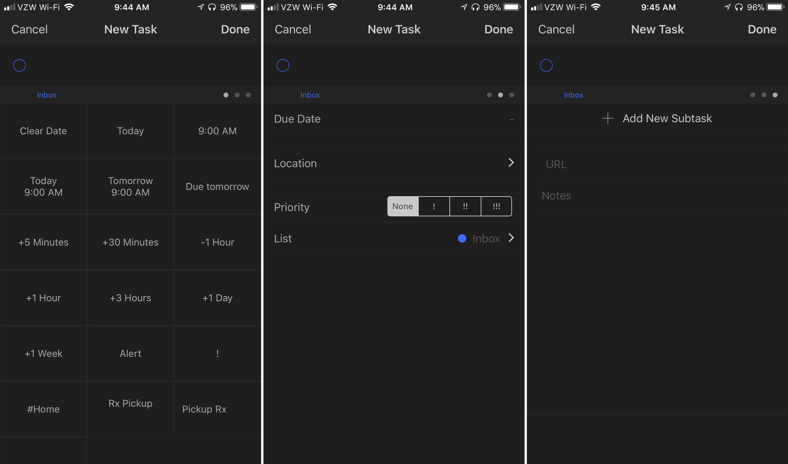
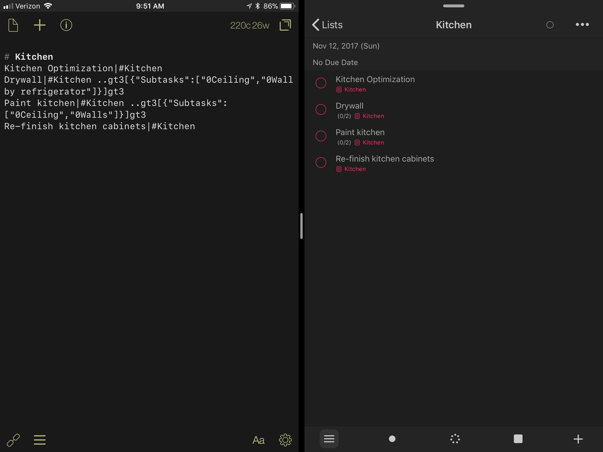

It's fall - damn near winter - and that can only mean one thing: time to make my task management more complicated. I often use the summer to make my life [simple](https://www.nahumck.me/basic/), and then spend some time making things overly complicated. I'm always looking for a better way to handle my tasks. I've tried many task managers, and had gone through all of them. Or so I thought. I've had a few people suggest some apps to me, and I often think: _do I really need another app_? Apparently, the answer is yes. But this time _feels_ different.

Enter [GoodTask](http://goodtaskapp.com/index.html "GoodTask"). There's a lot to unpack here. I know I won’t cover everything possible, but I'll do my best to tell you why it’s important to me now. First and foremost, GoodTask - available for both [iOS](https://itunes.apple.com/us/app/goodtask-3/id1068039220?mt=8&uo=4&at=1001l4VZ "GoodTask 3 for iOS") and [macOS](https://itunes.apple.com/us/app/goodtask-3/id1143437985?mt=12&uo=4&at=1001l4VZ "GoodTask 3 for macOS") - is build upon Reminders. It uses the Reminders integration and provides very fast sync across devices and with the integrations themselves; in fact, I usually see a task show up in a second or less when I use _Hey, Siri_. The benefit here is that my tasks don't need to have a separate, proprietary sync engine: it can use native sync with all the benefits therein.

The iOS app is free, with a $5 in-app purchase to unlock the power features. While you can try the app, you don’t really get to experience the full app without buying the IAP.[1](#fn1) I’m using the best parts of GoodTask: [the URL scheme](http://goodtaskapp.com/help13.html), themes (dark mode!), [text snippets](http://goodtaskapp.com/help7.html), and [quick actions](http://goodtaskapp.com/help10.html). I'm not using the notifications, however; I'm still using Reminders for that aspect because notifications persist. Additionally, because I’m a big fan of the [Siri Watch Face](https://www.nahumck.me/keep-it-simple/ "Keep It Simple"), my tasks are surfaced there without having to use a different app on the watch. The GoodTask watch app isn’t as good as something like [Things](https://itunes.apple.com/us/app/things-3/id904237743?mt=8&uo=4&at=1001l4VZ "Things 3 for iPhone and Apple Watch"), but it does allow you to see your tasks and add a new one from your wrist. In general, I’m adding tasks in other ways; if I have to add a task from my watch, I find it much easier to use Siri to do so. And that's a benefit of using tight integration with Reminders: I get all the benefits of a highly-functional app while using all the benefits of a native solution. There really is no down side here.

There are some additional benefits that GoodTask provides over Reminders. Search in Reminders is great, but GoodTask goes the extra step to have Smart Lists to create saved searches. This goes back to an aspect of what I [loved about 2Do](https://www.nahumck.me/move-your-thoughts-to-2do/), and is something that I've missed while trying other apps as well. I can search text, tags, etc. to compile what I need to view across my tasks. The repeat options are the the same as Reminders, with one notable exception: repeat after completion. I really like using this option for tasks like specific cleaning, furnace filters, and other things that need to be completed with a frequency but have the flexibility of when I do them.

There are two unique ways that you can speed up task entry. First, you can setup customizable quick actions. These quick actions can be dates, times, time intervals, tags, etc.; there are even quick actions to set up repetitive tasks. I have a few set up for dropping off or picking up prescriptions, dry cleaning, and some other work-related tasks that aren’t regularly repeating, but occur frequently enough to have a quick entry option. The second quick-entry feature is user-defined text snippets. While it isn’t full natural language parsing, it greatly speeds up entry. You can add “Wednesday 7p” and it will set the date and time without having to select each one in the regular fields of the task. You can customize the snippets to work for you, using common words or other shorthand to enter your tasks quickly.

The developers at have come up with a way of storing extra information to provide greater functionality than the built in Reminders.app: by using the notes field of the task, they can add details about the reminder that GT parses. Because of this clever use of the field, the app can provide tags and subtasks: `#tags` have a simple syntax, where subtasks follow a more complex format of

`..gt3[{"Subtasks":["0SubTask1","0SubTask2",...,"0SubTaskN"]}]gt3`.

With that syntax in the notes field, GoodTask will read that information and treat it like a checklist.

Knowing the syntax of the subtasks and realizing that it can be read by adding text to the note field, I can start opening up some automation possibilities. When I started looking into moving some things over, I quickly realized that I can simply use [Drafts](https://itunes.apple.com/us/app/drafts-quick-capture/id905337691?mt=8&uo=4&at=1001l4VZ) for [trusted capture](https://www.nahumck.me/trusted-capture-with-drafts/), just as I always have.

I set up an action with Drafts that sends over a task via the Smart Add functionality of [the URL scheme](http://goodtaskapp.com/help13.html). When using Smart Add, the text snippets you type automatically expand and populate items. So when I look at [the weather](https://itunes.apple.com/us/app/carrot-weather/id961390574?mt=8&uo=4&at=1001l4VZ "Carrot Weather") and see that it will rain in the morning, I can quickly open up Drafts, type "Take Umbrella tomorrow morning alert", and send a reminder into GoodTask; it will receive the text, parse the text snippets, and create a "Take Umbrella" reminder with due time of 7:00am that will trigger an alert.

That action is great for moving a single task or a selection over, but what about a list? This is where knowing the syntax really helps. I wanted to move my house list over to GT. It's a list of a plethora of items that I don't have time to complete. For a while, I've been using Drafts to store all of those types of lists. I've split it up now, with longer-term projects (like remodeling) residing in Notes and the remainder in a regular list.

Some of the tasks I have around the house are actually small projects, or a task with a few subtasks. Now that I know how the syntax works, I made a [subtask creation key](https://drafts4-actions.agiletortoise.com/k/2Ht "GT3 Subtasks") that takes a group of lines and turns it into the proper syntax for GT to accept.[2](#fn2) Then, I simply put each main task in the format `task|note` so that I could use [this action](http://drafts4-actions.agiletortoise.com/a/1C6) that moved it over into Reminders. Here's a small example:

Again, the benefit here is using the backbone of the Reminders integrations. The input of the tasks from Drafts to Reminders is simple; the syntax that GoodTask uses to parse subtasks and tags allows for even better integration when using GoodTask as the manager. There are also numerous other possibilities for task entry. Users of [Fantastical](https://itunes.apple.com/us/app/fantastical-2-for-ipad/id830708155?mt=8&uo=4&at=1001l4VZ "Fantastical for iPad") are able to use NLP to send tasks into Reminders, which in turn would show up in GoodTask. I can use Siri to add a simple task. I could use [Workflow](https://itunes.apple.com/us/app/workflow/id915249334?mt=8&uo=4&at=1001l4VZ "Workflow") to create a task from the widget or the watch. I can use the Share Sheet to select Reminders, and input a task in that way. There are a ton of ways to enter my tasks.

There are some weaknesses, but they are small: I can’t use drag/drop to add a message in the same way I can in the Reminders app; I also can’t view a note when I use the “remind me of this later” feature of Siri.[3](#fn3) I’d really like to see 3D Touch and drag/drop improvements for the iOS app, automatic theme options for day/night based on location, and better visual indications for tags. I’d also like to have my view state saved by list, so that I can better view my tasks in each list; my all tasks list would likely be a week view, while my individual lists would be a list view so that I can see all of them. The basis for all of these things are there, and it will just take a bit of effort to incorporate them. Judging from the emails I’ve sent in and the quick responses from the developer, I’m guessing these things are coming soon.

I'm really looking to the future of this app, and I feel like I have found a solution where I can get all of the benefits of a power-user app while keeping the native aspects I wanted. GoodTask is the perfect blend of what I need: it's a powerhouse tool when it needs to be while giving me all the benefits of the Reminders integrations that proliferate throughout iOS for easy task entry. Until Apple does an [overhaul of Reminders](https://www.nahumck.me/rethinking-reminders/), this will serve as a phenomenal surrogate.

1. My hope is that in the future, the developer will allow a 2-week trial similar to other productivity apps so that you can really understand the full potential of the app. [↩](#ffn1)
2. I’m not a programmer, so the key isn’t perfect. It will take separate lines and group them in the syntax. If you don’t highlight the lines, it will input some text. If I was better at this stuff, it would be improved. But, it’s what I know how to do. [↩](#ffn2)
3. Which works about 10% of the time and is frustrating as all hell. [↩](#ffn3)
