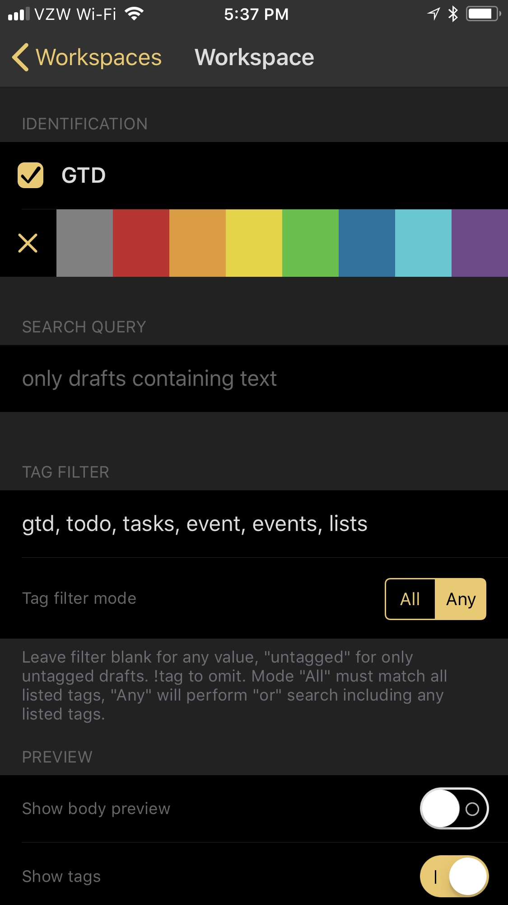
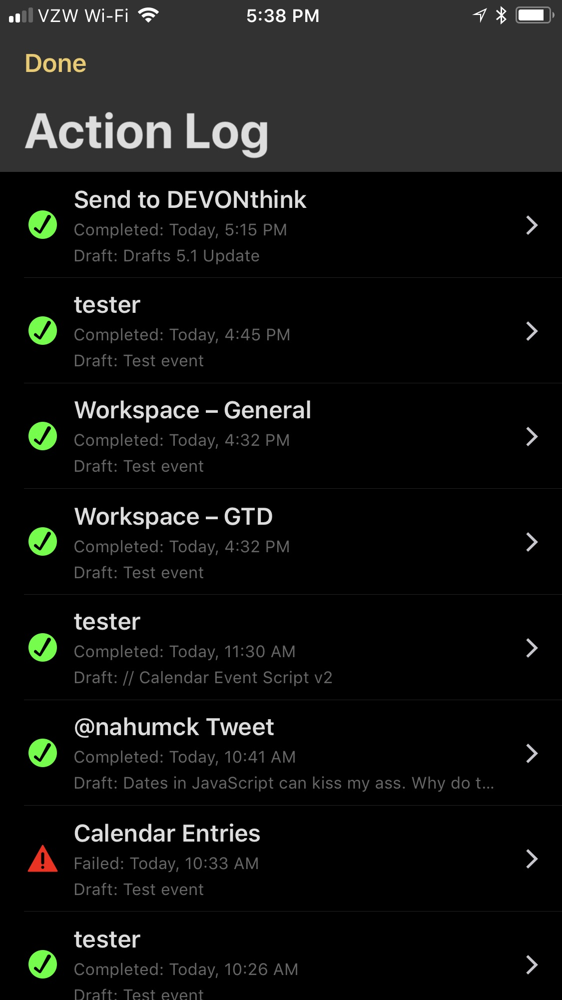
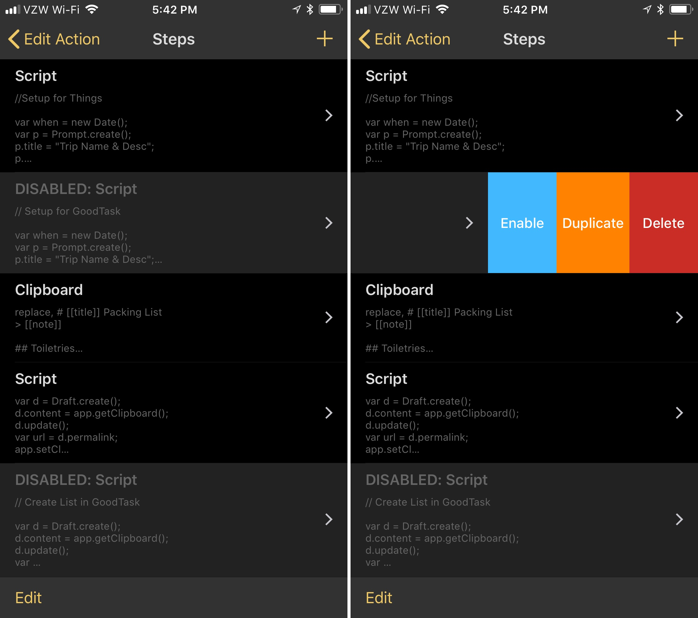

While I'm working on another large post, I wanted to put out at least a small bit about some of the added features in the 5.1 update of [Drafts](https://itunes.apple.com/us/app/id1236254471?at=1001l4VZ) that has been released.

### Tag Filter Improvements

I really love the addition of tags, and more importantly, workspaces. I did, however, have a couple of gripes about the features. My single gripe about filtering using tags from the review:

> A nice addition to tagging not present in the app is an `or` function, which would expand the filtering to get drafts that are tagged with `red` or `blue` instead of `red` and `blue` as it is today, giving better functionality to the feature.

This has now been fixed. Whether in the tag drawer or within a workspace, you can specify "All" or "Any" for the tags. This distinguishes the behavior of the tags so that you can include the correct one(s) as you filter. For example, I have a GTD workspace. Previously, I'd have to rely on a single tag for this to work, and I settled on `gtd`. But now I can create new tags to not only add new drafts with similar tags, but I can also provide context within the workspace. I can have tasks, events, lists, calendars, etc. included in my GTD workspace simply by choosing "Any" for the tags.

This added flexibility I wanted to see has been quickly added, which is already reaping dividends for my productivity. Now all I need is the ability to set a default action group for my workspace, and I'll be all set.

### Action Debugging Features

Action logging has been added to the action drawer. In the top right corner of the drawer, you'll see a clock-like icon located in between the search and menu icons. This contains the log of _every_ action run, rather than finding it in the draft information screen, which is on a per-draft basis. This not only provides a nice log, but provides quick access for when you're de-bugging scripts. I've been doing a few large scripts as of late, and it has been saving me time along the way. You can also delete the logs as you go, if that's your particular cup of tea.

In addition to the log, individual action steps can now be disabled in your actions by swiping on the step in the action editor. This is useful when you want to troubleshoot errors and check steps along the way. Another useful option for this is for when you are someone who likes to move around apps. For example, many of you know that I like to change up my task management app of choice. Rather than create all-new actions every time I switch, I can simply disable the URL block for [GoodTask](https://itunes.apple.com/us/app/id1068039220?at=1001l4VZ) and add a new URL block for [Things](https://itunes.apple.com/us/app/id904237743?at=1001l4VZ) or [OmniFocus](https://itunes.apple.com/us/app/id904071710?at=1001l4VZ) or [2Do](https://itunes.apple.com/us/app/id303656546?at=1001l4VZ). I don't need to clutter up my action drawer with similar actions that are based on a URL scheme any more. I'm going to need to refactor some of my actions, but I can already see how this is going to benefit me in so many ways. I've even done a [packing list action](https://actions.getdrafts.com/a/1Iy) for you already to show you how it works.

### Event Action Step

You can now create calendar events by simply tapping on an action which brings up the default system card for event creation, as you would see in Calendar.app. There is a simple default action in the directory which creates a [single event](http://actions.getdrafts.com/a/1Ia) that takes the first line of your draft as a title, and the body of the draft as a note. You can select the rest of the parameters as you would in the calendar. when completed, you're back in Drafts, ready to go.

I've already modified this to take a selection rather than a draft (I don't usually use the note field in a calendar event entry), so that I can quickly add meetings or personal events from a larger note, rather than having to create a new draft when I want to create an event.

* * *

We're a month into the new version of Drafts, and already there's been some added features which were missing from the previous version, as well as some carefully considered features to help make life a bit easier for users. There are some other small features added, so be sure to read those in the [release notes](https://forums.getdrafts.com/t/drafts-5-1-released/961).
