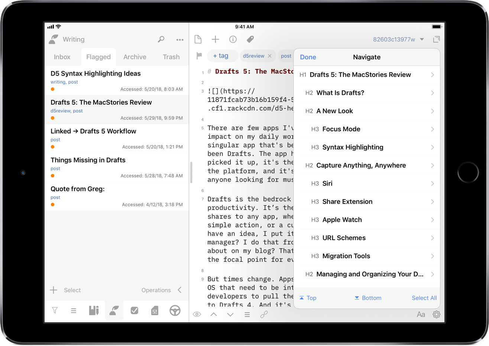
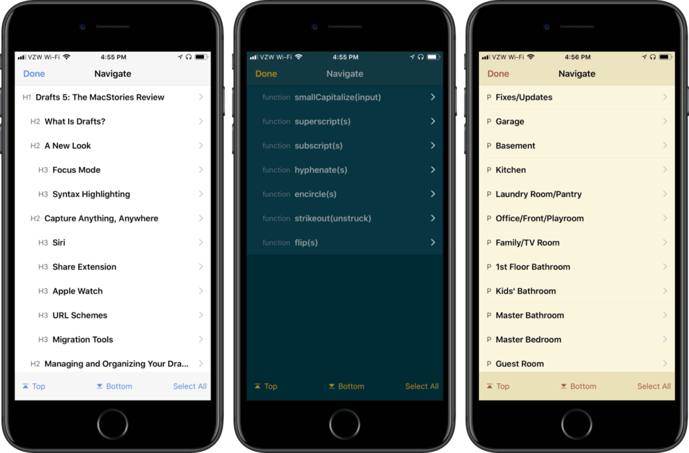
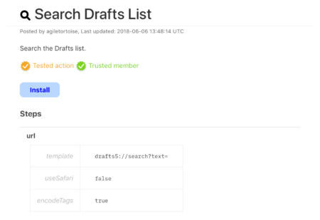

I really like seeing the pace of [Drafts](https://itunes.apple.com/us/app/id1236254471?at=1001l4VZ) development. I can't remember exactly where I heard [Greg](https://twitter.com/agiletortoise) talk about it, but with the subscription model, he no longer has to wait a long period of time for big updates to drop new features; the releases can be done quickly, with focused changes in each one. This is great for him, and even better for users. Like the [previous point release](https://www.nahumck.me/drafts-5-dot-1-update/), the [5.2](https://forums.getdrafts.com/t/drafts-5-2-released/1539) update includes updates that provide better functionality within the app.

### Draft Navigation

When writing [my review](https://www.macstories.net/reviews/drafts-5-the-macstories-review/), I needed a way to navigate between the different sections, and all of the subheadings I had created. I had developed an action to navigate to each of the markdown headers, which I was happy with at the time. It was nice to have that functionality to switch around where I was in my review.

Well, I'm happy to say that I have been [Sherlocked](https://www.urbandictionary.com/define.php?term=sherlocked).

In the upper right corner of the editor, there is a small triangle icon; when you tap the icon, you are presented with a navigation menu. Not only does this navigate headers in Markdown, but it also navigates projects in TaskPaper, and code blocks in JavaScript. It also include a top and bottom button, as well as a select all button.

\[caption id="attachment\_1348" align="aligncenter" width="840"\] Syntax navigation in Markdown, JavaScript, and TaskPaper\[/caption\]

Additionally, using the keyboard shortcut `⌘\`, you can use your external keyboard now to navigate your way through longer writing, coding, or task management projects. This implementation is much better than I could have ever programmed in an action, and it's great to see this type of behavior built into the application itself. As more syntax highlights come in the future, it will be nice to have [navigation](http://getdrafts.com/editor/navigation) along with them.[1](#fn-1354-syntax)

### Loading Modules

My favorite feature of Drafts has been workspaces. In the initial app release, it was possible to use the URL scheme to switch workspaces. Someone in the [Drafts Community forum](https://forums.getdrafts.com/) created a [workspace switcher action group](https://forums.getdrafts.com/t/workspace-switcher/736) that could be customized to switch workspaces, using shortcut keys for external keyboards. While switching workspaces in this manner was fantastic, I wanted to see more in the way of loading modules. From my review:

> Pushing modules further, I would love to see Workspaces get improved by allowing a pre-defined action group. That way when switching workspaces, the user can automatically have all necessary tools at their disposal right away, thus speeding up capture.

The idea of [modules](https://www.macstories.net/reviews/drafts-5-the-macstories-review/#drafts-as-a-modular-interface) – using a workspace in conjunction with action groups – has been a game changer for the way I use Drafts. And now through scripting and URL steps, I can not only change workspaces, but I can also change the action groups in both the action drawer and extended row; this takes the module concept to completion. For those that don't want to get into scripting, new [URL schemes](http://getdrafts.com/urls/) are available to switch action groups: - `/loadActionGroup?name=GROUP-NAME` loads action group in action drawer, while `/loadKeyboardActionGroup?name=GROUP-NAME` loads action group in extended keyboard. If you want to switch workspaces and both action groups, you can have a [single module action](https://actions.getdrafts.com/a/1Ji) with three URL steps, one each for the component you are changing.

But for those that use [scripting](http://reference.getdrafts.com/objects/App.html), there are additional methods that allow for some further capabilities with modules. Not only can you switch the workspace and load action groups, but you can show or hide the drafts or action drawer/list; if you had pinned the drawer previously, it will show up as pinned.

When running on the iPad, I want to have my draft list shown (and pinned); however, I don't want this to be done on the iPhone. When I run an action on either device, I want it to have unique behavior. Thankfully, there is a [device script object](http://reference.getdrafts.com/objects/Device.html) that pulls which device I'm running the action on, allowing me to change the behavior of the action. For an example of using modules in this way, I've shared a [Writing Module](https://actions.getdrafts.com/a/1Jj) which contains the following script step:

// Get device model
var model = device.model;

var module = "Writing"
var workspace = Workspace.find(module);
var keyboard = ActionGroup.find(module);
var group = ActionGroup.find("Social");

// Show draft list if action is run on an iPad
if (model == "iPad") {
    app.showDraftList();
}
else {
    app.hideActionList();
}

app.loadActionGroup(group);
app.loadKeyboardActionGroup(keyboard);
app.applyWorkspace(workspace);
editor.activate();

This loads the Writing workspace and extended row, and puts my Social action group to the side. I can use this module to create posts like this one or share a thought or tweet storm to Twitter. When I'm done writing, I can use the external keyboard to quickly switch modules into scripting or task management.

I have even created some additional options in each one: if I'm on my iPad, my drafts list is shown on the side; on the iPhone, it hides the action drawer, presenting you with the editor activated. In some of the modules, I have also loaded different action groups based on the device I'm using. This gives me full control of what I do and where I share my writing, all with a single action; coupled with the use of keyboard shortcuts, this is now a powerful app-like switcher right inside Drafts. I even created a [Select Module](https://actions.getdrafts.com/a/1K5) action with select boxes to load modules when on my iPhone, which I have added to each of my action groups for faster switching.[2](#fn-1354-buttons) I have placed a duplicate action at the beginning of every action group so that I can switch modules on the fly, especially when on the iPhone. And I've thrown them into a [module action group](https://actions.getdrafts.com/g/1Jn), though I haven't made it an extended keyboard row option because I use the single action to switch on the iPhone and the keyboard shortcuts on the iPad.

### Other Improvements

Speaking of sharing actions, there have been a few new elements added in the [Action Directory](http://actions.getdrafts.com/). There are two new visual indicators: trusted member and tested action. These indications give users confidence that the actions listed have come from trusted sources and that they do not contain any errors. When I refer to errors here, I am not speaking about programming knowledge and efficiencies. It specifically refers to the result of the action and that it won't damage any of your data. This will be handled by the developer on a case-by-case basis: after all, this is Agile Tortoise's app, and they need to make these decisions for their app and business.

Another nice feature that has been added is the ability to assign tags after a successful action; this can be found in the action editor. When I post to Twitter, I will archive the draft and assign a `tweet` tag. There isn't a special script code block required like I had before, it's simply baked into the action. Users could apply something like a `sent` tag for messages or emails, or a `submitted` tag for when you're sending your writing off for review/editing. The nice aspect of this is that you don't have to apply the tags up front, but you can apply them after the fact.

* * *

The small but useful changes and new features are another nice release for Drafts. The navigational improvements are absolutely fantastic for how you move through Drafts. I'm getting very close to never leaving the keyboard when I'm on the iPad. I love how fast I'm able to switch through modules now, providing different the various different mini-apps at my fingertips to productively get everything done.

* * *

2. The navigation feature is based on the syntax highlighting. When customizable options come in a future update, you'll be able to specify the navigation as well. [↩](#fnref-1354-syntax)

4. I also have one for buttons, which saves a tap. I do like the idea of "loading" a module, which is why I went with select boxes with a single "Load" button. Yes, I'm nerdy. [↩](#fnref-1354-buttons)
