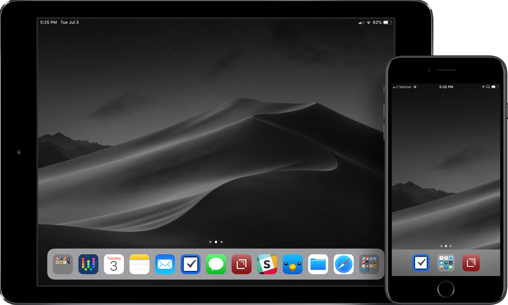

People often post about their homescreens. I've shared one of mine in the [Club MacStories](https://club.macstories.net/) newsletter, but I thought it might be time to give an update.

A great homescreen starts with the wallpaper. I generally like a dark background for visual deference to the icons, and I like to have the same wallpaper on both. This means I need a high-resolution option. And with WWDC happening, I turned to [512 Pixels](https://512pixels.net/projects/default-mac-wallpapers-in-5k/) for my even-darker Mojave wallpaper.

My second pages on both devices are nothing but folders. This allows me to group apps that I search for via Spotlight search or don't regularly use into like categories. There are a bunch of apps on both devices on the second screen, too many to cover here.

The main focus for homescreen layout should always be around the dock.

#### The iPad Dock

When iOS 11 was introduced and the iPad dock was changed to be different than a larger iPhone dock, my homescreen immediately changed. I needed to move most apps into the dock to facilitate multitasking with apps in layouts. The usefulness of dragging an icon out of the dock and into a split view or as the slide-over app was a fundamental shift in the way I was using my device.

With using an external keyboard – first the [Logitech Create](http://www.amazon.com/dp/B01HIS30OY/?tag=nahumck-20), then the [Smart Keyboard](http://www.amazon.com/dp/B01DOQR99Q/?tag=nahumck-20) – it became apparent that I could use the shortcut of `⌘space` to pull up Spotlight search from anywhere, and it meant that unless the app was in the dock, I didn't need to have it on the main homescreen. All I have to is search for the app I want, and then I can either tap to open or drag it into one of the app slots on my screen.

The apps I use the most are in my dock. The three center icons of my dock are similar to what I have on my iPhone. I like having those central in both places. Surrounding them are apps that frequently use during the day and/or in a split-screen setup. I have folders on either side of the dock: on the left is a folder of the "creative" apps that I use to generate podcasts or images for my site; on the right is a folder of reference apps.

Here's a list of the apps that are in my dock:

- **Creative Folder**: [Pixelmator](https://itunes.apple.com/us/app/id924695435?at=1001l4VZ), [Graphic for iPad](https://itunes.apple.com/us/app/id363317633?at=1001l4VZ), [Linea Sketch](https://itunes.apple.com/us/app/id1094770251?at=1001l4VZ), [Ferrite Recording Studio](https://itunes.apple.com/us/app/id1018780185?at=1001l4VZ), Photos, [MindNode 5](https://itunes.apple.com/us/app/id1218718027?at=1001l4VZ), [iCab Mobile](https://itunes.apple.com/us/app/id308111628?at=1001l4VZ), [LumaFusion](https://itunes.apple.com/us/app/id1062022008?at=1001l4VZ)
- [Workflow](https://itunes.apple.com/us/app/id915249334?at=1001l4VZ)[1](#fn1)
- Calendar
- Notes
- Mail
- [Things 3 for iPad](https://itunes.apple.com/us/app/id904244226?at=1001l4VZ)
- Messages
- [Drafts 5](https://itunes.apple.com/us/app/id1236254471?at=1001l4VZ)
- [Slack](https://itunes.apple.com/us/app/id618783545?at=1001l4VZ)
- [Twitterrific](https://itunes.apple.com/us/app/id580311103?at=1001l4VZ)
- Files
- Safari
- **Reference Folder**: Maps, News, [AnyList](https://itunes.apple.com/us/app/id522167641?at=1001l4VZ), [1Password](https://itunes.apple.com/us/app/id568903335?at=1001l4VZ), [PDF Expert](https://itunes.apple.com/us/app/id743974925?at=1001l4VZ), [PCalc](https://itunes.apple.com/us/app/id284666222?at=1001l4VZ), Settings, [Notes Plus](https://itunes.apple.com/us/app/id374211477?at=1001l4VZ), [GoodNotes 4](https://itunes.apple.com/us/app/id778658393?at=1001l4VZ), [Gladys](https://itunes.apple.com/us/app/id1257526927?at=1001l4VZ), [Documents](https://itunes.apple.com/us/app/id364901807?at=1001l4VZ), Transmit (RIP), [DEVONthink To Go](https://itunes.apple.com/us/app/id395722470?at=1001l4VZ), and [Dropbox](https://itunes.apple.com/us/app/id327630330?at=1001l4VZ).

#### The iPhone Dock

I tried a new setup a while back after seeing the [homescreen master](https://twitter.com/ronnielutes) do it for his iPhone X. I thought that it would be great for using a larger variety of wallpapers, and allow me to break from my typical black and white image to something with some color. At first, I was hesitant to do this: it seemed more cumbersome and inefficient. But then I remembered my iPad homescreen, and thought that I should give it a try.

While the mechanics of the screens between the iPhone and iPad are different – largely due to the multitasking abilities of the iPad – the end result of this path has been the same: my most important apps in the dock, and other apps grouped into folders. I'm a proponent of the three-icon dock, and that has remained unchanged for a while. So for me, I needed to put the folder in the center for balance, with Drafts and [Things 3](https://itunes.apple.com/us/app/id904237743?at=1001l4VZ) flanking either side. In the folder are my most-used apps: it is a mix of apps that change from time to time, but are all vital to my daily workflow. The folder contains (from top left to bottom right): Calendar, Music, Safari, Mail, [Castro](https://itunes.apple.com/us/app/id1080840241?at=1001l4VZ), Workflow, Slack, Twitterrific, and Messages.[2](#fn2)

And the rest of the rows are blank. Which, as I said, seems to be very odd when you first see it. But, there are a few benefits. First off, I don't have the temptation: no tapping all the icons on the homescreen, no badges on the screen to pull my attention, reduced stress. I don't feel compelled to dive into Twitter, Instagram, or YouTube to look through content. It's clean, it's focused, and it helps me not sit and waste idle time. The other nice benefit is that I have a giant area to pull down on the homescreen, allowing me to quickly access Spotlight search. I'm actually faster at opening my apps now because I just pull down, type a few characters, and I'm there.

One of the biggest enablers for me was the [new update of Drafts](https://www.macstories.net/reviews/drafts-5-the-macstories-review/), and the [subsequent](https://www.nahumck.me/drafts-5-dot-1-update/) [updates](https://www.nahumck.me/drafts-5-2-the-navigation-update/) after it was released. It has replaced so much for me that I find myself not using other apps and figuring out new ways to use Drafts in my daily workflows.

I've tried going back to icons in other rows. But it fills me with more anxiety, mental overhead, and makes me feel like I'm serving my apps instead of my apps serving me. Maybe one day I'll go back to it, especially with Screen Time, but for now, this is what I need and I love using it this way.

* * *

Homescreens are very personal. I often change my mind about them, but this is the first time in recent memory where the layout had remained the same. The apps in certain spots may change, but for the most part, the layout has remained the same for months now. I'm happy with it. I'm sure this will change when I get a new device, but for now, I'm happy to have it figured out and have less stress facing me in my daily life as a result.

1. Soon to be Shortcuts. [↩](#ffn1)
2. I'm right handed, so Drafts is on the right for better access when I'm using my phone in one hand. I also have the folder set up to be more accessible while using my right hand as well. [↩](#ffn2)
