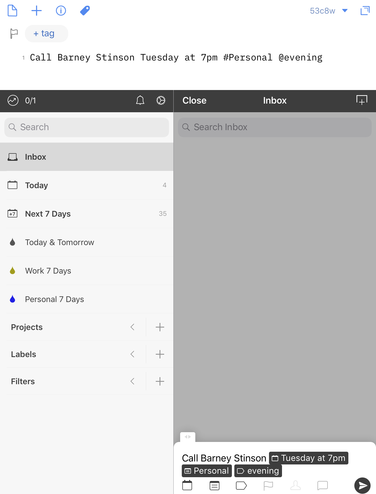

I've been using [Todoist](https://itunes.apple.com/us/app/id572688855?at=1001l4VZ) for almost two years now. I started [integrating it](https://www.nahumck.me/bifurcation/) into my system for work-only purposes, and it has served me very well. I have to use a PC for work, so the cross-platform support was essential in this process; with the Outlook add-on, it has really elevated my work flow of task management.

But it never really clicked for me on iOS. I'm not sure what it was. Perhaps it was the un-iOS-like interactions or the swipe to complete. I knew that there were some nice automation possibilities through various apps like Drafts, Workflow, Slack, and others, but it again, it didn't really grab my attention.

That was until the [Drafts 5.3 update](http://getdrafts.com/changelog.html) added Todoist support. In typical Drafts fashion, there is an action step and a [script object](http://reference.getdrafts.com/objects/Todoist.html), along with a handy [integration guide](https://forums.getdrafts.com/t/using-todoist-with-drafts/1845) for those that want to get a bit more familiar.

I'm not going to get too technical here, but it uses a particular portion of the API called "Quick Add": the best thing about this portion of the API is that you can type just as you would in the quick add window of Todoist. But the best part of this is that I don't have to leave Drafts to enter the tasks, there's no back-and-forth dance via a URL scheme. Just sending the tasks on their way.

Say I'm in a meeting: I can not only take notes and [send the tasks](https://actions.getdrafts.com/a/1OQ) to Todoist, but if I have another random thought I can add via a [prompt-only](https://actions.getdrafts.com/a/1MM) information. And all of this gets added via the Quick Add, so I can type in all the information that I need right away. For example, I can simply type "Call Barney Stinson Tuesday at 7pm #Personal @evening" and it will all get added, with the date being parsed and the proper #project and @label being assigned. I can also create single drafts that contain a task with some notes in the body of the draft, and send it to [Todoist with options](http://actions.getdrafts.com/a/1MW), which imports the project and labels automatically for selection via a tumbler.

Utilizing Workflow Shortcuts, I've even been able to take some repetitive tasks and automate them with Todoist. Every week, I run a meeting that can be attended by between 1 and 150 people (don't ask). But I have to take meeting minutes for distribution. For a while, I tried just using pen and paper. Then I tried using digital paper on my iPad Pro with the Apple Pencil. When that didn't work out the way I wanted, I decided that I would just start typing them out. So when I run the meeting, I present everything from my laptop and take notes on my iPad. At the end of the meeting, I can tap a single action that sends the `[[title]]` line along with the HTML-formatted text to create a PDF and save that PDF as an attachment to a task in Todoist with today's date and the project assigned. This small but effective automation has saved me tens of minutes per week. And that adds up to a lot over time.

This whole idea of quickly entering tasks is really important. I've talked a lot about [capture](https://www.nahumck.me/trusted-capture-with-drafts/) before. And now I have an even better capture ‣‣ action (in this case send) workflow with Todoist. I can also see a balance of work and home, which would have required two apps before. I still think having that split can be beneficial, but for what is going on in my life – both at work and at home – this singular solution is working out really well for me.

There are some things that still bother me: you can drag and move things around, but it's not drag/drop like I would prefer. I'd like to drag tasks from the inbox onto a project. There isn't a dark mode ([yet](https://twitter.com/amix3k/status/1031853841422139392)) for when I'm tasking at night, nor are there alternative icons for the app; both of these are nice touches to have, and is something I hope they consider bringing quickly to the app. And the app itself doesn't feel as whimsical as something like [Things](https://itunes.apple.com/us/app/id904237743?at=1001l4VZ). But when it comes down to it, maybe I don't need to have whimsy in a task manager, and that's been holding me back in my tool-of-choice. I need something dependable, accessible, and manageable on a day-to-day basis.

Once I got past my own preconceived notions about using the app, it has been a phenomenal tool for me. I've even started sharing some projects with others via the built-in sharing options,[1](#fn-1427-options) and it's helpful when setting up something new in collaboration with others. Even though it is a small change in what I've been doing in the past and I've replicated a lot of my actions from other task managers, having everything in front of me is working at this five minutes for me. This is, of course, all subject to change. But I don't see it happening any time soon.

* * *

2. This requires that both people have Todoist Premium. [↩](#fnref-1427-options)
