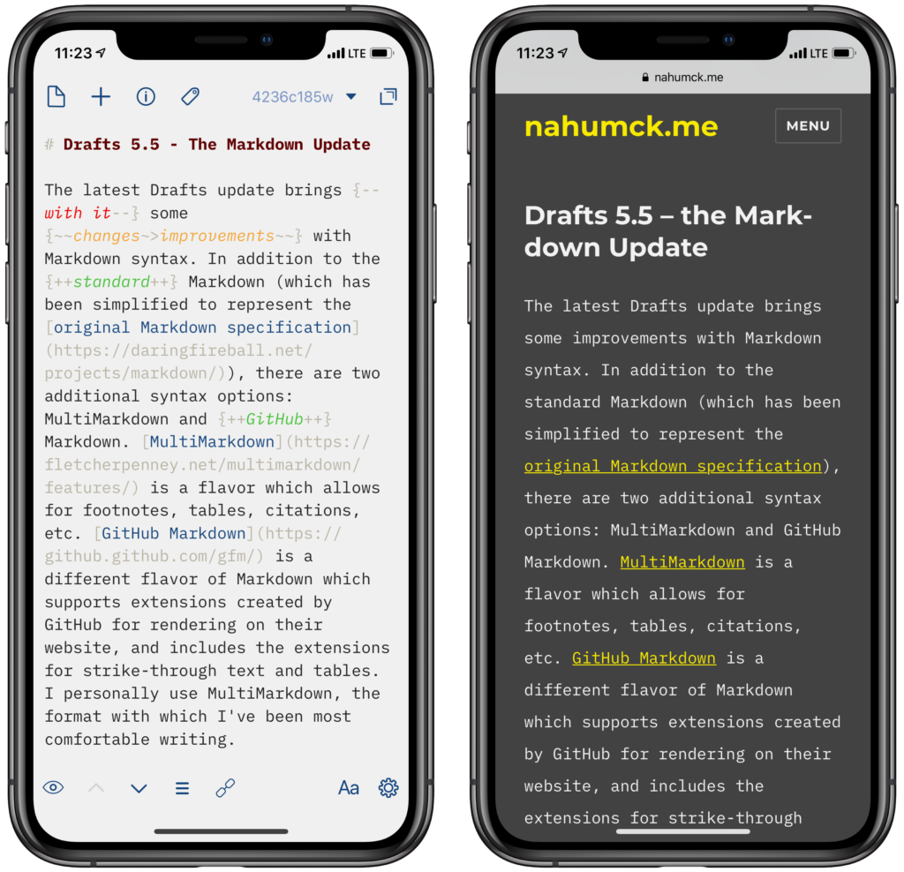

The latest Drafts update brings some improvements with Markdown syntax. In addition to the standard Markdown (which has been simplified to represent the [original Markdown specification](https://daringfireball.net/projects/markdown/)), there are two additional syntax options: MultiMarkdown and GitHub Markdown. [MultiMarkdown](https://fletcherpenney.net/multimarkdown/features/) is a flavor which allows for footnotes, tables, citations, etc. [GitHub Markdown](https://github.github.com/gfm/) is a different flavor of Markdown which supports extensions created by GitHub for rendering on their website, and includes the extensions for strike-through text and tables. I personally use MultiMarkdown, the format with which I’ve been most comfortable writing.

One thing that is included with MultiMarkdown as an option is [Critic Markup](http://criticmarkup.com/users-guide.php). Looking through the guide, there are several helpful elements that can be used for editing my writing utilizing Critic Markup. I can highlight some substitutions, additions, and deletions. I can highlight text to show something I might want to work on later. I can also add a basic comment somewhere that won’t be shown in a preview. And with this [action](https://actions.getdrafts.com/a/1RL), I can easily add any of them with a tap and a text entry, which inserts it in the proper format. This is helpful for creating and previewing the documents in Drafts, and gives users the flexibility to mark up files and save them back to a cloud service. I can see myself using this a lot for [longer posts](https://www.nahumck.me/move-your-thoughts-to-2do/) or [large reviews](https://www.macstories.net/reviews/drafts-5-the-macstories-review/). I’ve even modified my own [site preview action](https://actions.getdrafts.com/a/1RO) to render the MultiMarkdown via [scripting](https://reference.getdrafts.com/objects/MultiMarkdown.html), as well as updating both my [standard](https://actions.getdrafts.com/a/1O1) and [linked](https://actions.getdrafts.com/a/1O2) post WordPress publishing actions to do the same.

\[caption id="attachment\_1512" align="aligncenter" width="840"\] Critic Markup in Drafts vs my site post\[/caption\]

There are additional Workspace options for sorting. You can now include flagged drafts in the archive tab – the same way it is done today with the inbox – as well as optionally sort the flagged drafts at the top. And of course, support for using these is also added to the script object. This allows you to give a bit of priority to Drafts in your inbox, depending on how you have your workspace configured. I liken it to something like Gmail: there’s a giant inbox of drafts, and you have a starred list that can be used to filter priority; you can also option to have the starred emails on top to bring them into focus, or have them in their separate list. This smart addition enables more focus on key drafts in your list.

There are some other small improvements and fixes; you can read the full list [here](https://forums.getdrafts.com/t/drafts-5-5-released-the-markdown-update/3292). It may seem like a small update to some, but for the advanced users of Markdown, this is a fantastic update. What this should give users a glimpse of for the future of Drafts: custom syntax highlighting. Currently, the following syntaxes are supported: Markdown, MultiMarkdown, GitHub Markdown, JavaScript, and TaskPaper. Whereas I love the new Critic Markup portion of MultiMarkdown, I would love to be able to customize my own syntax. When I used Ulysses for writing, I really liked some of the comment, highlight, delete, and other markup styles. Part of what makes Drafts so versatile to each user is the myriad of ways which it can be customized. Controlling the editor in this fashion would, to me, make the editor the most powerful on iOS. No other editor would allow for syntax highlighting for writing _and_ coding in the same way. I know this will at some point be on the horizon, but that cannot come soon enough. I’ll patiently wait for it after the [Drafts for Mac release](https://forums.getdrafts.com/t/drafts-for-mac-status-update/2276/9).
