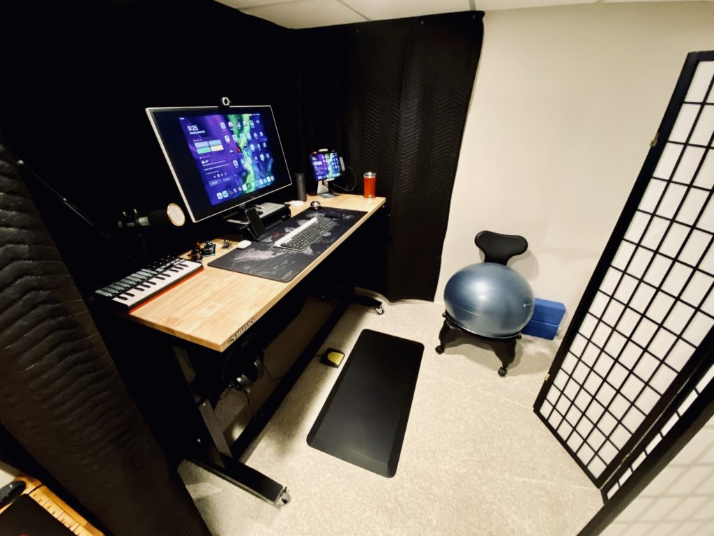
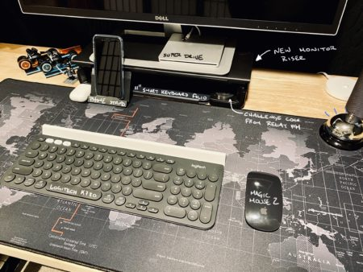
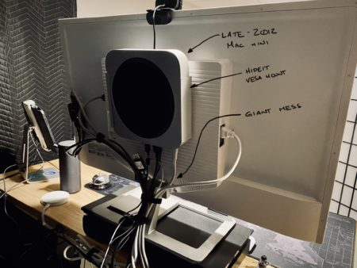
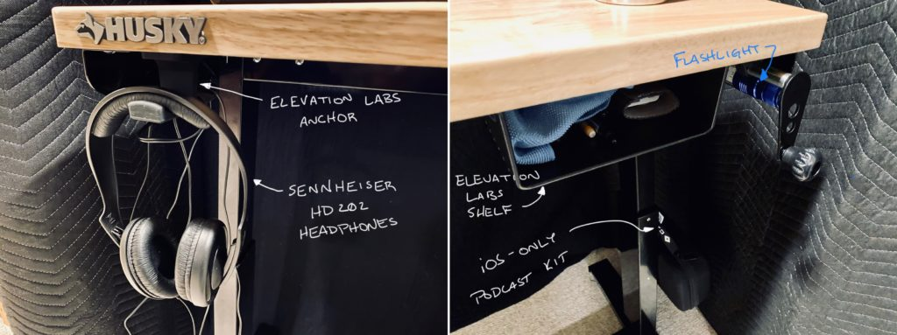
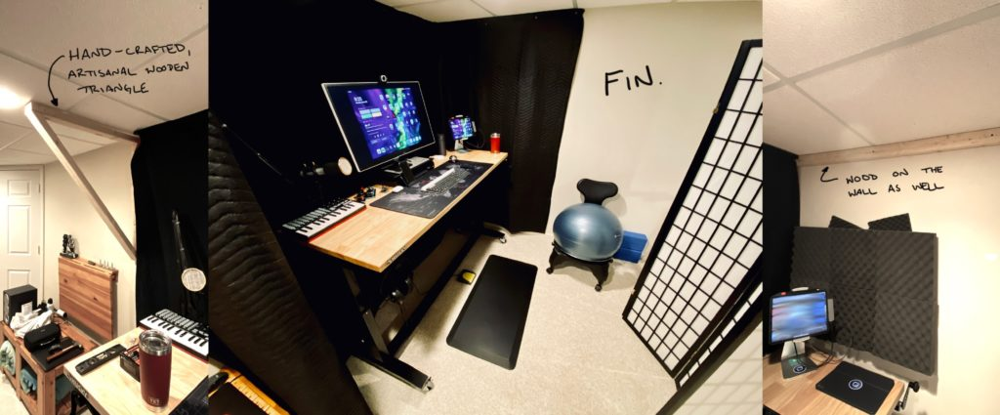
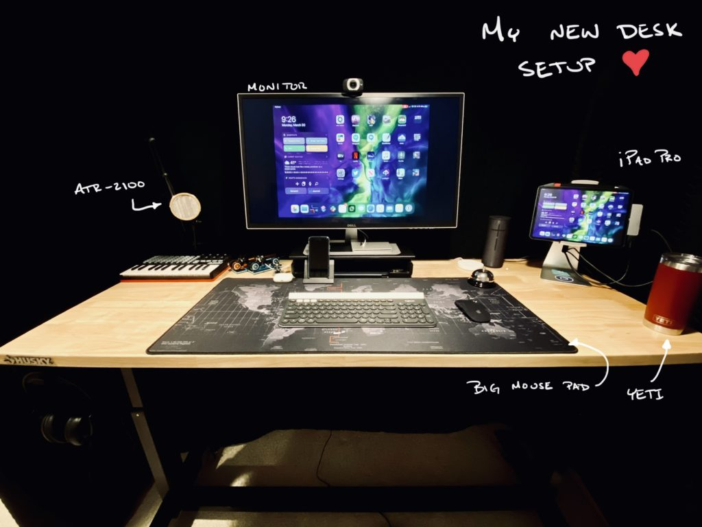

For a long time, I've wanted my own office. For a while, I've had a [podcast space of my own](https://www.nahumck.me/my-podcast-setup/), but it has never been what I've truly wanted in a home office/podcast studio. So in this time of social distancing and staying-at-home to reduce the spread of COVID-19, I realized very quickly that my podcast area was going to be very insufficient for long-term working from home. This sent me down a path of incorporating what I currently have to what I've wanted for so long: a sit/stand desk.

If you want to see where I've started to where I've ended up, I [posted some pictures on Twitter](https://twitter.com/nahumck/status/1244625495062437888?s=21) to show the progression. It's a massive change. The original setup was just abysmal. The middle two setup steps were ok, and really just a move from one area of the basement to the other with some upgrades. But this last one has been special for me. I've been able to take my time and craft a setup that works best for this space in my home. As always, the focal part of a new desk setup is, well, the desk. I've looked for a long time at various options for me: buying a pre-made sit/stand motorized desk, making my own table top and using a sit/stand motorized frame, or just making a standing desk with a high stool for the short periods of time I'd like to sit.

Frustrated at the prospect of spending $600 on just the desk, I took a walk to clear my head. During the walk, I kept thinking "sit/stand" and tried to get at the root of what I wanted. I wanted something I could change frequently. I wanted to move from one level to another for comfort. I wanted something _adjustable_. So when I return from my walk and typed "adjustable desk" into Amazon, a bunch of different opportunities presented themselves. And that's when I saw what I wanted – the [Husky 62" Adjustable Height Work Table](https://www.homedepot.com/p/Husky-62-in-Adjustable-Height-Work-Table-HOLT62XDB12/301810799).[1](#fn-1654-homedepot)

This is really an adjustable workbench, primarily used for garages. But there's no reason I can't use this; and, at $300 total shipped to my door, it's half the cost of the other desks I was considering. It has the same depth as my old desk, but it's 14" wider than my previous one. The extra room gives me the space to both my laptop and my iPad Pro up at the same time on either side of my monitor, effectively having three screens if I need to do it. It's plenty of space to include other things like my bluetooth speaker, my Yeti mug, a giant [mouse pad](https://smile.amazon.com/Cmhoo-Professional-Large-Computer-35-4x15-7x0-1IN/dp/B01F0XHA5E), and a [midi keyboard](https://amzn.to/33YzRbj).[2](#fn-1654-midi)

The other nice part of having an adjustable desk is that I already had an [anti-fatigue mat](https://amzn.to/2UR3qaI) and a [balance ball chair](https://amzn.to/39uHBD2) to use with it. I adjust the desk maybe two times in a day, so the manual adjustment isn't that big a deal. When I need to stand, the chair goes behind me to the side and the mat is placed on the floor; when I need to sit, I pick the mat up and put it to the side of the desk against the wall, and move my chair in position. If I needed to do this more frequently, I'd be doing something different. But this is more than fine for my needs, and I'm following the [ergonomic guidelines](https://www.startstanding.org/proper-workplace-ergonomics/) I've found. So with the adjustable desk and comfort taken care of, I focused on the top of my desk. First, this all centers around my monitor: it's a 31.5" Dell 1080p monitor with a [Logitech webcam](https://smile.amazon.com/Logitech-Laptop-Webcam-Design-360-Degree/dp/B004YW7WCY) on top. It's not 4K but it does the job.[3](#fn-1654-upgrade) I needed it to be slightly higher up for the setup, so I purchased a [monitor stand](https://amzn.to/3dl6V1z) to raise it up the appropriate amount. I picked this one for a few reasons: it looks clean, has flexibility with the shape and width, and had some hidden features within it. I have a small stand for my work iPhone as well as a drawer/stand for my personal iPhone. I can also store some small items in the drawer. Surprisingly, the 11" iPad Pro Smart Keyboard Folio fits perfectly underneath in the way I have it configured.

In front of the monitor sits my keyboard, the [Logitech K780 keyboard](https://amzn.to/2V2DkBX). I picked this up before the [Logitech MX Keys](https://amzn.to/2X4P8WJ) was released, which I would recommend picking up over the K780. And next to that, I have the Magic Mouse 2; this is mainly used for my iPad Pro, which is primarily to the right of my monitor sitting in my [iPad stand](https://amzn.to/2wMcENq). This is plugged into the monitor via HDMI and a [HyperDrive USB-C Hub 6-in-1 Adapter](https://amzn.to/2G1f388). Eventually, I would like to get a Magic Trackpad 2 for my setup, and use the Magic Mouse 2 for travel.

Now, I'm sure you're thinking: do you have a Mac? Well, I do have a late-2012 Mac mini, but it's pretty much invisible in the picture. That's because it's attached to the Vesa mount holes on my monitor in a [HIDEit Mount](https://amzn.to/2R8q5hX). I've done my best with some velcro straps to keep the cables as invisible as possible throughout the desk, and this was no small feat. But this is working very well so far. I have an [HDMI switch](https://amzn.to/39Ia08S) also mounted to the back of the monitor via some trusty 3M Velcro Command Strips, which are a big enabler for cable management. I do use the Mac, albeit rarely; most times it acts as a nice mass damper on the back of the monitor. Perhaps one day I will upgrade it, but for now, it's back there when I need it for the singular task of uploading an MP3.

To the left of the monitor sits my mic: this is the [Audio-Technica ATR2100-USB microphone](https://amzn.to/2ylTz5l) in a [microphone shock mount](https://amzn.to/2UTk9dM) which has a metal pop filter, mounted to the desk via a [Knox Gear 38" Microphone Stand](https://amzn.to/2QKLT2O). I absolutely love the boom arm: it's well made, feels solid and fluid in it's movement, and is long enough to extend the microphone to the center of the desk from the corner. When I'm not podcasting,[4](#fn-1654-beenawhile) it can be moved out of the way.

On the under side of my desk, I have the Elevation Labs [Anchor](https://amzn.to/3aHdPMV) for [my headphones](https://amzn.to/2JyAAXl) on the left, and the [Shelf](https://amzn.to/2xO7CAs) for some odds & sods on the right. I liked these options as they stick to the bottom of the desk, and they aren't holding heavy items. In addition to those items, I also have a power strip along with an [Anker 5-port wall charger](https://amzn.to/2UDOzl1) mounted to the bottom to keep things nice and tidy. On the back side of the desk, multiple command strips keep the cords running out of sight as well. On the right side, I also have a magnetic flashlight attached along with a hook for my [iOS Podcasting Kit](https://www.nahumck.me/the-ios-only-podcasting-kit/).

With all the bits of my desk figured out, I needed to make sure I had some decent soundproofing. For a long time, I had some foam in my setup. And while that's good, and looks good, the walls around where I have my desk have had some holes put in them over time when mounting different items, and I'd have to cover the entire wall. I started doing some research and spoke to a few people on the most effective yet most inexpensive options. And I ended up going to something I've said before: _use what's around you if you can_. I had the blanket I had used previously to dampen sound from the metallic desk worked, and it worked perfectly for the backdrop. Then I added two [moving blankets](https://amzn.to/2WUp6Fv) on either side because I wanted it to be as uniform as possible; for the left side, I made a simple triangle out of some wood, and attached that to the wall to create a false wall out of the blanket. I hung all of the blankets using some screws and some washers.

While this doesn't look as "professional" as others with acoustic foam, it actually works better for my situation. I didn't have to spend money to fix the wall, and it looks good enough that I can share it without feeling some shame. To cap it off, I have a decent-looking [room divider](https://amzn.to/2wfVBTW); in the future, I plan on getting a second, and also attaching some thin sound barrier to the back side of both; this will help with the sound behind me during recordings, but is easy enough to get out of the way. About my only gripe with this setup is that I'm in the basement, but that's nothing that a [happy light](https://amzn.to/3aFPF5z) couldn't fix.

I am overjoyed with how this has turned out. I had to put in a bit of money (around $400 total) to make it this way, and I was able to use all of the other items I've collected over time. However, the sum total is less than what a typical sit/stand desk could cost me, and that makes me smile. With the flexibility that the desk affords me has helped me mentally focus on work and writing, it has been invaluable to me. I _feel_ more professional now, or really, more like an adult who has their own place. Maybe not quite an adult, but at least a man-child with some new [toys](https://amzn.to/33VERh3).

This setup is tailor made for me and my iPad-first lifestyle. I've been using the iPad Pro over the past few years as my main computer, and even at this time from home, I've been using it for both work and home as well. There are very few times I'm reaching for my work laptop. Most everything can be done now for me on an iPad. And with this setup, I can use it as an iPad and the pencil flat on my desk; I can type on my keyboard with the iPad on a stand; or I can turn it into a docking station and use my keyboard & mouse to navigate it fully. It really feels like the modern computer I've wanted, and we are only at the start.

* * *

2. I ended up getting it at Home Depot, as it was cheaper than Amazon. [↩](#fnref-1654-homedepot)

4. I don't have much use of the midi keyboard right now, but I had it in the house and found it while I've been going through another round of purging. Surprisingly, it actually does work with the iPad Pro in GarageBand. So there might be a use for it down the road. [↩](#fnref-1654-midi)

6. Eventually, I'd love to upgrade to a nice 4K monitor. But it really has not been an issue for me, and I don't feel like dropping $350+ on a good monitor. Once my partner's or this one break, I'll look at upgrading then. [↩](#fnref-1654-upgrade)

8. Yeah, it's been a while. Maybe soon? [↩](#fnref-1654-beenawhile)
