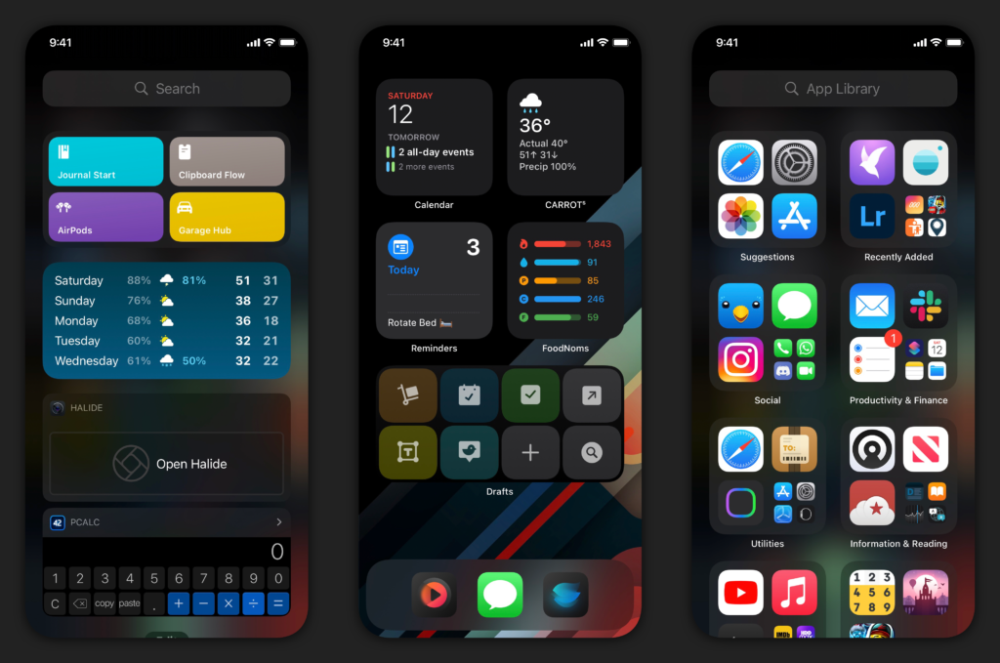
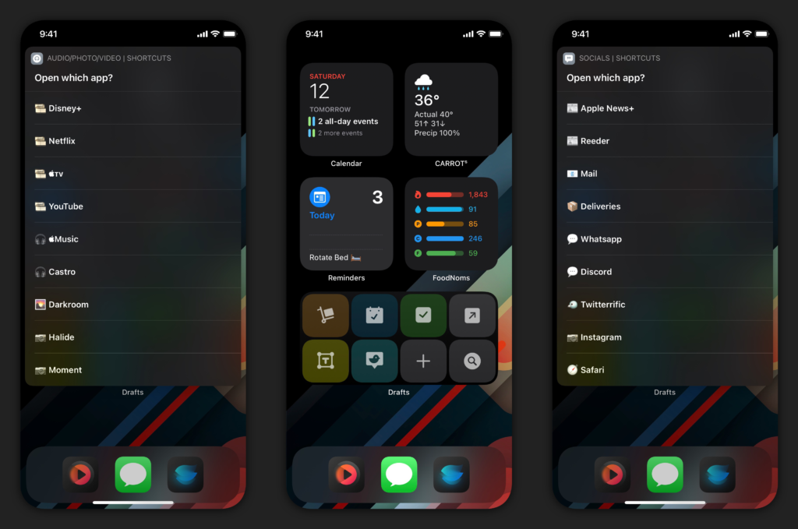
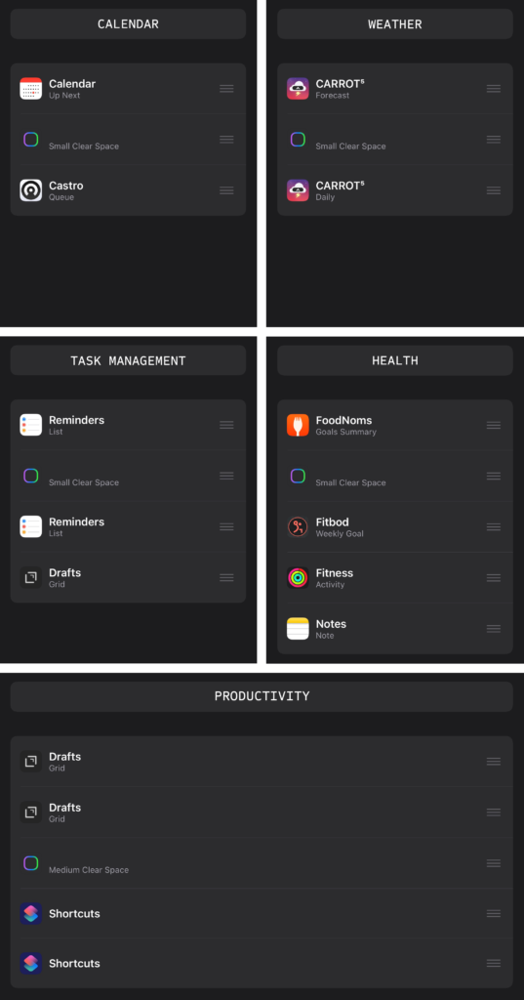

I get asked often for what's on my Home Screen: what apps, what wallpaper, what layout. Now with iOS 14, I'm asked about my widget setup as well. I've shared some updates through posts and social media sporadically. A lot of my current setup is visually unchanged (except the wallpaper), but I wanted to cover the _why_ of the Home Screen - where apps/widgets are placed, what stacks are being used, and now I'm using them together for a more streamlined, productive setup.

I'll state this now before we go further: I'm going to cover my iPhone Home Screen. The iPad inexplicably didn't get the same treatment, so the uses of the widgets there aren't the same. The multitasking aspects of the iPad don't lend it to the same use case as the iPhone, which I actually like: these are ever-diverging devices, both with their set use cases. Back to the iPhone…

I try to keep as few Home Screens as possible. I prefer the minimalist approach rather than having multiple pages to swipe through. On iOS 13 I kept 2 Home Screens: the main page – which was usually blank – with a 3-icon dock, and a second page of folders to house my apps. With iOS 14 and introduction of the App Library, I'm back down to a single Home Screen. I like that I can swipe to get to the Today view, or swipe to get to the App Library. Everything is a quick swipe away.

\[caption id="attachment\_1948" align="aligncenter" width="1024"\] My full iPhone Home Screen experience\[/caption\]

I've retained the 3-icon dock, because that's what looks right to me. I've used this time to experiment with a 4-icon dock, but it feels off. Call me neurotic, but that's just how I see it. As I said in my [Drafts review for iOS 14](https://www.macstories.net/reviews/drafts-22-review-widgets-scribble-and-more/), the use of a [Drafts](https://apps.apple.com/us/app/drafts/id1236254471?uo=4&at=1001l4VZ) widget negates my need of the icon in my dock. So I now had to rethink how I use the dock. And with the change in iOS 14.3, which allows Home Screen shortcuts to be run without bouncing into the Shortcuts app and then to the app you wanted to be in, I decided to start putting apps at my fingertips.

I created two launcher-style shortcuts: these shortcuts present a menu of apps in compact UI; when one is selected, the shortcut kicks over to that app without going to Shortcuts first. I don't know that I would have done this before the change in 14.3, if I'm being honest. The icon on the left is for media and consumption apps; the icon on the right is for social and web-related apps. I am using icons provided in the [echoes pack](https://gumroad.com/l/echoes) on Gumroad, which I've found to be aesthetically pleasing and matches my [wallpaper](https://pin.it/7HfbaWA) (which I modified) as well. I like that I can tap the icons and go to multiple apps without having to slide over to the App Library: sure it's easy to do that, but I also avoid seeing the badges on app icons there and keeps me more focused during the day.

\[caption id="attachment\_1949" align="aligncenter" width="1024"\] Home Screen shortcuts in my dock are more powerful in iOS 14.3\[/caption\]

My widget layout has changed a little since the summer betas. I use 4 small widgets and one medium on the Home Screen, all with stacks and without Smart Rotate turned on. I placed the widgets in their respective locations based on use: it would never make sense to me that I put a Drafts widget all the way at the top when I access it all the time. So the order of importance always starts above the dock and works upwards. All of them have a specific function and different apps within; all of them contain one "blank" widget, which is from the app [Clear Spaces](https://apps.apple.com/us/app/clear-spaces/id1532666619?uo=4&at=1001l4VZ) – but more on why that is later. I think the best way to show you is to have the layout with the stacks and the titles of each, and then explain them.

\[caption id="attachment\_1947" align="aligncenter" width="537"\] My widgets and stacks\[/caption\]

**Calendar**: this stack has the calendar to see my next events, as well as a Castro widget to quickly access my queue. This is pretty much self explanatory.

**Weather**: I use [Carrot Weather](https://apps.apple.com/us/app/carrot-weather/id961390574?uo=4&at=1001l4VZ) as my weather app because it's the best weather app for me. I have two different widgets: the first is forecast so that I can see the forecast for the day, and the second is a daily forecast so I can view 5 days of weather if I need to look at that quickly as well.

**Task Management**: I've been using Reminders more and more, thanks to some deep integrations with task assignment. It's not perfect, but it works. I've tried [GoodTask](https://apps.apple.com/us/app/goodtask-to-do-list-manager/id1068039220?uo=4&at=1001l4VZ) and even used it for a while, but until Apple provides the tools to developers to fully tie into the full feature set, I'll be staying with Reminders. I have two Reminders widgets, one for the Today smart list and the other for my Grocery List. The remaining widget in there is for Drafts, which brings up my Work workspace where I keep my work tasks.

**Health**: I'm doing my best to be better, I really am. To help me improve, I'm using [FoodNoms](https://apps.apple.com/us/app/foodnoms-food-tracker/id1479461686?uo=4&at=1001l4VZ) for food tracking, [Fitbod](https://apps.apple.com/us/app/fitbod-workout-fitness-plans/id1041517543?uo=4&at=1001l4VZ) for my workouts, monitoring my rings with Activity, and keeping my diet steady in a shared note with my girlfriend for our meal plan.

**Productivity**: I have 2 different Drafts widgets and 2 Shortcuts widgets. For Drafts, the first widget is for my workspaces and a few quick actions for adding tasks/drafts or searching. The second widget is a few of the same actions, but adds a few additional actions I use from the widget. I've been set on these for a while, but I have some plans to change them.[1](#fn-1950-later)

With all of the widgets, they center around an idea of having a clean Home Screen. It's something that I've always enjoyed. But I also like having a productive screen as well, and this method gives me the best of both worlds. In all of the widgets, Clear Spaces is at or near the center of the stack to allow for quick swiping up and down to get to a different layout. As I go through my day, I may change the app that's there to give me a visual cue to focus. I might keep my task manager on work rather than my personal when I need to focus up on work things. I might keep FoodNoms on the screen to make sure I'm keeping track of my food intake, but I'm a quick swipe away to my meal plan so I can know what's ahead for dinner. But as I get through different aspects of my day, I always swipe to the Clear Spaces widget in the stack to have a clear Home Screen, almost like checking off a task. When I'm done with that particular area of focus for the day, it can simply go away. And the next day, I wake up and swipe my widget back in like it's March 294th.

\[video width="480" height="1039" autoplay="true" playsinline="true" mp4="https://www.nahumck.me/wp-content/uploads/2020/12/iOS-14\_3-Home-Screen-Video.mp4"\]\[/video\]

I'm sure that there will be changes over time, but I'm really happy with my current setup. Of course, there are a few apps that are missing from widgets that I'd love. I'm getting more into photography, and I'd love to see an app like [Halide](https://apps.apple.com/us/app/halide-mark-ii-pro-camera/id885697368?uo=4&at=1001l4VZ) develop a widget to open the camera into different modes for quicker access. I wish I could have a task management app where I could check off the tasks from the widget itself, like the old Today widgets used to be. And I wish that Apple would allow for a 4x4 small widget for Shortcuts and Drafts so that I can have more combinations and possibilities. I'll remind myself that this is just the first iteration of this, but it's something that I still don't understand 6 months into this OS.

But for now, I'm using widgets and Home Screen shortcuts to have more power when I need it. And when I don't, I can simply swipe away widgets to create a clear space for my clear mind. I've been more mindful of my day, and I think this new Home Screen layout has something to do with it. It just might work for you too.

* * *

2. More on that in a different post. [↩](#fnref-1950-later)
