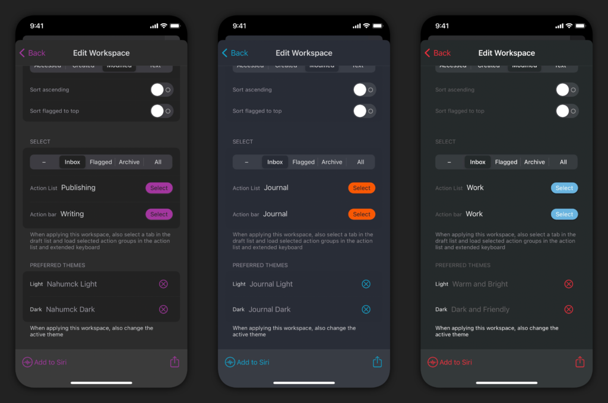
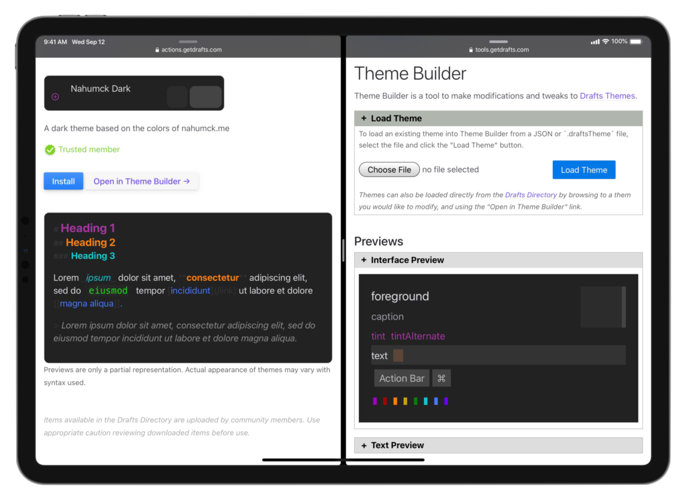

Since the very recent release of [Drafts 26](https://www.nahumck.me/drafts-26-the-customization-update/) there have been a couple of changes to theming in [Drafts](https://apps.apple.com/us/app/drafts/id1236254471?at=1001l4VZ) that make creation, modification, and switching easier.

After appearing on the [Automators](https://www.nahumck.me/appearance-automators-episode-73/) podcast, I shared my module-switching action group, which included the scripts to switch themes based on workspaces. I wished that this feature get rolled into the workspace manager, and although there are a few complications with doing it this way, I think it will be better overall for users now that it has been added.

Within the workspace manager, choose any workspace, scroll to the bottom of the settings, and you'll find the place where you can set both the light and dark theme you want to load when that workspace is selected. This does come with one small catch: you'll need to do this with most of your workspaces. If you don't do that, when you switch to a different workspace that doesn't have one set, it will retain the set workspace. I personally have all mine set and have removed the scripts for the Module action group. You can set the Default workspace to your default themes as well.

But that's not the big news here. The big news is the new [Drafts Theme Builder](https://tools.getdrafts.com/themes/theme-builder), an online tool which does a fantastic job of setting all the different colors you'd want in a theme. It's pretty easy to use, even without the [tutorial](https://youtube.com/watch?v=WnuyF7Rb9IQ&feature=share) explaining things. There are some very nice additions to it as well: you can import your own theme as a file, modify it, and either import into Drafts or export as a file. But the method that I like using is importing the theme from the Directory straight into the Theme Builder for modification using the provided link on the theme page. This means that you can take any of your favorite themes that you find on the directory, import it into the Theme Builder, modify it to create your own, and then import it to Drafts; if you like the way it looks, you can export that theme right to the Directory. I've done this a lot more frequently with my [own](https://actions.getdrafts.com/t/1is) [themes](https://actions.getdrafts.com/t/1hn), and the tool has made the whole process easier.

This means you don't need to use a JSON file editor to create your themes (though you will need to do that with syntaxes), and it's a much more visual, user-friendly way of creating them. My only wish for themes in its current implementation: an interface integrated into Drafts itself. But until that happens, I'm extremely pleased with this online creation tool and the improvements made to my workflow.

It's time for you to go forth and create your perfect theme!
