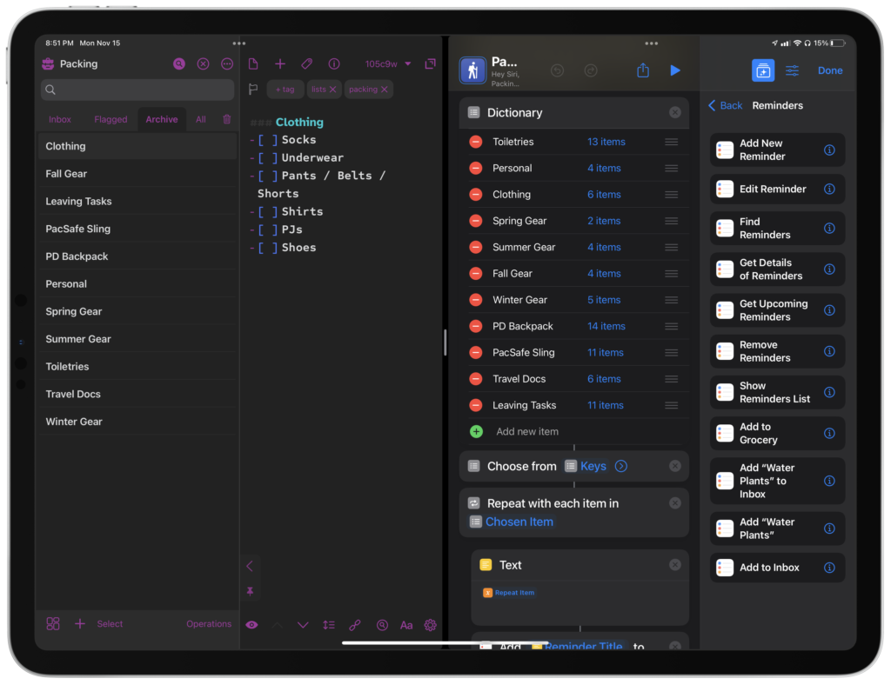
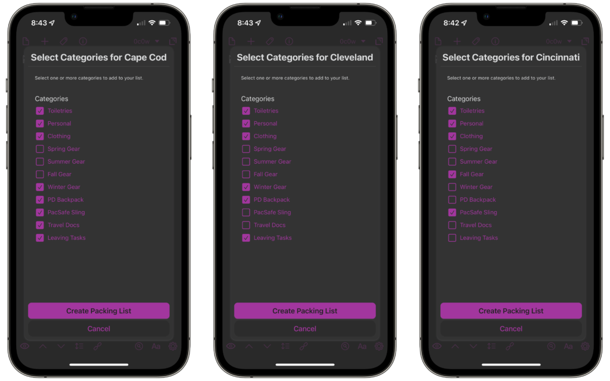
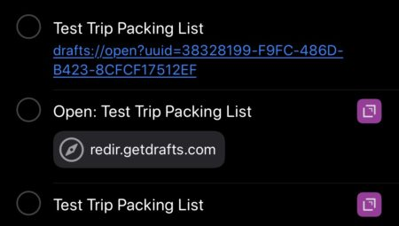

Recently, I created a shortcut for the Club MacStories Discord as part of the Automation Academy. If you're not a [member](https://club.macstories.net/), I highly recommend doing so. This shortcut was in response to the latest lesson, all about Reminders. I've been meaning to create this for a while, and it seemed like a good idea to apply this lesson in practice.

From the Discord:

> I've been using packing lists in Drafts for a long time. Once it is created in Drafts, I send a single task over to Reminders with a link back to the packing list. This has worked well for years, but when I read the piece by Federico, I thought that maybe it'd be a good idea to make a customizable, variable shortcut for a packing list in Reminders instead.

I do appreciate this shortcut, as it creates reminders with subtasks in a packing list. Unfortunately, there are three things I do not like about it after using it for a short while: first, I cannot create a new list for each trip I without manual interaction; second, it clutters up my system with a lot of new tasks; third, it takes longer than I'd like to run. Now, that last point is a complete nitpick, but the first is critically important. There has been more than one occasion where I have needed to pack for work trip and then a subsequent personal trip. Having two lists to separate them is more ideal for me.

I started thinking about how I could better use [Drafts](https://itunes.apple.com/us/app/drafts-capture-act/id1236254471?mt=8&uo=4&at=1001l4VZ) to manage all of this. I have had a [single packing list](https://www.nahumck.me/making-2do-lists-better/) action for a long time. My biggest complaint about using this method is that it wasn't variable for the type of trip I was taking. I'd run the action to create the same list over and over, then have to remove items that weren't applicable to that particular trip. That kind of solution works, but is far less elegant. Having just gone through the shortcut activity, I couldn't help but think that there was a better solution for me: cleaner appearance in Reminders and faster automation with Drafts.

\[caption id="attachment\_2168" align="aligncenter" width="1024"\] Managing a workspace is easier for me than a complex dictionary with arrays and items.\[/caption\]

With this in mind, I created a new tag `packing`. This tag is only used by my newly created [Packing workspace](https://actions.getdrafts.com/w/1sV). None of my other workspaces contain this tag, and this workspace contains only this tag. I've also archived these particular drafts to keep them out of any other workspace inbox in the future, so it's very filtered for what I need. Next, I take each category from my shortcut and make its own draft. Within each draft, the title line is formatted `### Category` and I have checkboxes for each item underneath. I can modify each draft as I need, or I can add completely new categories with items to pack.

Using a query on the drafts with the specific tag, I created a checklist prompt: it presents the same information as what was in Shortcuts and functions in much the same way. I even briefly thought about making an HTML prompt for this, but thought that this was easier and fits a user's preferred theme better; this is about quick interaction after all, right?. The way this is constructed grabs all of the draft titles and presents them as items; as the categories grow, so does the list.

\[caption id="attachment\_2167" align="aligncenter" width="1024"\] Setting up individual trips is better this way.\[/caption\]

The next script then pulls in the selected draft content, and compiles it into a single list. There's an optional forth step, which creates a new task in Reminders with the URL to the newly created draft. I personally don't like the way this is rendered as just the URL. I actually use Siri to do this, usually when on my iPad by pressing Globe + S and typing to Siri "remind me of this". This shows the Drafts icon to the right of the task and the URL; I will delete the URL part, which still keeps a link via the icon on the right, for cleanliness.

\[caption id="attachment\_2169" align="aligncenter" width="450"\] I prefer using Siri to "remind me of this", and edit the task in Reminders manually to make it cleaner.\[/caption\]

This might seem a bit more complex than editing a single shortcut, but there are a few reasons why I prefer this method. First, It runs really quickly: sure, I might only be saving a few seconds, but it makes me _feel_ better. Next, I think that the manipulation of text within a draft, combined with the power of [arrange mode](https://www.nahumck.me/arrange-mode-in-drafts/) in Drafts, is better. I can also duplicate categories – like with my backpack and travel sling – to make a different version with or without camera gear far easier than creating another array in Shortcuts. Finally, it keeps me in Drafts. I'm not saying that Shortcuts isn't the right tool for most here, but I know that Drafts is a better tool for me. I trust the system I've developed over years, and it doesn't let me down. Unfortunately, I can't say the same for Shortcuts: even in the setup of the packing checklist shortcut, there were bugs that prevented me from completing it fully. With the groundwork done in Drafts, this is fully extensible and will adapt to new situations or changes in my gear.

Now that I'm going to travel slightly more than I have in the past, having this type of [flexible packing list](https://actions.getdrafts.com/a/1sT) will keep me better prepared for travel. As I continue to venture out into The World, A.C., [^covid] I'll have the confidence and assurance that I have packed everything I need for any type of trip that might come my way.

[^covid]: After COVID.
